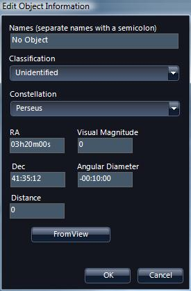

### <a name="CreatingaNewCollection">Creating a New Collection</a>

A _Collection_ is the term used to describe a WorldWide Telescope data file. You can create your own collections, either from existing images or perhaps from your own data. As long as the data that the new collection references is available on the internet, your new collections can be shared.

To create a new collection, either select **Explore > New > Collection...**, or select **Collections > My Collections > Add New Item**, which has the same effect. Enter an appropriate name in the **Create New Collection** dialog box. Your new collection will be added under **My Collections** and the data will be saved off automatically when you add new images to it.

To add images to this new collection use the **Research** option of the [Finder Scope](#TheFinderScope), which has an **Add to Collection** menu entry. If you select the **Add New Item** thumbnail when the new collection is displayed in the top panel this will add a new _folder_ to your collection, enabling a folder and image structure which might be helpful for a large or complex collection. Add as many folders and images as you like to the collection.

To edit the metadata for any one of the images, right click the thumbnail for the image, and select **Edit**. This will bring up the **Edit Object Information** dialog:

|  | Some of the metadata information is populated, including the **Constellation** and **RA** and **Dec** co-ordinates, when the image is added to the collection. Clicking **FromView** will overwrite this with the co-ordinates of the current view, so be careful of clicking this inadvertently.

Add appropriate **Names** and **Classification**. |

Your own collections are saved to the **My Documents/WWT Collections** folder. Each time you add an image to a collection the file is updated. If a collection is moved to another location, you can open if by browsing to it using the **Explore > Open** menu option.

Note that by right-clicking on an image in one of your collections, the **Remove from Collection** menu option is available for you to delete images. To delete or rename a collection, right-click the collection thumbnail. To move images around within a collection that contains folders, use the **Add to Collection** option to add the image to the right folder, then **Remove from Collection** to delete the image in the wrong folder.

To share your collection with other users, email the .wtml file in the **My Documents/WWT Collections** folder. The users that receive this email can either double click on the wtml file (if the file mime types have been set up appropriately) to open up WorldWide Telescope with this collection, or simply use **Explore > Open** to navigate to and open the collection.

#### See Also

*   [Astronomy Research](#AstronomyResearch)

* * *
