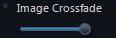
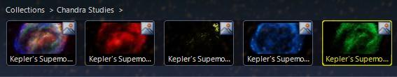

### <a name="ComparingForegroundandBackgroundImages">Comparing Foreground and Background Images</a>

Astronomers often use comparisons of images of different wavelengths of an object to help expose information about that object, such as the type of gasses being emitted, the blue or red-shift, the intensity of x-rays or gamma rays, and so on.

WorldWide Telescope has the concept of a _study_ - usually a single or composite image of one object in space, and a _survey_ - usually a comprehensive collection of data from a large area of the sky. Typically a study is loaded from a _Collection_ by clicking a thumbnail in the top panel, and a survey is selected from the **Imagery** list. In this context the study is the _foreground_ image and the survey the _background image_. There are options to reverse this, or to compare two studies or two surveys, but the study on top of the survey is the default operation.

When both a foreground and background image are in view, the **Image Crossfade** slider appears, enabling you to visually compare the two images:

|  |

Another method of comparing images is available if there are several thumbnails (studies) of the same object. For example, select **Explore > Collections > Chandra Studies** and then scroll to **Kepler's Supernova**. There are a number of thumbnails representing different studies of this feature, including the visible wavelength and high energy x-rays. To compare the studies without any change in camera position, click on the picture icons in the top right hand corner of the thumbnails:

|  | 
The picture icon. |

To change the default operation of a study as foreground and survey as background there are a number of options. All default surveys appear as thumbnails in the **Collections > All-Sky Surveys** folder. Simply clicking on the thumbnail will load the survey as background. However if you right-click on the picture icon, there is the option to load the survey as foreground or background. Load one as foreground and one as background and the **Image Crossfade** slider will be enabled to compare the two. Similarly two studies can be compared this way.

There are options in the [**Finder Scope**](#TheFinderScope) to set images as foreground or background, and then there is the greater flexibility (and complexity) provided by the SDK (refer to the [WorldWide Telescope Data Files Reference](http://www.worldwidetelescope.org/docs/WorldWideTelescopeDataFilesReference.html) document).

Note that not all images of an object are taken from exactly the same camera position. Also sky survey images are composite images -- perhaps with images taken at different times or even by different telescopes -- so the exact location of an object may appear to vary.

#### See Also

*   [Astronomy Research](#AstronomyResearch)
*   [Sky](#ExploreSky)

* * *
