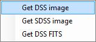
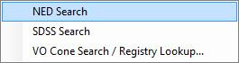

### <a name="TheFinderScope">The Finder Scope</a>

The **Finder Scope** is a pane designed to help you fix on and research a particular object. It can be opened by right-clicking on the view, or from the **Explore** menu.

Certain celestial objects, when pointed to, display a circle and a name. This indicates that the object is in one of the databases that WorldWide Telescope links to. Right-click the object to display the **Finder Scope.** With the **Finder Scope**, you can refine your search in the field of view, or research your selected object from online references.

You can also view the object's image from the [DSS](#DigitizedSkySurvey) or [SDSS](#SloanDigitalSkySurvey) archive, download its DSS [FITS](#FITSImages) file, or run a [USNO](http://www.us-vo.org) NVO cone search for objects near the selected object.

If you find an object you wish to research further, try not to move the **Finder Scope** as the RA and Dec will change, so if you then click **Research** for example, this will use the new values and not those of the object.

Note also that you can pan by dragging the **Finder Scope** to the edges of the field of view.

|  | An object in space may have multiple names: **Ksora** and **HIP6686** in the example shown.

Click **Show object** to return to the view of the object if for any reason the view no longer shows it.

The properties of the object (**RA**, **Dec**, **Alt** and so on), are explained in the [Astronomy Terminology](#TutorialAstronomyTutorial) tutorial.

Refer also to the note: [Viewing from a new location](#ViewingfromaNewLocation).

Both the **X** in the top right corner, and the **Close** button, close the **Finder Scope**. |
|  | Click **Research** to bring up a menu of options to research websites for data or more images of the object.

The **Set as Foreground Imagery**, **Set as Background Imagery**, and **Remove from Image Cache** will only appear in the menu if these items are relevant to the selection.

**Copy Shortcut** can be used to create and copy a URL locating the object that can be emailed to friends or colleagues. Refer to the **Sharing Views** section of the [WorldWide Telescope Data Files Reference](http://www.worldwidetelescope.org/docs/WorldWideTelescopeDataFilesReference.html) for specific details of the format of the URL.

**Add to Collection** can be used to store the view in a data collection file you are working on.

**SAMP** is an astronomy protocol for sharing data. |
| Information

 | Note that informational websites are independent of Microsoft and may require additional software, licenses or sign in procedures.

**SIMBAD**: the Set of Identifications, Measurements, and Bibliography for Astronomical Data.
**SEDS**: the Students for the Exploration and Development of Space.
**Wikipedia**: online encyclopedia.
**ADS**: the Smithsonian/NASA Astrophysics Data System.
**NED**: the NASA/IPAC Extragalactic Database. |
| Imagery
  | **DSS**: Digitized Sky Survey
**SDSS**: Sloan Digitized Sky Survey
[**FITS**](#FITSImages): Flexible Image Transport System image, commonly used in astronomy because of its ability to store human-readable metadata.
 |
| Virtual Observatory Searches
 | Refer to the [Virtual Observatory Tables](#VirtualObservatoryTables) example below. |
| SAMP options
 | Send the image or table data to **Broadcast** to be picked up by all other [SAMP](http://www.ivoa.net/Documents/WD/App/SAMP-20080625.html) compliant programs you are running. |

#### See Also

*   [Astronomy Research](#AstronomyResearch)
*   [Context Search](#ContextSearch)
*   [Sky](#ExploreSky)

* * *
