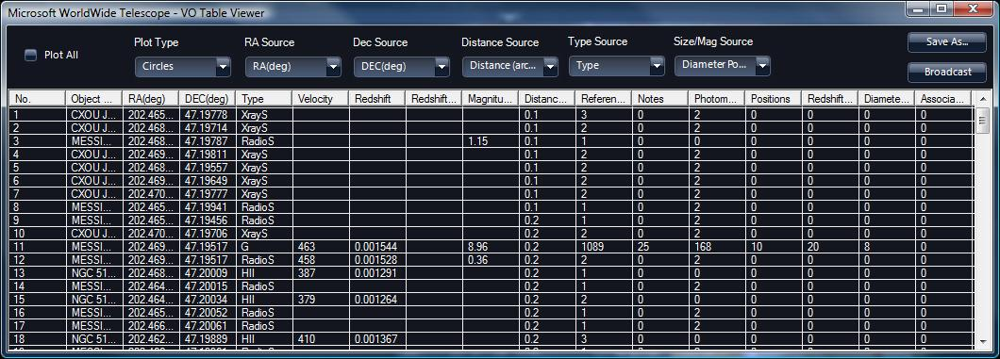
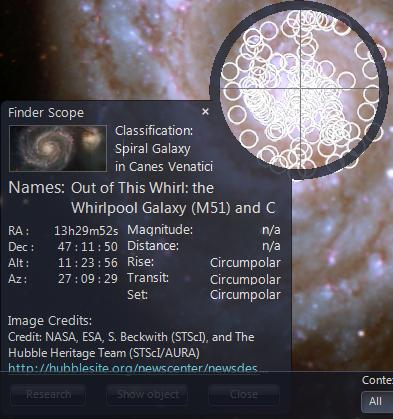

#### <a name="VirtualObservatoryTables">Virtual Observatory Tables</a>

Virtual Observatory (VO) tables are spreadsheets of mainly numerical astronomical data, layout to a standard set by the [National Virtual Observatory](http://www.us-vo.org).

For example, use the [Search Panel](#TheSearchPanel) to navigate to the galaxy M51 -- much better known as the _Whirlpool Galaxy_, and right click to bring up the **Finder Scope**, select **Research > Virtual Observatory Searches > NED**. This will bring up the VO table shown below. Select **Plot All** in the **VO Table Viewer** to annotate all the located objects in the view with the selected **Plot Type** (white circles by default) -- a lot in the case of M51! Now use the **Finder Scope** on the individual plots to investigate them further, many will be unidentified electromagnetic wave sources.

|  |
|  |
|  |

* * *

###### <h7><a name="VOConeSearch">VO Cone Search</a></h7>

A Virtual Observatory (VO) cone search is a search for data on objects in space within a cone - specified by a direction into space and a radius. The diagram below shows a cone search with a radius of approximately 8.5 degrees.

| 
The cone search can be refined by specifying that only certain types of objects ("white dwarfs", "knots", "supernovae" etc.) should be located. |
| 
First pan to the area of space you wish to search, then zoom in to reduce the radius to an appropriate amount.

Select **VO Cone Search/Registry Look up** from the **Search** drop down menu.

Enter the search criteria (pulsar in the example), and click **NVO Registry Search** to populate the table with data.

Further refine your search by selecting one of the rows in the table (to locate the **Base URL** field), and click **Search** to bring up a VO table.
  |

Note the Web Client version has an additional option, to allow the selection of either a catalog search, or a search for images using a SAIP query.

#### See Also

*   [Astronomy Research](#AstronomyResearch)

* * *
