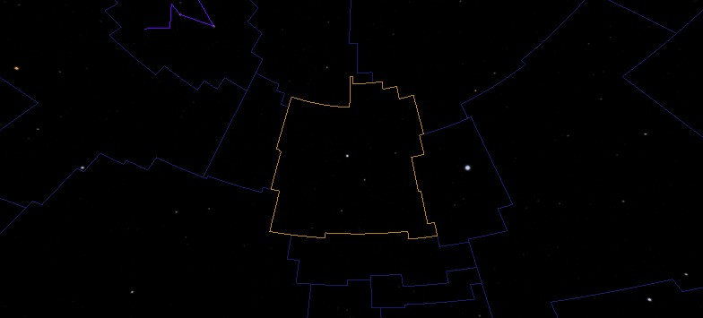
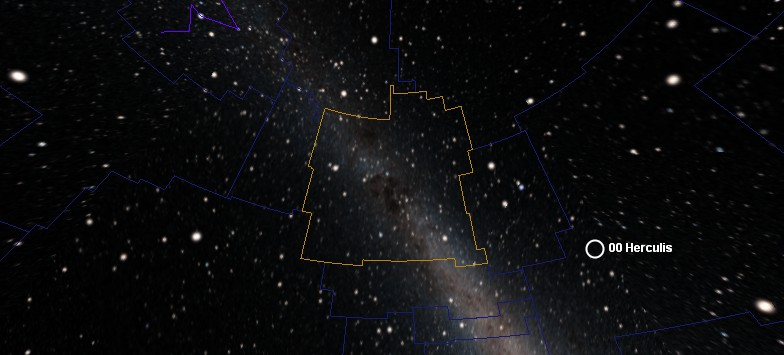
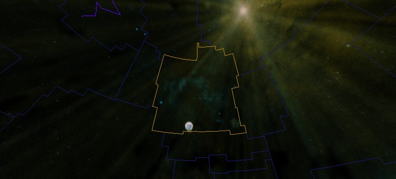

### <a name="SkySurveys">Sky Surveys</a>

Comprehensive surveys of the sky have been carried out at different wavelengths to help determine the composition of stars and galaxies. The digital images generated by sky surveys are compiled into the data sets that are available in the **Imagery** drop down list, and usually provide the _background image_ to the view.

Each imagery set provides unique information about objects in the sky because the images were taken at different wavelengths of the electromagnetic spectrum, and at different times. Different wavelengths expose different energy regimes, stellar processes, and effects. For example, with observations made in the low-energy spectrum (radio and microwave), cold processes are exposed: molecules forming or moving about, or giant clouds of gas and dust. The optical band (between infrared and ultra violet) exposes gas escaping from black holes, volcanoes on the moons of Jupiter, or heat escaping from stellar dust. With x-rays, hot processes become apparent such as explosions on stars, neutron stars, comets, supernova remnants, or energy beams emanating from matter falling into black holes. With gamma-rays, even more violent events become apparent, such as the destruction of atoms, stars spiraling into black holes, supernovas, and pulsars.

Electromagnetic radiation is classified as follows:

|

##### Wavelength

 |

##### Name

 |
| Greater than 10cm | Radio waves |
| Between 10cm and 1mm | Microwaves |
| Between 1mm and 700nm | Infrared radiation. |
| Between 700nm and 400nm | Visible light
 |
| Between 400nm and 10nm | Ultraviolet radiation |
| Between 10nm and 1/100nm | X-rays |
| Less than 1/100nm | Gamma rays |

Try selecting a specific object or an area of the sky and then changing **Imagery** to compare the object's properties. Astronomers have used the different wavelengths to great effect, for example by using the hydrogen alpha wavelength to track stellar red-shift, over 250 planets have been discovered.

Below is a description of the **Imagery** sets included in WorldWide Telescope. Note that specific objects are not always visible in every imagery set. For example, specific stars identifiable in the Digital Sky Survey are not always visible to the unaided eye in the Hydrogen Alpha imagery. Also, the different surveys have been carried out at different resolutions. For comparison purposes, the images below show the constellation Cygnus.

#### Imagery Data

*   [Digitized Sky Survey](#DigitizedSkySurvey)
*   [Hipparcos Catalog](#HipparcosCatalog)
*   [RASS: ROSAT All Sky Survey (X-Ray)](#ROSATAllSkySurvey)
*   [VLSS: VLA Low Frequency Sky Survey (Radio)](#VLALowFrequencySkySurvey)
*   [WMAP ILC 5-Year Cosmic Microwave Background](#WMAPMicrowave)
*   [SFD Dust Map](#SFDDustMap)
*   [IRIS: Improved Imaging of IRAS Survey (Infrared)](#IRIS)
*   [2MASS Two Micron All Sky Survey (Synthetic)](#TwoMicroAllSkySurvey)
*   [Hydrogen Alpha Full Sky Map](#HydrongenAlphaFullSkyMap)
*   [SDSS: Sloan Digital Sky Survey](#SloanDigitalSkySurvey)
*   [Tycho (Synthetic, Optical)](#Tycho)
*   [USNOB: US Naval Observatory B1.0 (Synthetic, Optical)](#USNOB)
*   [GALEX (Ultraviolet)](#GALEX)
*   [RASS: ROSAT All Sky Survey (X-Ray)](#ROSATAllSkySurvey)
*   [Fermi (Gamma)](#Fermi)
*   [Black Sky Background](#BlackSkyBackground)

#### See Also

*   [Astronomy Research](#AstronomyResearch)
*   [Sky](#ExploreSky)

* * *

#### <a name="DigitizedSkySurvey">Digitized Sky Survey</a>

| A comprehensive sky survey in the visible wavelength, first published in 1994\. This survey was created by the Space Telescope Science Institute's (STScI) Catalogs and Surveys Group from images of the northern sky taken by the National Geographic Palomar Observatory in California (from 1948 to 1958) and images of the southern sky taken by the UK Schmidt telescope in Australia (from 1973 to 1988). The original image data was a large number of glass photographic plates, with each plate covering 6.5 x 6.5 degrees of the sky. These plates have produced very large digital images (14000x14000 or 23040x 23040 pixels), and it is a compressed version of these images that WorldWide Telescope accesses.
 |

#### See Also

*   [Tutorial: Visiting the Neighbors](#TutorialVisitingtheNeighbors)
*   [Sky Surveys](#SkySurveys)

* * *

#### <a name="HipparcosCatalog">Hipparcos Catalog</a>

| Hipparcos is the name of a European Space Agency Mission and Satellite that took images from 1989 to 1993 and accurately catalogued 118,218 stars. Taken from space, the measurements avoided the gravitational, atmospheric and thermal distortions that were limiting ground based telescopes. The error in the positioning of stars in this catalog is under 0.001 arc seconds. An auxiliary star mapper pinpointed many more stars with lesser but still considerable accuracy at 0.03 arc seconds. Known as the [Tycho Catalog](#Tycho) this identified 1,058,332 stars.
 |

#### See Also

*   [Tutorial: Visiting the Neighbors](#TutorialVisitingtheNeighbors)
*   [Sky Surveys](#SkySurveys)

* * *

#### <a name="VLALowFrequencySkySurvey">VLSS: VLA Low Frequency Sky Survey (Radio)</a>

| The Very Large Array (VLA) Low-Frequency Sky Survey (VLSS) is an ongoing survey of the sky for radio waves at 74 MHz (4-meter wavelength). The radio survey consists of 358 overlapping images covering the entire sky north of the -30� declination. The survey has so far identified over 70,000 sources of radio waves. From the survey, there are significant samples of objects including high red-shift radio galaxies, galaxy clusters and supernova remnants. Very distant radio galaxies may reveal information on the timeline of cosmic events, such as how soon black holes were formed in the history of the Universe.
 |

#### See Also

*   [Sky Surveys](#SkySurveys)

* * *

#### <a name="WMAPMicrowave">WMAP ILC 5-Year Cosmic Microwave Background</a>

| The Wilkinson Microwave Anisotropy Probe (WMAP) was a three-year, all-sky survey that concluded in 2006\. The survey was conducted at several microwave bands (K, Ka, Q, V and W) to measure and map the cosmic microwave background radiation, measuring both its intensity and by how much it fluctuates. Microwave radiation is the oldest light in the Universe, and from this survey the Universe is estimated at 13.73 billion years old, to a 1% accuracy. Other results of the survey include support for the theory that most of the Universe is made up of dark energy (73%), with the rest mostly dark matter (22%) and only a small portion (5%) as atomic.
 |

#### See Also

*   [Sky Surveys](#SkySurveys)

* * *

#### <a name="SFDDustMap">SFD Dust Map</a>

| The Infrared Dust Map is an all-sky, 100 micron, far infrared (12, 20, 25, and 100 micron pass bands) survey modulated by dust temperatures and then calibrated to be dust reddening at various magnitudes. Dust affects optical light by effects known as _extinction_ and _reddening_. Extinction is the loss of light due to scattering and absorption as it travels through clouds of dust. Because the dust scatters blue light more than red, the color of the light also changes - an effect known as reddening. When astronomers measure distant stars, galaxies, supernovae, or any other light-emitting object, they must correct the color and amount of light they measure for the amount of dust the light has passed through.
 |

#### See Also

*   [Sky Surveys](#SkySurveys)

* * *

#### <a name="IRIS">IRIS: Improved Imaging of IRAS Survey (Infrared)</a>

| Starting in 1983 the Infrared Astronomical Satellite (IRAS) - a joint project of the US, UK, and the Netherlands - performed a survey of 98% of the sky at four wavelengths: 12, 25, 60, and 100 m. IRAS led to numerous scientific discoveries spanning a broad range of astrophysical subjects, from comets to circumstellar disks to interacting galaxies. A new generation of IRAS images, called IRIS, benefits from a better zodiacal light subtraction, an improved calibration and zero level, and from a better de-striping. The data set is used to study the variations of dust properties. Several studies of dust emissions at high galactic latitudes show large variations of dust
properties depending on the grain sizes of the dust. Large dust clouds are the birthplaces of stars and planets.
 |

#### See Also

*   [Sky Surveys](#SkySurveys)

* * *

#### <a name="TwoMicroAllSkySurvey">2MASS Two Micron All Sky Survey (Synthetic)</a>

| The 470,992,970-source Two Micron All Sky Survey (2MASS) Point Source Catalog was produced by a joint project of the University of Massachusetts and the Infrared Processing and Analysis Center. The entire sky was uniformly scanned in three near-infrared bands to detect and characterize point sources brighter than about 1 mJy (1 milliJanksy) in each band. 2MASS used two highly-automated 1.3-m telescopes, one at Mt. Hopkins, Arizona, and one at Cerro Tololo Inter-American Observatory, Chile. The northern 2MASS facility began routine operations in 1997, and the southern facility in 1998\. The primary use of these maps is likely to be as a new estimator of galactic extinction.
 |

#### See Also

*   [Sky Surveys](#SkySurveys)

* * *

#### <a name="HydrongenAlphaFullSkyMap">Hydrogen Alpha Full Sky Map</a>

| A full sky map generated at Princeton University compositing the Virginia Tech Spectral line Survey (VTSS) of the northern skies and the Southern H-Alpha Sky Survey Atlas (SHASSA) produced from images taken by the Cerro Tololo Inter-American Observatory in Chile of the southern skies. The hydrogen-alpha filters block out as much of the hydrogen emission spectrum leaving only a band pass from 0.5 Angstrom to 1 Angstrom deep in the red end of the visible light spectrum. The composite map can be used to provide limits on thermal emissions from ionized gas known to contaminate microwave-background data.
 |

#### See Also

*   [Sky Surveys](#SkySurveys)

* * *

#### <a name="SloanDigitalSkySurvey">SDSS: Sloan Digital Sky Survey</a>

| The Sloan Digital Sky Survey (SDSS) was initiated in 2000 and is ongoing. The survey uses a dedicated 2.5-meter telescope at Apache Point Observatory, New Mexico, equipped with two powerful special-purpose instruments: a 120-megapixel camera images 1.5 square degrees of the sky at a time (about eight times the area of the full moon), and a pair of spectrographs fed by optical fibers measure the spectra of (and hence distance to) more than 600 galaxies and quasars in a single observation. After eight years of operations this survey has obtained deep, multi-color images covering more than a quarter of the sky. The result has enabled the creation of 3-dimensional maps containing more than 930,000 galaxies and 120,000 quasars.

The survey has not yet covered the constellation Cygnus, so the image shows the constellation Leo:
 |

#### See Also

*   [Sky Surveys](#SkySurveys)

* * *

#### <a name="Tycho">Tycho (Synthetic, Optical)</a>

| The Tycho-2 catalog is based on a mix of 1991 space-based data from the European Space Agency's [Hipparcos](#HipparcosCatalog) satellite, data from the Tycho 1 catalog, and over 140 other astrometric catalogs. The catalog also included the re-analysis of positional data for the Tycho-1 stars. The celestial co-ordinate data for all the earlier catalogs was corrected to match the J2000 epoch of the Hipparcos catalog. The mix increased the number of stars in the catalog to 2,539,913 of the brightest stars in the Milky Way, of which about 5000 are visible to the naked eye. Components of double stars with separations down to 0.8 arc seconds are included.
 |

#### See Also

*   [Sky Surveys](#SkySurveys)

* * *

#### <a name="USNOB">USNOB: US Naval Observatory B1.0 (Synthetic, Optical)</a>

| The US Naval Obersvatory-B1.0 is a catalog of 1,042,618,261 objects. The data were obtained from scans of 7,435 Schmidt plates taken for the various sky surveys during the last 50 years by the Precision Measuring Machine (PMM) at the US Naval Observatory in Flagstaff, Arizona. The originating plate material includes five complete coverages of the northern sky and four of the southern sky To be included in the catalog, an object must have been detected on two different surveys, to avoid the unreliability of single detections. The [Tycho-2 Catalog](#Tycho) is the astrometric reference. The USNO-B1.0 is believed to provide all-sky coverage, completeness down to 0.2 arc second astrometric accuracy at J2000, 0.3 magnitude photometric accuracy in up to five colors, and 85% accuracy for distinguishing stars from non-stellar objects. 
 |

#### See Also

*   [Sky Surveys](#SkySurveys)

* * *

#### <a name="GALEX">GALEX (Ultraviolet)</a>

| Since its launch in 2003, the Galaxy Evolution Explorer (Galex) telescope has imaged more than a half-billion objects across two-thirds of the sky. The telescope studies galaxies far beyond our Milky Way through its sensitive ultraviolet telescope - the only such far-ultraviolet detector in space. The Galaxy Evolution Explorer has two detectors: one in far-ultraviolet, which reveals stars younger than about 10 million years old, and another in near-ultraviolet, which detects stars younger than about 100 million years old. Massive young stars burn their large supply of hydrogen fuel quickly, burning hot and bright while emitting most of their energy at ultraviolet wavelengths. Compared with low-mass stars like our sun, which live for billions of years, these massive stars never reach old age, having a lifespan as short as a few million years.
 |

#### See Also

*   [Sky Surveys](#SkySurveys)

* * *

#### <a name="ROSATAllSkySurvey">RASS: ROSAT All Sky Survey (X-Ray)</a>

| The ROSAT All Sky Survey (RASS) was a survey of the sky released in March 2000 by the Max-Planck-Institut f�r extraterrestrische Physik. The survey was the first imaging X-ray survey of the entire sky. Combining the RASS Bright and Faint Source Catalogs yields an average of about three X-ray sources per square degree. However, while X-ray sources are known to range from distant quasars to nearby M dwarfs, the RASS data alone are often insufficient to determine the nature of an X-ray source. The X-rays are mainly emitted by some million-degree gases such as stellar coronae, supernova remnants, superbubbles (a cavity hundreds of lights years across filled with hot gas), and the hot plasma of the galactic nucleus. The faint source catalog has 105,924 sources, and the bright source catalog has 18,811 - the distinction being that to qualify for a bright source listing the source must emit 0.05 counts/sec or greater. Counts per second (or CPS) is a measure of x-ray activity.
 |

#### See Also

*   [Sky Surveys](#SkySurveys)

* * *

#### <a name="Fermi">Fermi (Gamma)</a>

| Launched in 2008, NASA's Fermi Gamma-ray Space Telescope is tasked with exploring extreme environments in the Universe. These include the powerful explosions known as gamma-ray bursts (believed to occur when massive stars run out of nuclear fuel), pulsars (neutron stars emitting beams of radiation), solar flares, and the acceleration of jets of material away from black holes.  So far the Fermi telescope has revealed a new class of pulsars, probed gamma-ray bursts and watched flaring jets in galaxies billions of light-years away.
 |

#### See Also

*   [Sky Surveys](#SkySurveys)

* * *

#### <a name="BlackSkyBackground">Black Sky Background</a>

| Simply sets the entire background to black.
 |

#### Browse

You can also open equirectangular projected images as a background (refer to [WorldWide Telescope Projection Reference](http://www.worldwidetelescope.org/docs/WorldWideTelescopeProjectionReference.html)) by browsing to their location on your computer. This option works in **Planet**, **Sky** and **Panorama** modes.

Note that there are more surveys available in WorldWide Telescope than are included in the **Imagery** list. These additional surveys are available in the **Collections > All-Sky Surveys > More Surveys** collection.

#### See Also

*   [Astronomy Research](#AstronomyResearch)
*   [Sky](#ExploreSky)
*   [Sky Surveys](#SkySurveys)

* * *
