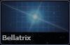
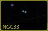
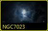
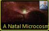
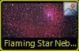
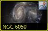
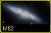

### <a name="ContextSearch">Context Search</a>

The _Context Search_ automatically searches the constellation that the reticle is currently on for deep sky objects that are listed in a catalog, such as the Messier or New General catalogs. If it finds any objects, its thumbnail image is added to the list in the lower panel. As you move the Field of View (FOV) to a new constellation, the thumbnails for the deep sky objects change automatically to reflect all the deep sky objects in the new constellation.

To obtain some information on the items in the Context Search, right-click on the thumbnails in the lower panel and select **Properties** from the menu. This will display the same information that appears in the [The Finder Scope](#TheFinderScope), for example:

|  | In this example M86 has appeared in the lower panel as a result of the context search. Selecting **Properties** from the right-click menu displays the property data without changing the view. |

#### Context Search Filter

You can restrict the list of deep sky objects displayed by the Context Search to only those objects identified in the following table, by selecting items in the **Context Search Filter**.

Click on the thumbnail images below to link to the example. And then click on the thumbnails as they appear in the top panel to bring the objects into view.

|

##### Group

 |

##### Title

 |

##### Description

 |

##### Example

 |
 **Solar System** | The Sun, or any planet or moon of our own Solar System. |  |
| **Stellar** |
 **Star** | A ball of gas held together by its own gravity and emitting its own radiation. |  |
 **Supernova** | A star (at least 8 times more massive than the Sun) that does not have enough fuel for the fusion process in its core will explode due to gravitational collapse. The explosion is called a supernova. The remaining material is known as a supernova remnant. | 
Supernova Dust Factory in M74 |
 **Black Hole** | A star (at least 10-15 times more massive than the Sun) that became a supernova and then further collapsed in on itself. The infinite density of the supernova's remnants causes the path of light to wrap around it. | 

Black Hole-Powered Jet of Electrons and Sub-Atomic Particles Streams From Center of Galaxy M87

 |
 **Neutron Star** | The ultra-dense collapsed core of a star that has undergone a supernova. | 
NASA Great Space Observatories Glimpse Faint Afterglow of Nearby Stellar Explosion |
 **Double Star** | Two stars that orbit around a common center of mass. |  |
 **Multiple Stars** | More than two stars that orbit around a common center of mass. |  |
| **Stellar Grouping** |
 **Constellation** | A grouping of stars occupying one of the 88 areas in which the sky is divided.
Note that the search filter will locate only those items that have a _Constellation_ classification set on them, which does not include all the constellations themselves, but studies relating to a constellation. | 

Young and Old Stars Found in Andromeda's Halo |
 **Asterism** | A group of stars that comprise a portion of a larger constellation whether physically related to it or not. For example, the Big Dipper is part of the Great Bear constellation, and the Belt of Orion is part of the Orion constellation. |  |
 **Open Cluster** | A physically related groups of stars formed from the same giant molecular cloud and held together by mutual gravitational attraction. |  |
 **Globular Cluster** | A spherical collection of stars that share a common origin and orbit a galaxy as a satellite. Globular clusters are very tightly gravitationally bound, which gives them their spherical shape. They are also extremely dense towards their core. |  |
 **Nebulous Cluster** | A diffuse mass of interstellar dust and gas that orbits a galaxy as a satellite. |  |
 **Dark Nebula** | An interstellar cloud of dust so dense that it obscures or absorbs light coming from stars or nebula behind it. | No current examples |
 **Giant Molecular Cloud** | A type of interstellar cloud whose density and size permits the formation of molecules, stars, and planets. |  |
 **Interstellar Dust** | Irregularly shaped, stellar material, just a fraction of a micron across, composed of silicates, carbon, ice, and/or iron compounds. This material scatters light in our line of sight and obscures or obstructs our view of stellar objects. | 
Nearby Dust Clouds in the Milky Way |
| **Nebula** |
 **Nebula** | A diffuse mass of interstellar dust and gas. These areas result from supernova explosions and are the birthplaces of new stars. |  |
 **Planetary Nebula** | A shell of gas ejected from stars, such as our Sun, at the end of their lifetimes. This gas continues to expand from the remaining white dwarf. |  |
 **Supernova Remnant** | The remains of the explosion of a massive star such as a red supergiant. |  |
 **Emission Nebula** | A nebula that shines by emitting light on a hydrogen cloud. |  |
 **Reflection Nebula** | A nebula that shines by reflecting light from nearby stars. |  |
 **Cluster of Galaxies** | A group of galaxies that are gravitationally bound together. |  |
 **Quasar** | An extremely bright object at the edge of our universe that emits massive amounts of radiation, including radio waves and x-rays. | No current examples |
| **Galactic** |
 **Galaxy** | A cluster of stars, dust, and gas held together by gravity. |  |
 **Spiral Galaxy** | A galaxy in which most of the stars are arranged in a disk and have spiral structures ("arms") that extend from the central bulge of stars. |  |
 **Irregular Galaxy** | A galaxy that does not fall into one of the three main Hubble sequence galaxy classes. |  |
 **Elliptical Galaxy** | A galaxy that does not have a disk but rather a smooth, featureless profile. They range in shape from nearly spherical to highly flattened. |  |
 **Knot** | An area within a galaxy containing a greater concentration of material (such as gas, dust, or stars) than adjacent areas. Knots appear in images as bright areas within a galaxy. |  |
| **Other** |
 **Unidentified** | Deep sky objects that have not been identified or cataloged. |  |
 **Plate Defect** | Plate defects are images containing photographic errors, such as the reflection of the telescope, color aberrations, dust, and so on. The telescope is usually reflected in an image when a single, very bright object is photographed. |  |
 **Other NGC** | The New General Catalogue is one of the most commonly-used catalogs in amateur astronomy and contains nearly 8,000 objects. |  |

#### See Also

*   [Astronomy Research](#AstronomyResearch)
*   [Screen Layout](#ScreenLayout)
*   [WorldWide Telescope User Guide](#WorldWideTelescopeUserGuide)

* * *
