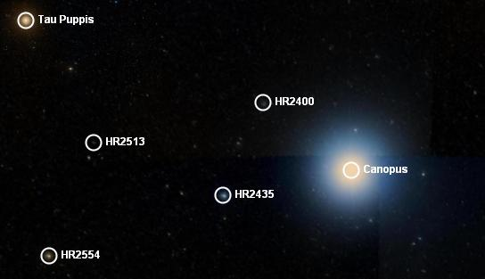

### <a name="StellarBrightness">Stellar Brightness</a>

The value in comparing and cataloging the brightness of stars was apparent to the ancient Greeks, who developed a system of six magnitudes, the brightest being level one, the dimmest level six. The difference between each level was roughly _twice-as-dim_, so a level six star would be 32 times as dim as a level one star. This system was formalized much later so that a level six star was 100 times as dim as a level one star, so the difference between each level became 2.512\. As the Sun, Moon and Planets were not part of the system to introduce them meant adding negative numbers, and to introduce stars that are only visible through telescopes the scale was extended far beyond six, and now goes from -26.73 for the Sun, to about 30 for the dimmest stars visible using the Hubble Space Telescope. It is an odd scale as it straddles zero, but the only important information in it is the difference between two numbers when calculating relative brightness - individual numbers on their own have little meaning. The reference point (a magnitude of zero) has changed from the star Polaris, to Vega, to no star in particular as all stars vary a little in brightness.

The value in this logarithmic scale is that it keeps the numbers in a small range. If the brightness scale was linear and not logarithmic it would have to extend from zero to one trillion simply to include distant stars (and ignoring the brightness of any object in the Solar System). The following image shows the brightness of a number of stars around Canopus (the second brightest distant star in our night sky):

|  |
**Tau Puppis

HR2400

HR2513

Canopus

HR2435

HR2554** |
2.93  

5.6

6.57

-0.72

4.39

4.4 |

The brightness magnitude usually quoted for a star is the _apparent magnitude_, which is how bright it appears to us on Earth. The _absolute magnitude_ of an object is how bright it would appear at a standard distance away from the observer (a distance which has been fixed at 10 parsecs or 32,616 light years). Both figures are often quoted in catalogs of stars, the [Finder Scope](#TheFinderScope) quotes only the apparent magnitude. Apparent magnitude is often referenced as the letter V, absolute magnitude as the letters MV.

To calculate the relative brightness of one object to another (either apparent or absolute magnitude) use the following C# code:

| private double calculateRelativeBrightness(double b1, double b2)
{

    return (Math.Pow(2.512d, b2 - b1));

}
 |

Using this program gives the following relative magnitudes of brightness:

|

##### First object

 |

##### Second object

 |

##### Relative Magnitude

##### (V scale)

 |

##### Relative Magnitude

##### (linear)

 |
| **Sirius
(-1.46)** | **Canopus
(-0.72)** | 0.77 | 1.977 |
| **Spica****
(1.04)** | **HR5597
(6.37)** | 5.29 | 135.552 |
| **Canopus
(-0.72)** | **HR2513
(6.57)** | 7.29 | 1600.137 |
| **Alpha Centauri
(-0.01)** | **Proxima Centauri
(11.05)** | 11.06 | 26559.333 |
| **Venus
(-4.7)** | **Neptune
(7.8)** | 12.5 | 100056.530 |
| **Spica****
(1.04)** | **IC3922
(14.8)** | 13.76 | 319352.396 |
| **The Sun
(-26.73)** | **The full moon
(-12.6)** | 14.13 | 449032.157 |
| **The Sun
(-26.73)** | **Proxima Centauri
(11.05)** | 37.78 | 1,296,408,329,574,280.0 |

#### See Also

*   [Astronomy Research](#AstronomyResearch)
*   [Tutorial: Visiting the Neighbors](#TutorialVisitingtheNeighbors)
*   [WorldWide Telescope User Guide](#WorldWideTelescopeUserGuide)

* * *
