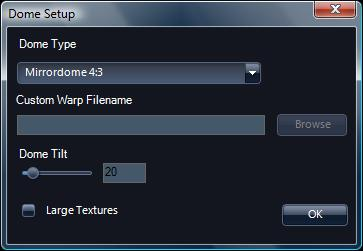

## <a name="Configuration">Configuration</a>

This section contains technical information on how to configure WorldWide Telescope to run in environments other than on a single desktop or laptop client computer.

*   [Regional Data Cache](#RegionalDataCache)
*   [Multi-Monitor Cluster](#MultiMonitorCluster)

*   [Single Slave Computer](#SingleSlaveComputer)
*   [Remote Starting of the Multi-Monitor Cluster](#RemoteStartingoftheMultiMonitorCluster)

*   [Single-Projector Planetarium](#SingleProjectorPlanetarium)

*   [Custom Warp Files](#CustomWarpFiles)

*   [Multi-Projector Planetarium](#MultiProjectorPlanetarium)

*   [Projection Designer Configuration](#ProjectionDesignerConfiguration)
*   [External Blending Configuration](#ExternalBlendingConfiguration)

#### See Also

*   [WorldWide Telescope User Guide](#WorldWideTelescopeUserGuide)

* * *

### <a name="RegionalDataCache">Regional Data Cache</a>

A regional data cache can be set up to improve data download performance on both a small and a large scale. A small scale data cache might be for a classroom of students, by setting up a local cache on the student network the number of simultaneous requests across the internet for one piece of data, a tour perhaps, can be greatly reduced. For the student all they have to do is enter a URL using the [Settings Menu Entries](#SettingsMenuEntries).

A large scale data cache could be setup for a region of the world where there is a requirement for a significant amount of data in a local language. Again all the users have to do is enter the URL.

In both cases the cache simply maintains a copy of the most recently requested data, so if a user requests some data that is available on the cache, then it is immediately downloaded from the cache rather than a request sent to more distant servers.

Note that the use of a regional data cache will only improve performance if the connection from computers that are to use it is better to the cache than it is to the specified data servers (such as the WorldWide Telescope data servers), which should certainly be the case on a local area network, but might not be the case across national or regional boundaries. Note also that the data is also cached locally on the user's computer whether a regional data cache is in use or not. This means that the improved performance of a regional cache is limited to the first use of the data by any user.

To set up a regional data cache, either on a small or large scale, contact the [WorldWide Telescope support team](http://www.worldwidetelescope.org/help/SupportHelp.aspx?Page=IssuesAndBugs) for details.

#### See Also

*   [Configuration](#Configuration)
*   [Settings Menu Entries](#SettingsMenuEntries)
*   [WorldWide Telescope User Guide](#WorldWideTelescopeUserGuide)

* * *

### <a name="MultiMonitorCluster">Multi-Monitor Cluster</a>

A straightforward example of a multi-monitor cluster is to have a single master computer, and a matrix of slave computers each rendering a portion of the view.

| 
Hoag's Object - a rare ring galaxy - displayed on a 4 x 3 cluster. With a resolution on each monitor of 1920 x 1200 the full image is 27 Megapixels.

The master computer is shown lower right.
 |

To setup a multi-monitor cluster, go through the following procedure:

1.  Setup the hardware required, with each computer installed with WorldWide Telescope. Each monitor is run by a single computer, so the hardware setup may take some time, and require some additional hardware, such as the support structure shown in the image above. The computers must all be linked to the same local network. The identification system used for a matrix of computers and monitors is shown in the following table (with the four by three matrix shown in the image above used as an example):

| 0,0 | 1,0 | 2,0 | 3,0 |
| 0,1 | 1,1 | **2,1** | 3,1 |
| 0,2 | 1,2 | 2,2 | 3,2 |

3.  Some of the bios settings for each of the slave computer need to be changed. This process is different for each make of computer - on some it involves pressing F2 during the startup process. This will bring up a bios settings menu, and make the following changes:
    1.  Ensure the Ethernet card is on. For example on a Dell computer, go to **Power Management** and set the **Low Power Mode** setting to **Off**.
    2.  Enable a remote computer to start up this one. For example on a Dell computer, also in **Power Management** set the **Remote startup** setting to **On**.
4.  Turn off any screen savers on the slave computers.
5.  If it is necessary to remotely edit the config.xml files, then enable remote login. The following links may be useful:

    *   [How to use the Remote Desktop feature of Windows XP Professional](http://support.microsoft.com/kb/315328)
    *   [Remote Desktop Connection for Windows 7 and Vista](http://www.microsoft.com/windows/windows-vista/features/remote-desktop-connection.aspx?tabid=1&catid=1)

6.  For all the slave computers in the matrix create a configuration file (called config.xml) in the root C: folder, with the following contents:

|

##### XML

 |

##### Description

 |
| **<?xml version="1.0" encoding="utf-8"?>** |
| **<DeviceConfig>** |
| **<Config>** |
| **<Device** |
| **    MonitorCountX="4"** | The number of monitors in the X axis of the matrix. |
| **    MonitorCountY="3"** | The number of monitors in the Y axis of the matrix. |
| **    MonitorX="2"** | The X position of the computer in the matrix. The computer (shown in bold in the table above) is shown as the example value. Note that this index starts at zero. |
| **    MonitorY="1"** | The Y position of the computer in the matrix. Note that this index starts from zero. |
| **    Master="False"** | Set to "**False**". |
| **    Width="1920"** | The desired screen resolution width for the slave. |
| **    Height="1200"** | The desired screen resolution height for the slave. |
| **    Bezel="1.07"** | As the physical edge of the monitors must be taken into account, certain pixels will not be rendered (those that would theoretically appear behind the edges of the monitors). The Bezel factor is the ratio of the size of the monitor to the size of the screen. An estimate of 107 percent is used in this example.
The minimum Bezel value is 1.0.
 |
| **    ConfigFile=""** | The following three entries should be present, but with empty strings as parameters. |
| **    BlendFile=""** |
| **    DistortionGrid="">** |
| **</Device>** |
| **</Config>** |
| **</DeviceConfig>** |

8.  If the WWTRemoteControl utility is _not_ being used, add WorldWide Telescope on the slave computers to the start up list of programs for that computer (this is done through the Control Panel).
9.  For large clusters consider adding a proxy server to the setup, such as an [ISA Proxy Server](http://www.microsoft.com/forefront/edgesecurity/isaserver/en/us/default.aspx), to reduce the amount of traffic over the web.
10.  Finally, on the master computer, start WorldWide Telescope, and in the **Settings > Advanced** menu, select **Master Controller**. From now on the slave computers (when they are running WorldWide Telescope) should display their section of the view on the master computer.

<h7>Restrictions</h7>

*   Currently the slave computers will not show text or graphic overlays when playing a tour.
*   The slave computers will not respond to changes in the **View** or **Settings** menu - they will only run with the default settings.

#### See Also

*   [Configuration](#Configuration)
*   [Settings Menu Entries](#SettingsMenuEntries)
*   [WorldWide Telescope User Guide](#WorldWideTelescopeUserGuide)

* * *

#### <a name="SingleSlaveComputer">Single Slave Computer</a>

If remote control from a master computer of a single slave computer is required, then create a confix.xml file on the slave computer such as:

| **  <?xml version="1.0" encoding="utf-8" ?>
  <DeviceConfig>
     <Config>
        <Device MonitorCountX="1" MonitorCountY="1" 
                MonitorX="0" MonitorY="0" 
                Master="False" 
                Width="1600" Height="1200" 
                Bezel="1.0" 
                ConfigFile="" BlendFile="" DistortionGrid="" /> 
     </Config>
  </DeviceConfig>
** |

#### See Also

*   [Configuration](#Configuration)
*   [WorldWide Telescope User Guide](#WorldWideTelescopeUserGuide)

* * *

#### Remote Starting of the Multi-Monitor Cluster

With a large cluster such as the one shown in the image in the previous section, it is helpful to automate the startup and shutdown of all the slave computers from the master. To do this use the **WWTRemoteControl** utility. For this to work though, go through the following procedure:

1.  On the master computer run the **WWTRemoteControl** utility program.
2.  Click the **Node List** button and add the MAC Address (physical address component) of each slave computer to the list. To get the MAC Address of a computer, open up a command-prompt window and type **getmac**. The address that is required is under the column **Physical Address** and should be six pairs of hexadecimal digits separated by hyphens.
3.  When the node list is complete, close that dialog and return to the main dialog.
4.  Click **Wake All** to turn on all of the slave computers.
5.  When all the slave computers have started, click **Launch All** to start WorldWide Telescope.
6.  When WorldWide Telescope is up and running on each slave, control the view from the master computer.
7.  Click **Close All** to finish the session and **Shutdown All** to shutdown the slave computers.
8.  The node list is saved to the application properties for the utility, so the next time it is run there is no need to re-enter the node list.

#### See Also

*   [Configuration](#Configuration)
*   [Multi-Monitor Cluster](#MultiMonitorCluster)
*   [WorldWide Telescope User Guide](#WorldWideTelescopeUserGuide)

* * *

### <a name="SingleProjectorPlanetarium">Single-Projector Planetarium</a>

A single projector planetarium is typically a small planetarium up to around 20 feet in diameter. To see plans and instructions for building a planetarium suitable for a small class of students, refer to [WorldWide Telescope Planetarium](http://www.worldwidetelescope.org/docs/WorldWideTelescopePlanetarium.html). The key to single-projector planetariums is that the output has to be warped in such a way that it appears correct on the dome (or geodesic dome). This warping is most noticeable in the rendering of lines (rather than spheres). The image below shows Saturn and the Milky Way warped for a 16:9 projector.

|  |

Select **Full Dome** from the [View Menu Entries](#ViewMenuEntries) to initiate setup for a small planetarium.

|  | Before clicking on **Full Dome** to activate the warping, select **Dome Setup** to provide a few basic parameters.

**Start Listener** is a toggle setting, used in [Multi-Projector Planetariums](#MultiProjectorPlanetarium), so leave this unchecked.

**Detach Main View to Second Monitor** will turn the current screen blank, and input control is transferred to the second view (dome or second monitor). |
|  | For **Dome Type** select from the drop down list:
**Fisheye**
**Mirrordome 16:9**
**Mirrordome 4:3**
**<Custom Warp>**

The 16:9 or 4:3 numbers refer to the aspect ratio of the projector. These are the two most common specifications, however the option to create [Custom Warp Files](#CustomWarpFiles) for other curvatures is provided.

The **Dome Tilt** angle, in degrees, locates the center of interest. For the [WorldWide Telescope Planetarium](http://www.worldwidetelescope.org/docs/WorldWideTelescopePlanetarium.html) dome tilted at 20 degrees, the center of interest is 70 degrees. For a classic horizontal dome enter 90 degrees, for a kiosk look-ahead type planetarium enter 0 degrees.

Check **Large Textures** at higher resolutions, such as 1920x1080 or 1920x1200\. With lower resolutions (1024x768 or 800x600) leave this unchecked so that no down-sampling is necessary. Also note that some graphics cards will not support large textures, and that large textures require four times the memory and pixel processing of small textures. |

A typical setup for running WorldWide Telescope in a small telescope would be to have the software running on a laptop, with a 16:9 projector connected to the computer using an HDMI cable. When giving presentations in the planetarium it can be helpful to have the image present on both the dome and the laptop screen, in order to point out objects of interest with the mouse, for example. If this is the case then consider setting the screen resolution of the laptop to match the aspect ratio of the projector; the following table shows some common options:

|

##### Screen resolution

 |

##### Aspect ratio

 |
| 800 x 600  | 4:3 |
| 1024 x 768 | 4:3 |
| 1152 x 864 | 4:3 |
| 1280 x 720 | 16:9 |
| 1280 x 960 | 4:3 |
| 1600 x 1200 | 4:3 |
| 1920 x 1080 | 16:9 |

If the option to **Detach Main View to Second Monitor** is used then there is no need to match screen resolution with aspect ratio. Also note that an [Xbox Controller](#XboxController) can be used to navigate in WorldWide Telescope, which can make controlling the view in the dome more comfortable.

#### See Also

*   [Configuration](#Configuration)
*   [View Menu Entries](#ViewMenuEntries)
*   [WorldWide Telescope User Guide](#WorldWideTelescopeUserGuide)

* * *

#### <a name="CustomWarpFiles">Custom Warp Files</a>

Custom warp files should be used when the aspect ratio of the projector is not 16:9 or 4:3, or you are using a variant of the standard fisheye projector.

Warp files have a .data extension and can be created using a third-party tool called _meshmapper_ tool described at the following website:

[http://local.wasp.uwa.edu.au/~pbourke/miscellaneous/domemirror/meshmapper/](http://local.wasp.uwa.edu.au/~pbourke/miscellaneous/domemirror/wwt/)

This website also contains a lot of interesting and useful information about small planetariums.

#### See Also

*   [Configuration](#Configuration)
*   [WorldWide Telescope User Guide](#WorldWideTelescopeUserGuide)

* * *

### <a name="MultiProjectorPlanetarium">Multi-Projector Planetarium</a>

The following section applies to the use of WorldWide Telescope in planetariums that use multiple projectors and a blended image. Typically these are large and commercial or university planetariums.

Projection into a large planetarium is often done using six projectors, with each projector projecting onto an area of the dome - with special blending done to mask the edges. The following diagram shows two common six-projector projection layouts:

|  |

There are two methods of projection that can be configured in WorldWide Telescope, the first using P_rojection Designer_ software, the second using an external blending system such as _Global Immersion�_. One of the main differences between the two is that blending is done by WorldWide Telescope when using _Projection Designer_, but is usually done in dedicated hardware when using external blending. The two methods require different parameters in the config.xml file.

*   [Projection Designer Configuration](#ProjectionDesignerConfiguration)
*   [External Blending Configuration](#ExternalBlendingConfiguration)

#### See Also

*   [Configuration](#Configuration)
*   [WorldWide Telescope User Guide](#WorldWideTelescopeUserGuide)

* * *

#### <a name="ProjectionDesignerConfiguration">Projection Designer Configuration</a>

Follow this link for more detailed information on [Projection Designer](http://orihalcon.jp/projdesigner/). Use Projection Designer to calibrate and set blending parameters for the dome, then define the configuration file as follows:

|

##### XML

 |

##### Description

 |
| **<?xml version="1.0" encoding="utf-8"?>** |
| **<DeviceConfig>** |
| **<Config>** |
| **<Device** |
| **    MonitorCountX="1"** | Set to **"1"**. |
| **    MonitorCountY="1"** | Set to **"1"**. |
| **    MonitorX="1"** | Set to **"1"**. |
| **    MonitorY="1"** | Set to **"1"**. |
| **    Master="False"** | Set to "**False**". |
| **    Width="1"** | Set to **"1"**. |
| **    Height="1"** | Set to **"1"**. |
| **    Bezel="1.0"** | Set to **"1.0"**. |
| **    MultiChannelDome="True"** | Set to "**True**". |
| **    DomeTilt="20"** | Tilt of the point of focus above the spring line of the dome, in degrees. |
| **    ConfigFile="path\configfile"** | The path to the Projection Designer configuration file. Refer to Projection Designer documentation for the format and purpose of the files. |
| **    BlendFile="path\blendfile"** | The path to the Projection Designer blend file. |
| **    DistortionGrid="path\distortiongrid">** | The path to the Projection Designer distortion grid. |
| **</Device>** |
| **</Config>** |
| **</DeviceConfig>** |

#### See Also

*   [Configuration](#Configuration)
*   [Multi-Projector Planetarium](#MultiProjectorPlanetarium)
*   [Settings Menu Entries](#SettingsMenuEntries)
*   [WorldWide Telescope User Guide](#WorldWideTelescopeUserGuide)

* * *

#### <a name="ExternalBlendingConfiguration">External Blending Configuration</a>

Follow this link for more detailed information on [Global Immersion](http://www.globalimmersion.com/Default.asp).

Define the configuration file as follows:

|

##### XML

 |

##### Description

 |
| **<?xml version="1.0" encoding="utf-8"?>** |
| **<DeviceConfig>** |
| **<Config>** |
| **<Device** |
| **    MonitorCountX="1"** | Set to **"1"**. |
| **    MonitorCountY="1"** | Set to **"1"**. |
| **    MonitorX="1"** | Set to **"1"**. |
| **    MonitorY="1"** | Set to **"1"**. |
| **    Master="False"** | Set to "**False**" |
| **    Width="1"** | Set to **"1"**. |
| **    Height="1"** | Set to **"1"**. |
| **    Bezel="1.07"** | Set to **"1.0"**. |
| **    ConfigFile=""** | The following three entries should be present, but with empty strings as parameters. |
| **    BlendFile=""** |
| **    DistortionGrid=""** |
| **    MultiChannelDome="True"** | Set to "**True**". |
| **    Heading="0"** | The left-right rotation of the projection, in degrees. |
| **    Pitch="0"** | The up-down rotation of the projection, in degrees. |
| **    Roll="0"** | The rotate-left, rotate-right rotation of the projection, in degrees. |
| **    UpFov="0"** | The field of view up from the center point, in degrees. |
| **    DownFov="0"** | The field of view down from the center point, in degrees. |
| **    DomeTilt="20"** | Tilt of the point of focus above the spring line of the dome, in degrees. |
| **    Aspect="1.390531">** | Aspect ratio of the projection, the ratio of width/height. |
| **</Device>** |
| **</Config>** |
| **</DeviceConfig>** |

#### See Also

*   [Configuration](#Configuration)
*   [Multi-Projector Planetarium](#MultiProjectorPlanetarium)
*   [Settings Menu Entries](#SettingsMenuEntries)
*   [WorldWide Telescope User Guide](#WorldWideTelescopeUserGuide)
