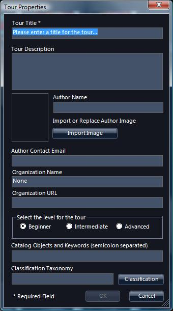
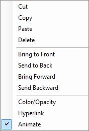
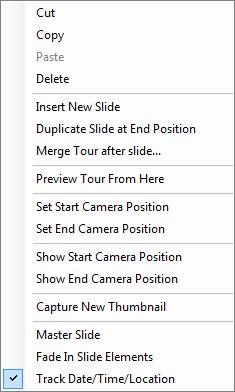
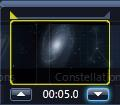
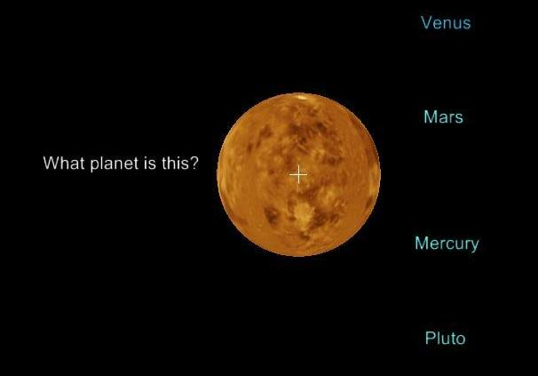
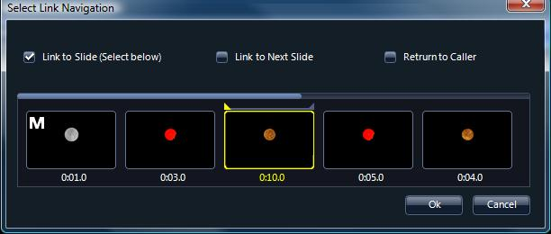
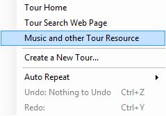

## <a name="GuidedTours">Guided Tours</a>

Guided Tours are annotated and animated slide-shows, created to demonstrate a feature of WorldWide Telescope (such as the **Welcome** tour), galaxies (such as the **Sombrero Galaxy** tour), or different views and perspectives of the sky and Earth (such as the **Multiple Worlds** tour). Feel free at any time to pause a tour, explore on your own (with multiple information sources for objects at your fingertips), and rejoin the tour where you left off.

Highly rated tours include **Tours > Galaxies > Universal Beauty** -- a tour of spectacular sights in the Universe set to music, created by High Skies. For a clear explanation of the search for Earth type planets, visit **Tours > Planets > Search for Extra Solar Planets**, created by the Harvard-Smithsonian Center for Astrophysics. Or select **Tours > Galaxies > Dust & Us** to join Harvard Astronomer Alyssa Goodman on a journey showing how dust in the Milky Way Galaxy condenses into stars and planets. Select **Tours > Cosmology > Dark Matter at Abell 1689** to take a tour with University of Chicago Cosmologist Mike Gladders to see a gravitational lens bending the light from galaxies allowing you to see billions of years into the past. Looking to the future, our own Milky Way galaxy is expected to collide with the Andromeda galaxy in a few billion years time, which is explained in the **Tours > Galaxies > Impact with M31** tour, created by Francis Reddy of Astronomy Magazine. The apparent result of a galactic collision is shown in the **Tours > Galaxies > M82 Cigar Galaxy** tour by Robert Hurt of the Spitzer Space Telescope. Other tours cover nebula, eclipses, black holes, the Apollo programs, supernova and many other topics.

You can also create your own tours, and share them with friends and colleagues.

*   [Playing a Tour](#PlayingaTour)
*   [Creating a Tour](#CreatingaTour)
*   [Creating an Interactive Tour](#CreatinganInteractiveTour)
*   [Guided Tours Menu Entries](#GuidedToursMenuEntries)

#### See Also

*   [WorldWide Telescope User Guide](#WorldWideTelescopeUserGuide)

* * *

### <a name="PlayingaTour">Playing a Tour</a>

To display the range of tours supplied with WorldWide Telescope, click on **Guided Tours**. Thumbnails will appear in the top pane for many different types of tour. These are folders of tours. Click on one of the folder thumbnails to view the range of actual tours. If a thumbnail is a direct link to a tour, it will contain a large **T** in the top right hand corner. If a thumbnail is for a folder of tours, it will not contain the **T**, and by default is an image of a folder.

To play a tour, click the thumbnail:

|  |

Alternatively, hover the mouse over the thumbnail so that the tour properties appear, and then press the play arrow:

|  |

To pause a tour, click the Escape key. You are then free to explore at will. When a tour is playing the top and lower panes are hidden. To bring these panes into view, simply hover the mouse over where they normally appear.

To restart the tour, press the play arrow in the top left corner of the screen. If the tour is not visible in the top panel, click the name of the tour in the menu bar to bring it up.

Note the thumbnails in the top panel show the tour stops (the large **M** that appears in the first image indicates that this is a master slide - refer to [Creating a Tour](#CreatingaTour) for more details).

|  |

To cancel a tour, click the **X** by the tour name in the menu bar:

|  |

To close a tour after it has completed, either click the **X** by the tour name, or the **Close Tour** button that appears in the final credits. In order to transmit your rating of the tour, click on one or more stars. If you enter too many stars and reconsider your opinion, click the star to the left to reduce the number of stars. Click **Close Tour** and this rating will be included in the average rating presented to other users.

|  |

To navigate the folders of tours click on the thumbnails to open up folders and tours,  and click on the text to step back. For example, clicking **Nebula** in the image below will close that folder and go back to display the contents of the higher level **Tours** folder:

|  |

###### Notes

*   There are other ways to start a tour. For example from the **Explore > Open > Tour...** menu, from community data, and from other data collections that contain tours.
*   When a tour is selected, a copy of it is downloaded to your local computer, and the entry **Save Tour As...** is added to the [Guided Tours Menu Entries](#GuidedToursMenuEntries). This tour can then be played again without internet access, and edited (though be mindful of copyright and ownership issues).

#### Playing Tours in Demo Mode

Refer to the [Guided Tours Menu Entries](#GuidedToursMenuEntries) section for details on how to play one or more tours in demo mode (that is, continuously).

#### See Also

*   [Guided Tours](#GuidedTours)

* * *

### <a name="CreatingaTour">Creating a Tour</a>

Creating your own tour can be as simple as annotating a few images showing deep sky objects, or locations on Earth. Or a tour can be as immersive as combining images with art and music and speech to illustrate and enhance a complex argument or experience.

#### Tour Properties Dialog

To create a tour, click **Guided Tours > Create a New Tour...**, or **Explore > New > Slide-based Tour...,** which has the same effect. The first thing that you will see is the **Tour Properties** dialog. Give the new tour a title (with a recommended limit of 35 characters, otherwise the title will be resized or truncated), and add as many of the properties as you can now. However these properties can be edited later, and some of the details may well not be finalized until you have completed the content of the tour.

|  | The information entered into this dialog is for informational purposes for the users that might run the tour.

The author image should measure 70 pixels wide by 94 in height.

The [WorldWide Telescope Data Files Reference](http://www.worldwidetelescope.org/docs/WorldWideTelescopeDataFilesReference.html) document contains a full list in the Taxonomy appendix for use with the **Classification Taxonomy** entry. Properly classifying guided tours will help users locate the tour when searching. (Note the search feature currently only applies to tours added to the default collection).

 |

#### Tour Editing Pane

Click **OK** to close the Tour Properties dialog and bring up the tour editing pane:

|  |

Adding slides to your tour could hardly be easier. Simply navigate to where you want to be and click **Add a Slide**. Note that when you do this a thumbnail image of the current view is taken, and added to your tour. You can change the view using the **Look At** and **Imagery** lists between slides though if you do the tour will jump sharply from one image to the next and not scroll smoothly.

The key editing elements are to the right of the image above. **Tour Properties** will bring up the original properties dialog, for editing. **Music**, **Voiceover**, **Text**, **Shapes** and **Picture** items can be added to the slide. The **Show Safe Area** checkbox can be used if you are using a wide screen, but plan on the tour being fully visible to users of narrower screens - checking it simply shades out the wider area.

*   **Music**: MP3 and WMA files are the supported formats for both music and voice. Browse for a suitable piece. Note that there are not fade-in, fade-out or other sound effects available in WorldWide Telescope, so applying effects must be done independently in audio editing software. Only volume can be adjusted while editing a tour. If a piece of music is attached to an individual slide, and the piece is longer than the slide display time, the music will cut off suddenly at the end of the slide. The recommended approach is to attach music to the starting [Master Slide](#MasterSlides), so that the music runs without glitches throughout the tour. Start by completing a silent version of the tour, so you know exactly how long the tour is, then locate suitable music and apply fading and perhaps other effects (using quality music editing software) and finally apply it to the tour when the music and tour are in a completed state.  Note that the entire music file is embedded in the tour binary, so it is a good idea to fade out and truncate the music at exactly the right time, so as not to store unnecessary data.
*   **Voiceover**: Use a similar procedure as for music, recording and editing the audio using quality software. The Sound Recorder accessory provided with Windows can be used to create voiceovers if you have a microphone attached to your computer, but without any editing features it is of limited utility. The difference between voiceovers and music is that voiceovers _should_ be applied to each individual slide, to get the timing right. Both music and voice can be rendered simultaneously, though adjust the volumes appropriately.
*   **Text**: Enter the text into the dialog, along with font and color information. Note that the text can be resized on the slide, so there is no need to get the point size perfect within this dialog. If a background color is required for the text, select one after clicking on the palette icon in the text dialog. Add line breaks by pressing ENTER where required.

    Click **Save** to add the text to the slide. Then use the resize and rotate handles as necessary.

    | 
    To select white as a color, click on any of the white space around the color picker. The two colored boxes at the bottom of the color picker show the old and new colors respectively. |

*   **Shapes**: Circles, rectangles, open rectangles, rings, lines, arrows and stars are supported shapes. Once added to the screen, edit some of their properties using the right click menu shown below.

    |  | Use the **Bring to...** and **Send...** options to layer multiple images appropriately.

    Selecting the **Color/Opacity** entry will bring up the color picker dialog shown above.

    Selecting **Hyperlink** will add a URL to the tour. If the user clicks on the shape, the URL will be opened in the default browser in a separate window. Note that no indication that this is a link is provided automatically -- this indication should be provided by the tour author.

    **Animate** enables the movement, recoloring and resizing of text, shapes or pictures. To animate an object, first move it, size it and color it at the location in the view you wish it to start. Then click **Animate**. Then drag the object to the location you wish the animation to end, and recolor and resize the object if required. Then deselect the object. Animations are only enabled between a starting point and an ending point. Right-click the slide you are working on, select **Preview Tour From Here...** and test the animations. Each animated object should smoothly move, recolor and resize over the time period assigned to the slide. |

*   **Picture**: Jpeg, Tiff, Png and [FITS](#FITSImages) still images can be added to the slide. Similar to text and shape entries, picture entries can be resized and rotated on the slide. The same right click menu available for **Shapes** can be used with pictures.

#### Slide Editing Menu

Some editing options are not quite so visible. Right click on a slide to bring up a menu with a range of detailed options:

| 

**Merge Tour after slide...** will insert another tour to become part of the tour being edited.

To set the start and end camera position for a slide, simply navigate to the required angle, then click **Set Start Camera Position**. Then navigate to the required ending angle, and click **Set End Camera Position**. When the slide is shown in the tour, the view will smoothly animate from the starting to ending positions.

Use **Capture New Thumbnail** to replace the thumbnail image of a selected slide.

To add a slide for a particular time -- say to capture an eclipse or a crescent moon or a certain alignment of a star or planet, for example -- go through the following procedure:

1.  Click **View** then open the **Date Time Selection** pane from the **Observing Time** pane.
2.  Click the push-pin icon in the **Date Time Selection** pane to undock it.
3.  Use the arrows to select the required time. Click **Apply** as many times as necessary to locate the exact time you want. Do not click **OK** so the **Date Time Selection** pane remains open. So far you have not edited the tour, but just selected the right data and time.
4.  Click the tour title bar to return to editing the tour. Create the new slide if it does not already exist and ensure the slide that the date and time applies to is highlighted with a yellow outline. Right-click to bring up the editing context menu, and ensure **Track Date/Time/Location** is selected.
5.  Right-click the slide again to bring up the menu again, and this time select **Set Camera Start Position**.
6.  In the **Date Time Selection** pane (that should still be storing the required date and time for the camera), click **OK**. This edits the tour and applies the date and time to the slide.
7.  Preview your tour to ensure you have done this procedure correctly.

 |

By default each slide will appear for 10.0 seconds. To change this click on the pane just below each slide, and use the up and down arrows to change the number of seconds.

|  | As an alternative to using the up and down arrows, mouse over the time itself, and edit the numbers by hand.

Note that the time taken for a tour is greater than the sum total of times for each slide, as the transition times from one slide to another are included in the total run time. |

#### <a name="MasterSlides">Master Slides</a>

Before progressing to add more and more slides, first consider creating a master slide. Master slides are templates that are applied to all subsequent slides, containing watermarks, logos, copyright messages, and so on. One tour can have one or more master slides -- so the master slide can change as the tour progresses, though only the most recent master slide applies to any one slide in a tour. All music, voiceovers, text, shapes and pictures on a master slide will be applied to all subsequent slides.

If background music is to be applied to your tour, consider starting the tour with a master slide with a display time of only a second or two, and attaching the music file to this one slide.

To make a slide a master slide, right click to bring up the context menu, then select **Master Slide**. A bold **M** will appear on the thumbnail. To revert a slide to normal status, bring up the menu and click **Master Slide** again.

#### Slide Title

To add a title to a slide, click on the area below the thumbnail but inside the yellow bounding rectangle, and type up to 15 characters as a title, for example:

|  | Note that a selected slide can be dragged and dropped to a new location in the displayed list of slides. |

#### Control Views and Settings

To change current view settings for your slides, go into the **View** or **Settings** menus and make the appropriate changes for the selected slide (for example, to turn Constellation Figures or Boundary lines on or off). To go back to editing the tour, click on the name of the tour in the menu bar.

**View** and **Settings** entries can be changed for each slide.

#### Completing the Tour

Click **Save** in the tour editing pane to save off the tour at any stage. Close the tour when it is completed by clicking the **X** by the name in the menu bar:

|  |

#### <a name="SharingtheTour">Sharing the Tour</a>

Tours can be sent by email to friends and colleagues. A tour is stored in a .wtt file, and can be sent as an attachment to a normal email. The file size of the tour should obviously be below the limit applied by your ISP.

Well produced and interesting tours could also be submitted to a community you are a member of, or for consideration by Microsoft Research for inclusion in WorldWide Telescope itself.

#### See Also

*   [Creating a Community](#CreatingaCommunity)
*   [Guided Tours](#GuidedTours)
*   [WorldWide Telescope User Guide](#WorldWideTelescopeUserGuide)

* * *

### <a name="CreatinganInteractiveTour">Creating an Interactive Tour</a>

An interactive tour is a tour where the user is required to give feedback. This feedback could be in response to a menu of possible selections, such as in a quiz with multiple choice answers, or even as simple as "where do you want to go from here?". The main difference between an interactive tour and a normal tour is that an interactive tour will not follow a set sequence of events, but will instead jump from one stop on the tour to another that has been selected by the user, or is in response to input from the user.

The basic process for creating an interactive tour is very similar to that of creating any other tour, this section just covers the differences. So if you are not familiar with the process of creating a tour, start with the [Creating a Tour](#CreatingaTour) section.

Scenarios for interactive tours include providing "Back" buttons in normal tours, creating coursework quizzes - perhaps at the end of a normal tour, the students can be quizzed on its contents, and in providing some control over the flow of a complex or long tour.

#### Tour Menu Selection

The following images shows a typical menu system that might appear in a quiz. The blue text entries are all links to other slides. The white text entries are not linked to other slides.

| 
The question (or menu) slide. |
| 
Three text entries in the question slide are linked to the "Wrong" answer slide: Mars, Mercury and Pluto.

The "Try again" text will return the user to the question slide. |
| 
Only the correct text entry on the question slide is linked to the "Correct" answer slide: Venus.

The "This is Venus" text will more the user onto the next question. |

In order to create the menu system shown above, _first_ create all the required slides with the appropriate text on them. Next right click on each text entry in turn, and click on **Link to Slide**, this will bring up the following dialog:

| 
Slides can be linked to another specific slide with the **Link to Slide (Select below)**  option. This is the appropriate selection for all the menu entries - linking "Venus" to the correct slide, and the rest to the "Wrong" slide.

The "Wrong" slide may be used many times, so its "Try again" text should be linked to **Return to Caller** - so the user will be returned to the question they got wrong.

The correct answer slide will probably be linked to the next question with the normal **Link to Next Slide** option. |

Any of the overlays - text, shapes or pictures - can be turned into active links. There are a few things to consider when creating an interactive rather than normal tour:

*   Master slides apply to the slides that follow it in linear order, not necessarily the order that the slides will be displayed. Consider making every slide that links to, or from, a slide out of normal sequence a master slide.
*   In order to prevent the timeout of a menu slide (or any slide with links on it that a user should select one of) from simply moving on to the next slide, link that slide to itself. For example, the menu and "Wrong" slides should link back to themselves, however the "Correct" slide can simply timeout and move on to the next question slide.
*   Music will not necessarily be rendered smoothly when the user jumps around the slides.
*   Links can be applied to entire slides, rather than to overlay entries. For example, instead of the "Wrong" slide having a "Try again" button the slide could be linked with **Return to Caller**, in which case it would simply timeout and then return the user to the question slide. Or of course, both systems could be used.

#### See Also

*   [Creating a Community](#CreatingaCommunity)
*   [Guided Tours](#GuidedTours)
*   [WorldWide Telescope User Guide](#WorldWideTelescopeUserGuide)

* * *

### <a name="GuidedToursMenuEntries">Guided Tours Menu Entries</a>

Clicking on the down arrow below **Guided Tours** opens up the menu entries.

| 
 | **Tour Home**, **Tour Search Web Page**, and **Music and other Tour Resource** link to Microsoft Research WorldWide Telescope websites.

To play tours in demo mode (that is, in a continuous loop) select **Auto Repeat** then one of:
**One**: play the selected tour continuously
**All**: start with the selected tour, and cycle through the other tours in the top pane continuously.
 

**Undo** and **Redo** are enabled appropriately while editing a tour. |

#### See Also

*   [Guided Tours](#GuidedTours)
*   [WorldWide Telescope User Guide](#WorldWideTelescopeUserGuide)

* * *
