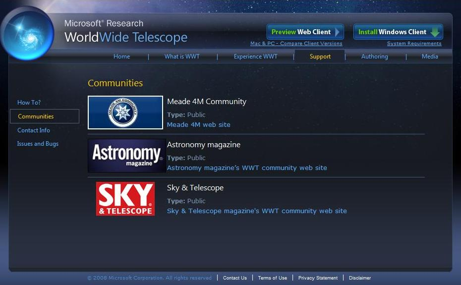

## <a name="Communities">Communities</a>

Communities are public or private groups that can share data using WorldWide Telescope.

Communities are great places to meet and share information with people who share your astronomy interests. Often communities are associated with product manufacturers, telescope manufacturers for example, or scientific communities, such as Harvard/Smithsonian or NASA. Many communities let you join even if you do not purchase their products or belong to their institution, but joining requirements will vary depending on the community.

You can also create your own community, populate it with items that are of specific interest (tours, images, links to blogs, and so on), and email a community link to your colleagues so they can join in.

*   [Joining a Community](#JoiningaCommunity)
*   [Creating a Community](#CreatingaCommunity)

* * *

### <a name="JoiningaCommunity">Joining a Community</a>

Joining a public community can be done both from the community menu, and from the community collection, by selecting **Join a Community**. This will link you to the WorldWide Telescope website:

|  |

Click the links on this website to join one or more communities. After you join a community, its logo displays in the top panel when you select **Communities** and when you want to connect to it, just click the thumbnail logo, and enter any log in information, if necessary.

To join a private community, click on the .wtml file that you should have received by email. If the community has been set up correctly, this will open WorldWide Telescope with the associated community collection data visible.

#### See Also

*   [Communities](#Communities)

* * *

### <a name="CreatingaCommunity">Creating a Community</a>

Creating a community involves writing .wtml data files, so this is covered in the **Communities** section of the [WorldWide Telescope Data Files Reference](http://www.worldwidetelescope.org/docs/WorldWideTelescopeDataFilesReference.html) document.

This document also covers the creation of a community _payload_ file - which contains all the data (tours, images, and so on) that are particular to the community. To add items to a community, an appropriate process (hand editing or automatic) has to be agreed on and created to update the payload file. Administering a community takes some computing and network expertise.

#### See Also

*   [Communities](#Communities)
*   [WorldWide Telescope User Guide](#WorldWideTelescopeUserGuide)

* * *
