+++
title = "Astronomical Research"
description = "Using AAS WorldWide Telescope for astronomical research."
weight = 900
+++

There is more information available within WorldWide Telescope that a newcomer
can easily grasp, and there are terabytes of astronomical information
available on the Internet. This section describes the features and data within
WorldWide Telescope that experienced astronomers should find helpful in their
studies.

## Creating a New Collection

A _Collection_ is the term used to describe a WorldWide Telescope data file.
You can create your own collections, either from existing images or perhaps
from your own data. As long as the data that the new collection references is
available on the internet, your new collections can be shared.

To create a new collection, either select {{ui(p="Explore > New > Collection...")}},
or select {{ui(p="Collections > My Collections > Add New Item")}}, which has the same
effect. Enter an appropriate name in the {{ui(p="Create New Collection")}} dialog box.
Your new collection will be added under {{ui(p="My Collections")}} and the data will
be saved off automatically when you add new images to it.

To add images to this new collection use the {{ui(p="Research")}} option of the
[Finder Scope](#the-finder-scope), which has an {{ui(p="Add to Collection")}} menu
entry. If you select the {{ui(p="Add New Item")}} thumbnail when the new collection is
displayed in the top panel this will add a new _folder_ to your collection,
enabling a folder and image structure which might be helpful for a large or
complex collection. Add as many folders and images as you like to the
collection.

To edit the metadata for any one of the images, right click the thumbnail for
the image, and select {{ui(p="Edit")}}. This will bring up the {{ui(p="Edit Object
Information")}} dialog:

Some of the metadata information is populated, including the {{ui(p="Constellation")}}
and **RA** and **Dec** co-ordinates, when the image is added to the
collection. Clicking {{ui(p="FromView")}} will overwrite this with the co-ordinates of
the current view, so be careful of clicking this inadvertently.

Add appropriate {{ui(p="Names")}} and {{ui(p="Classification")}}.

Your own collections are saved to the {{ui(p="My Documents/WWT Collections")}} folder.
Each time you add an image to a collection the file is updated. If a
collection is moved to another location, you can open if by browsing to it
using the {{ui(p="Explore > Open")}} menu option.

Note that by right-clicking on an image in one of your collections, the
{{ui(p="Remove from Collection")}} menu option is available for you to delete images.
To delete or rename a collection, right-click the collection thumbnail. To
move images around within a collection that contains folders, use the {{ui(p="Add to
Collection")}} option to add the image to the right folder, then {{ui(p="Remove from
Collection")}} to delete the image in the wrong folder.

To share your collection with other users, email the .wtml file in the {{ui(p="My
Documents/WWT Collections")}} folder. The users that receive this email can
either double click on the wtml file (if the file mime types have been set up
appropriately) to open up WorldWide Telescope with this collection, or simply
use {{ui(p="Explore > Open")}} to navigate to and open the collection.

## Comparing Foreground and Background Images

Astronomers often use comparisons of images of different wavelengths of an
object to help expose information about that object, such as the type of
gasses being emitted, the blue or red-shift, the intensity of x-rays or gamma
rays, and so on.

WorldWide Telescope has the concept of a _study_ - usually a single or
composite image of one object in space, and a _survey_ - usually a
comprehensive collection of data from a large area of the sky. Typically a
study is loaded from a _Collection_ by clicking a thumbnail in the top panel,
and a survey is selected from the {{ui(p="Imagery")}} list. In this context the study
is the _foreground_ image and the survey the _background image_. There are
options to reverse this, or to compare two studies or two surveys, but the
study on top of the survey is the default operation.

When both a foreground and background image are in view, the {{ui(p="Image
Crossfade")}} slider appears, enabling you to visually compare the two images:

Another method of comparing images is available if there are several
thumbnails (studies) of the same object. For example, select {{ui(p="Explore >
Collections > Chandra Studies")}} and then scroll to {{ui(p="Kepler's Supernova")}}.
There are a number of thumbnails representing different studies of this
feature, including the visible wavelength and high energy x-rays. To compare
the studies without any change in camera position, click on the picture icons
in the top right hand corner of the thumbnails: 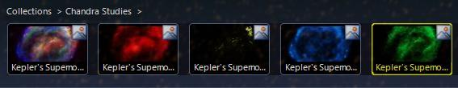
 The picture icon.

To change the default operation of a study as foreground and survey as
background there are a number of options. All default surveys appear as
thumbnails in the {{ui(p="Collections > All-Sky Surveys")}} folder. Simply clicking on
the thumbnail will load the survey as background. However if you right-click
on the picture icon, there is the option to load the survey as foreground or
background. Load one as foreground and one as background and the {{ui(p="Image
Crossfade")}} slider will be enabled to compare the two. Similarly two studies
can be compared this way.

There are options in the [{{ui(p="Finder Scope")}}](#the-finder-scope) to set images
as foreground or background, and then there is the greater flexibility (and
complexity) provided by the SDK (refer to the
[WorldWide Telescope Data Files Reference](http://www.worldwidetelescope.org/docs/WorldWideTelescopeDataFilesReference.html)
document).

Note that not all images of an object are taken from exactly the same camera
position. Also sky survey images are composite images -- perhaps with images
taken at different times or even by different telescopes -- so the exact
location of an object may appear to vary.

## The Finder Scope

The {{ui(p="Finder Scope")}} is a pane designed to help you fix on and research a
particular object. It can be opened by right-clicking on the view, or from the
{{ui(p="Explore")}} menu.

Certain celestial objects, when pointed to, display a circle and a name. This
indicates that the object is in one of the databases that WorldWide Telescope
links to. Right-click the object to display the {{ui(p="Finder Scope.")}} With the
{{ui(p="Finder Scope")}}, you can refine your search in the field of view, or research
your selected object from online references.

You can also view the object's image from the [DSS](#digitized-sky-survey) or
[SDSS](#sdss-sloan-digital-sky-survey) archive, download its DSS
[FITS](#fits-images) file, or run a [USNO](http://www.us-vo.org) NVO cone
search for objects near the selected object.

If you find an object you wish to research further, try not to move the
{{ui(p="Finder Scope")}} as the RA and Dec will change, so if you then click
{{ui(p="Research")}} for example, this will use the new values and not those of the
object.

Note also that you can pan by dragging the {{ui(p="Finder Scope")}} to the edges of
the field of view.

An object in space may have multiple names: **Ksora** and **HIP6686** in the
example shown.

Click {{ui(p="Show object")}} to return to the view of the object if for any reason
the view no longer shows it.

The properties of the object (**RA**, **Dec**, **Alt** and so on), are
explained in the
[Astronomy Terminology](@/explore/index.md#tutorial-astronomy-terminology) tutorial.

Refer also to the note:
[Viewing from a new location](@/viewmenu/index.md#viewing-from-a-new-location).

Both the **X** in the top right corner, and the {{ui(p="Close")}} button, close the
{{ui(p="Finder Scope")}}.

Click {{ui(p="Research")}} to bring up a menu of options to research websites for data
or more images of the object.

The {{ui(p="Set as Foreground Imagery")}}, {{ui(p="Set as Background Imagery")}}, and {{ui(p="Remove
from Image Cache")}} will only appear in the menu if these items are relevant to
the selection.

{{ui(p="Copy Shortcut")}} can be used to create and copy a URL locating the object
that can be emailed to friends or colleagues. Refer to the {{ui(p="Sharing Views")}}
section of the
[WorldWide Telescope Data Files Reference](http://www.worldwidetelescope.org/docs/WorldWideTelescopeDataFilesReference.html)
for specific details of the format of the URL.

{{ui(p="Add to Collection")}} can be used to store the view in a data collection file
you are working on.

- **SAMP** is an astronomy protocol for sharing data.
  
- **SIMBAD**: the Set of Identifications, Measurements, and Bibliography for
  Astronomical Data.
- **SEDS**: the Students for the Exploration and Development of Space.
- **Wikipedia**: online encyclopedia.
- **ADS**: the Smithsonian/NASA Astrophysics Data System.
- **NED**: the NASA/IPAC Extragalactic Database.
- **DSS**: Digitized Sky Survey
  
- **SDSS**: Sloan Digitized Sky Survey
- [**FITS**](#fits-images): Flexible Image Transport System image, commonly
  used in astronomy because of its ability to store human-readable metadata.
- Virtual Observatory Searches
  
  Refer to the [Virtual Observatory Tables](#virtual-observatory-tables) example below.
- SAMP options
  
  Send the image or table data to **Broadcast** to be picked up by all other
  [SAMP](http://www.ivoa.net/Documents/WD/App/SAMP-20080625.html) compliant
  programs you are running.

## Virtual Observatory Tables

Virtual Observatory (VO) Tables are a standard exchange format for
astronomical catalog data and queries to registries allow you to find, plot
and interact with a wide variety of catalogs that have VO table interfaces.

### VO Queries from the Finder Scope

You can launch VO queries of the current view using the Finder Scope. For
example, use the [Search Panel](@/searchpanel/index.md) to navigate to the
galaxy M51 — much better known as the _Whirlpool Galaxy_, and right click to
bring up the {{ui(p="Finder Scope")}}. Selecting {{ui(p="Research > Virtual
Observatory Searches > NED")}} will bring up the VO table shown below. Select
{{ui(p="Plot All")}} in the {{ui(p="VO Table Viewer")}} to annotate all the
located objects in the view with the selected {{ui(p="Plot Type")}} (white
circles by default) — a lot in the case of M51! Now use the {{ui(p="Finder
Scope")}} on the individual plots to investigate them further, many will be
unidentified electromagnetic wave sources.

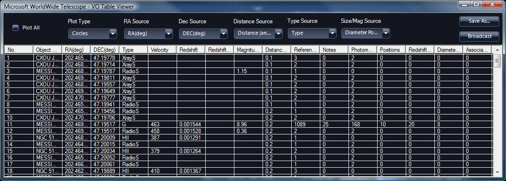

### VO Cone Searches

A Virtual Observatory (VO) cone search is a search for data on objects in
space within a cone - specified by a direction into space and a radius. The
diagram below shows a cone search with a radius of approximately 8.5 degrees.

The cone search can be refined by specifying that only certain types of
objects ("white dwarfs", "knots", "supernovae" etc.) should be located.

WWT’s {{ui(p="View")}} menu allows you to perform cone searches with greater
control than that offered by the Finder Scope. First, orient the view to a sky
location of interest. In this example we target the Pleiades open cluster.

1. Make sure you are in Sky mode.
2. Under the Search Tab, select {{ui(p="SIMBAD Search …")}}.
3. Enter “Pleiades” in the search box. This will orient your view to the
   Pleiades cluster and zoom in.
   
4. Under the Search Tab, open the {{ui(p="VO Cone Search / Registry Lookup …")}}.
5. In the field “NVO Registry Title Like” enter “Pleiades.” Then click the “NVO Registry Search” button.
   
6. This will populate the bottom of the table with a list of VO “registries”, which in this case
   are catalogs registered with the VO service.
7. Click on a row to search that catalog. This will load values into “Base
   URL.” For this example, select “ZYJHK photometry in Pleiades …” Since you
   are looking at the location of the Pleiades, you can click the checkbox
   next to “from View.” Set the Verbosity pull-down to “Medium” in order to
   return photometric measurements at all observed bands, rather than the
   default positions if the default “Low” is used. Then click “Search” on the
   right.
   
8. This will plot the catalog entries of the returned table on the background
   sky image. The default is to plot circles at each location. Also, this
   table is added as a layer (default name is “VO Table”) under the “Sky” of
   the Layer Manager on the left. If you close this table, you can always
   right-click on the “VO Table” in the layer manager and select “VO Table
   Viewer.”
   
   
9. Clicking on an entry of the returned table will center the display on the
   location of the catalog entry and show a label.
10. You can right-click on the VO Table layer in the layer manager and select
    **Copy** and then you can paste the table into an Excel spreadsheet.
11. To plot data, you can use software like
    [TOPCAT](http://www.star.bris.ac.uk/~mbt/topcat/). First download _and
    run_ TOPCAT according to its installation instructions. Then in the VO
    Table Viewer click the “Broadcast” button. This uses the SAMP messaging
    protocol to send the retrieved VO Table to TOPCAT for plotting.
13. In TOPCAT, you can then set up a scatter plot, by clicking the icon
    at the top menu.
    
14. This brings up a scatter plot window. You can map columns to axes in the
    plotting window.
    
15. You can also save the current table out of TOPCAT as Comma Separated
    Variable (CSV) format for input into Excel or other software.

## FITS Images

The FITS (Flexible Image Transport System) was developed particularly to hold
the one, two and three dimensional data that is particular to astronomy, with
the requirement for a large amount of metadata to be stored along with an
image or table of data. For specific details refer to
[FITS Data Format](http://heasarc.gsfc.nasa.gov/docs/heasarc/fits.html).

If a FITS image is loaded into WorldWide Telescope some additional analysis
options become available. To load a FITS image simply use the {{ui(p="Explore > Open
> Image...")}} option, and note that the {{ui(p="Scale")}} icon appears in the lower
panel alongside the {{ui(p="Image Crossfade")}} slider:

Click on the {{ui(p="Scale")}} icon to display a light intensity histogram.

Slide the green and red bars to select the starting and ending points for the
display, then select from {{ui(p="Linear")}}, {{ui(p="Log")}}, {{ui(p="Power")}}, {{ui(p="Square Root")}} to
determine how the data is to be displayed in the main view. Note that the red
bar can precede the green bar to invert the slope. The bars limit the range of
data that is to be displayed, and the slope determines the emphasis given to
the data. The final option, {{ui(p="Histogram Equalization")}}, does not use the bars,
but instead gives equal emphasis to each intensity level of the data.

Note that there are 256 intensity levels, from pure black on the left margin
of the histogram, to pure white on the right. The height of any bar in the
histogram indicates the number of pixels in the image at that particular
intensity level.

The zoom in and zoom out options enable greater focus on a particular band of
data.

Using this tool particular light sources can be examined in isolation.

## Sky Surveys

Comprehensive surveys of the sky have been carried out at different
wavelengths to help determine the composition of stars and galaxies. The
digital images generated by sky surveys are compiled into the data sets that
are available in the {{ui(p="Imagery")}} drop down list, and usually provide the
_background image_ to the view.

Each imagery set provides unique information about objects in the sky because
the images were taken at different wavelengths of the electromagnetic
spectrum, and at different times. Different wavelengths expose different
energy regimes, stellar processes, and effects. For example, with observations
made in the low-energy spectrum (radio and microwave), cold processes are
exposed: molecules forming or moving about, or giant clouds of gas and dust.
The optical band (between infrared and ultra violet) exposes gas escaping from
black holes, volcanoes on the moons of Jupiter, or heat escaping from stellar
dust. With x-rays, hot processes become apparent such as explosions on stars,
neutron stars, comets, supernova remnants, or energy beams emanating from
matter falling into black holes. With gamma-rays, even more violent events
become apparent, such as the destruction of atoms, stars spiraling into black
holes, supernovas, and pulsars.

Electromagnetic radiation is classified as follows:

| Wavelength |  Name |
| :-- |
| Greater than 10cm | Radio waves |
| Between 10cm and 1mm | Microwaves |
| Between 1mm and 700nm | Infrared radiation |
| Between 700nm and 400nm | Visible light |
| Between 400nm and 10nm | Ultraviolet radiation |
| Between 10nm and 1/100nm | X-rays |
| Less than 1/100nm | Gamma rays |

Try selecting a specific object or an area of the sky and then changing
{{ui(p="Imagery")}} to compare the object's properties. Astronomers have used the
different wavelengths to great effect, for example by using the hydrogen alpha
wavelength to track stellar red-shift, over 250 planets have been discovered.

Below is a description of the {{ui(p="Imagery")}} sets included in WorldWide
Telescope. Note that specific objects are not always visible in every imagery
set. For example, specific stars identifiable in the Digital Sky Survey are
not always visible to the unaided eye in the Hydrogen Alpha imagery. Also, the
different surveys have been carried out at different resolutions. For
comparison purposes, the images below show the constellation Cygnus.

### Imagery Data

#### Digitized Sky Survey

A comprehensive sky survey in the visible wavelength, first published in
1994. This survey was created by the Space Telescope Science Institute's
(STScI) Catalogs and Surveys Group from images of the northern sky taken by
the National Geographic Palomar Observatory in California (from 1948 to 1958)
and images of the southern sky taken by the UK Schmidt telescope in Australia
(from 1973 to 1988). The original image data was a large number of glass
photographic plates, with each plate covering 6.5 x 6.5 degrees of the sky.
These plates have produced very large digital images (14000x14000 or 23040x
23040 pixels), and it is a compressed version of these images that WorldWide
Telescope accesses.

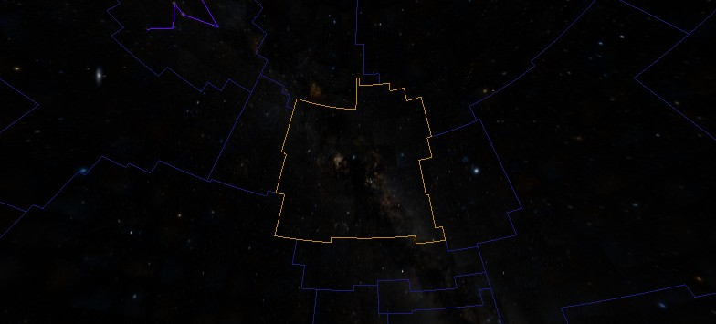

#### Hipparcos Catalog

Hipparcos is the name of a European Space Agency Mission and Satellite that
took images from 1989 to 1993 and accurately catalogued 118,218 stars. Taken
from space, the measurements avoided the gravitational, atmospheric and
thermal distortions that were limiting ground based telescopes. The error in
the positioning of stars in this catalog is under 0.001 arc seconds. An
auxiliary star mapper pinpointed many more stars with lesser but still
considerable accuracy at 0.03 arc seconds. Known as the
[Tycho Catalog](#tycho-Synthetic- optical) this identified 1,058,332 stars.

#### VLSS: VLA Low Frequency Sky Survey (Radio)

The Very Large Array (VLA) Low-Frequency Sky Survey (VLSS) is an ongoing
survey of the sky for radio waves at 74 MHz (4-meter wavelength). The radio
survey consists of 358 overlapping images covering the entire sky north of the
-30&deg; declination. The survey has so far identified over 70,000 sources of
radio waves. From the survey, there are significant samples of objects
including high red-shift radio galaxies, galaxy clusters and supernova
remnants. Very distant radio galaxies may reveal information on the timeline
of cosmic events, such as how soon black holes were formed in the history of
the Universe.

#### WMAP ILC 5-Year Cosmic Microwave Background

The Wilkinson Microwave Anisotropy Probe (WMAP) was a three-year, all-sky
survey that concluded in 2006. The survey was conducted at several microwave
bands (K, Ka, Q, V and W) to measure and map the cosmic microwave background
radiation, measuring both its intensity and by how much it fluctuates.
Microwave radiation is the oldest light in the Universe, and from this survey
the Universe is estimated at 13.73 billion years old, to a 1% accuracy. Other
results of the survey include support for the theory that most of the Universe
is made up of dark energy (73%), with the rest mostly dark matter (22%) and
only a small portion (5%) as atomic.

#### SFD Dust Map

The Infrared Dust Map is an all-sky, 100 micron, far infrared (12, 20, 25, and
100 micron pass bands) survey modulated by dust temperatures and then
calibrated to be dust reddening at various magnitudes. Dust affects optical
light by effects known as _extinction_ and _reddening_. Extinction is the loss
of light due to scattering and absorption as it travels through clouds of
dust. Because the dust scatters blue light more than red, the color of the
light also changes - an effect known as reddening. When astronomers measure
distant stars, galaxies, supernovae, or any other light-emitting object, they
must correct the color and amount of light they measure for the amount of dust
the light has passed through.

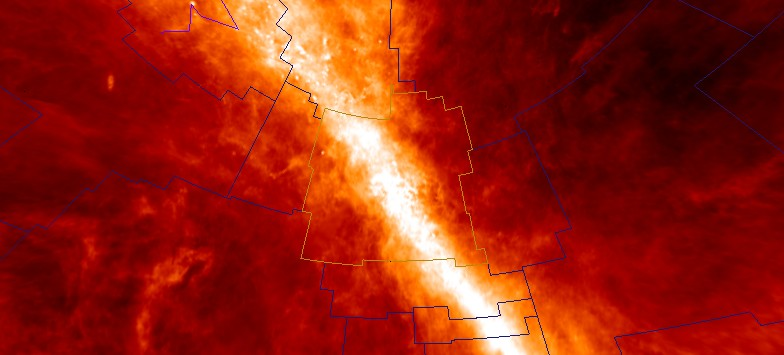

#### IRIS: Improved Imaging of IRAS Survey (Infrared)

Starting in 1983 the Infrared Astronomical Satellite (IRAS) - a joint project
of the US, UK, and the Netherlands - performed a survey of 98% of the sky at
four wavelengths: 12, 25, 60, and 100 m. IRAS led to numerous scientific
discoveries spanning a broad range of astrophysical subjects, from comets to
circumstellar disks to interacting galaxies. A new generation of IRAS images,
called IRIS, benefits from a better zodiacal light subtraction, an improved
calibration and zero level, and from a better de-striping. The data set is
used to study the variations of dust properties. Several studies of dust
emissions at high galactic latitudes show large variations of dust properties
depending on the grain sizes of the dust. Large dust clouds are the
birthplaces of stars and planets.

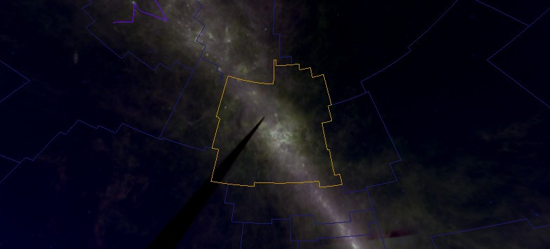

#### 2MASS Two Micron All Sky Survey (Synthetic)

The 470,992,970-source Two Micron All Sky Survey (2MASS) Point Source Catalog
was produced by a joint project of the University of Massachusetts and the
Infrared Processing and Analysis Center. The entire sky was uniformly scanned
in three near-infrared bands to detect and characterize point sources brighter
than about 1 mJy (1 milliJanksy) in each band. 2MASS used two highly-automated
1.3-m telescopes, one at Mt. Hopkins, Arizona, and one at Cerro Tololo
Inter-American Observatory, Chile. The northern 2MASS facility began routine
operations in 1997, and the southern facility in 1998. The primary use of
these maps is likely to be as a new estimator of galactic extinction.

#### Hydrogen Alpha Full Sky Map

A full sky map generated at Princeton University compositing the Virginia Tech
Spectral line Survey (VTSS) of the northern skies and the Southern H-Alpha Sky
Survey Atlas (SHASSA) produced from images taken by the Cerro Tololo
Inter-American Observatory in Chile of the southern skies. The hydrogen-alpha
filters block out as much of the hydrogen emission spectrum leaving only a
band pass from 0.5 Angstrom to 1 Angstrom deep in the red end of the visible
light spectrum. The composite map can be used to provide limits on thermal
emissions from ionized gas known to contaminate microwave-background data.

#### SDSS: Sloan Digital Sky Survey

The Sloan Digital Sky Survey (SDSS) was initiated in 2000 and is ongoing. The
survey uses a dedicated 2.5-meter telescope at Apache Point Observatory, New
Mexico, equipped with two powerful special-purpose instruments: a
120-megapixel camera images 1.5 square degrees of the sky at a time (about
eight times the area of the full moon), and a pair of spectrographs fed by
optical fibers measure the spectra of (and hence distance to) more than 600
galaxies and quasars in a single observation. After eight years of operations
this survey has obtained deep, multi-color images covering more than a quarter
of the sky. The result has enabled the creation of 3-dimensional maps
containing more than 930,000 galaxies and 120,000 quasars.

The survey has not yet covered the constellation Cygnus, so the image shows
the constellation Leo:

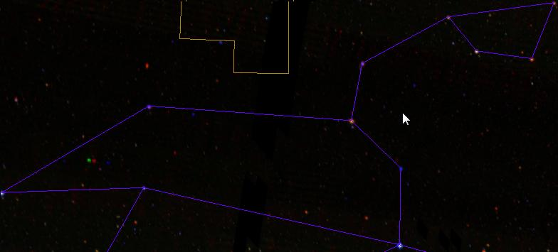

#### Tycho (Synthetic, Optical)

The Tycho-2 catalog is based on a mix of 1991 space-based data from the
European Space Agency's [Hipparcos](#hipparcos-catalog) satellite, data from
the Tycho 1 catalog, and over 140 other astrometric catalogs. The catalog also
included the re-analysis of positional data for the Tycho-1 stars. The
celestial co-ordinate data for all the earlier catalogs was corrected to match
the J2000 epoch of the Hipparcos catalog. The mix increased the number of
stars in the catalog to 2,539,913 of the brightest stars in the Milky Way, of
which about 5000 are visible to the naked eye. Components of double stars with
separations down to 0.8 arc seconds are included.

#### USNOB: US Naval Observatory B1.0 (Synthetic, Optical)

The US Naval Obersvatory-B1.0 is a catalog of 1,042,618,261 objects. The data
were obtained from scans of 7,435 Schmidt plates taken for the various sky
surveys during the last 50 years by the Precision Measuring Machine (PMM) at
the US Naval Observatory in Flagstaff, Arizona. The originating plate material
includes five complete coverages of the northern sky and four of the southern
sky To be included in the catalog, an object must have been detected on two
different surveys, to avoid the unreliability of single detections. The
[Tycho-2 Catalog](#tycho-Synthetic- optical) is the astrometric reference. The
USNO-B1.0 is believed to provide all-sky coverage, completeness down to 0.2
arc second astrometric accuracy at J2000, 0.3 magnitude photometric accuracy
in up to five colors, and 85% accuracy for distinguishing stars from
non-stellar objects. 

#### GALEX (Ultraviolet)

Since its launch in 2003, the Galaxy Evolution Explorer (Galex) telescope has
imaged more than a half-billion objects across two-thirds of the sky. The
telescope studies galaxies far beyond our Milky Way through its sensitive
ultraviolet telescope - the only such far-ultraviolet detector in space. The
Galaxy Evolution Explorer has two detectors: one in far-ultraviolet, which
reveals stars younger than about 10 million years old, and another in
near-ultraviolet, which detects stars younger than about 100 million years
old. Massive young stars burn their large supply of hydrogen fuel quickly,
burning hot and bright while emitting most of their energy at ultraviolet
wavelengths. Compared with low-mass stars like our sun, which live for
billions of years, these massive stars never reach old age, having a lifespan
as short as a few million years.

#### RASS: ROSAT All Sky Survey (X-Ray)

The ROSAT All Sky Survey (RASS) was a survey of the sky released in March 2000
by the Max-Planck-Institut f�r extraterrestrische Physik. The survey was the
first imaging X-ray survey of the entire sky. Combining the RASS Bright and
Faint Source Catalogs yields an average of about three X-ray sources per
square degree. However, while X-ray sources are known to range from distant
quasars to nearby M dwarfs, the RASS data alone are often insufficient to
determine the nature of an X-ray source. The X-rays are mainly emitted by some
million-degree gases such as stellar coronae, supernova remnants, superbubbles
(a cavity hundreds of lights years across filled with hot gas), and the hot
plasma of the galactic nucleus. The faint source catalog has 105,924 sources,
and the bright source catalog has 18,811 - the distinction being that to
qualify for a bright source listing the source must emit 0.05 counts/sec or
greater. Counts per second (or CPS) is a measure of x-ray activity.

#### Fermi (Gamma)

Launched in 2008, NASA's Fermi Gamma-ray Space Telescope is tasked with
exploring extreme environments in the Universe. These include the powerful
explosions known as gamma-ray bursts (believed to occur when massive stars run
out of nuclear fuel), pulsars (neutron stars emitting beams of radiation),
solar flares, and the acceleration of jets of material away from black holes. 
So far the Fermi telescope has revealed a new class of pulsars, probed
gamma-ray bursts and watched flaring jets in galaxies billions of light-years
away.

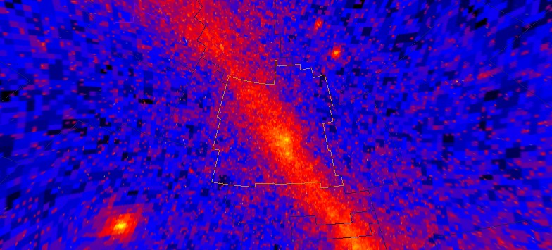

#### Black Sky Background

Simply sets the entire background to black.

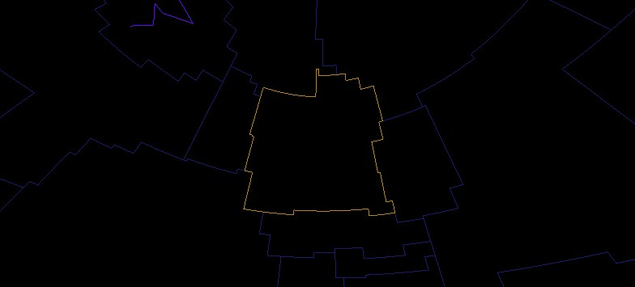

### Browse

You can also open equirectangular projected images as a background (refer to
[WorldWide Telescope Projection Reference](http://www.worldwidetelescope.org/docs/WorldWideTelescopeProjectionReference.html))
by browsing to their location on your computer. This option works in
{{ui(p="Planet")}}, {{ui(p="Sky")}} and {{ui(p="Panorama")}} modes.

Note that there are more surveys available in WorldWide Telescope than are
included in the {{ui(p="Imagery")}} list. These additional surveys are available in
the {{ui(p="Collections > All-Sky Surveys > More Surveys")}} collection.

## Context Search

The _Context Search_ automatically searches the constellation that the reticle
is currently on for deep sky objects that are listed in a catalog, such as the
Messier or New General catalogs. If it finds any objects, its thumbnail image
is added to the list in the lower panel. As you move the Field of View (FOV)
to a new constellation, the thumbnails for the deep sky objects change
automatically to reflect all the deep sky objects in the new constellation.

To obtain some information on the items in the Context Search, right-click on
the thumbnails in the lower panel and select {{ui(p="Properties")}} from the menu.
This will display the same information that appears in the
[The Finder Scope](#the-finder-scope), for example:

In this example M86 has appeared in the lower panel as a result of the context
search. Selecting {{ui(p="Properties")}} from the right-click menu displays the
property data without changing the view.

### Context Search Filter

You can restrict the list of deep sky objects displayed by the Context Search
to only those objects identified in the following table, by selecting items in
the {{ui(p="Context Search Filter")}}.

Click on the thumbnail images below to link to the example. And then click on
the thumbnails as they appear in the top panel to bring the objects into view.

| Group | Title | Description | Example |
| :-- |
| **Solar System** | | The Sun, or any planet or moon of our own Solar System. | [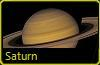](http://www.worldwidetelescope.org/wwtweb/goto.aspx?object=Saturn&ra=11.1310226934708&dec=7.92703939594174&zoom=0.1) |
| **Stellar** | **Star** | A ball of gas held together by its own gravity and emitting its own radiation. |  |
| | **Supernova** | A star (at least 8 times more massive than the Sun) that does not have enough fuel for the fusion process in its core will explode due to gravitational collapse. The explosion is called a supernova. The remaining material is known as a supernova remnant. | [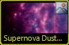](http://www.worldwidetelescope.org/wwtweb/goto.aspx?object=Supernova%20Dust%20Factory%20in%20M74&ra=1.61166666666667&dec=15.7405555555556&zoom=1.415) *Supernova Dust Factory in M74* |
| | **Black Hole** | A star (at least 10-15 times more massive than the Sun) that became a supernova and then further collapsed in on itself. The infinite density of the supernova's remnants causes the path of light to wrap around it. |  *Black Hole-Powered Jet of Electrons and Sub-Atomic Particles Streams From Center of Galaxy M87* |
| | **Neutron Star** | The ultra-dense collapsed core of a star that has undergone a supernova. |  *NASA Great Space Observatories Glimpse Faint Afterglow of Nearby Stellar Explosion* |
| | **Double Star** | Two stars that orbit around a common center of mass. |  |
| | **Multiple Stars** | More than two stars that orbit around a common center of mass. |  |
| **Stellar Grouping** | **Constellation** | A grouping of stars occupying one of the 88 areas in which the sky is divided. Note that the search filter will locate only those items that have a _Constellation_ classification set on them, which does not include all the constellations themselves, but studies relating to a constellation. | [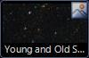](http://www.worldwidetelescope.org/wwtweb/goto.aspx?object=Young%20and%20Old%20Stars%20Found%20in%20Andromeda%27s%20Halo&ra=0.768611111111111&dec=40.71&zoom=2.82833333333333) *Young and Old Stars Found in Andromeda's Halo* |
| | **Asterism** | A group of stars that comprise a portion of a larger constellation whether physically related to it or not. For example, the Big Dipper is part of the Great Bear constellation, and the Belt of Orion is part of the Orion constellation. |  |
| | **Open Cluster** | A physically related groups of stars formed from the same giant molecular cloud and held together by mutual gravitational attraction. |  |
| | **Globular Cluster** | A spherical collection of stars that share a common origin and orbit a galaxy as a satellite. Globular clusters are very tightly gravitationally bound, which gives them their spherical shape. They are also extremely dense towards their core. |  |
| | **Nebulous Cluster** | A diffuse mass of interstellar dust and gas that orbits a galaxy as a satellite. |  |
| | **Dark Nebula** | An interstellar cloud of dust so dense that it obscures or absorbs light coming from stars or nebula behind it. | No current examples |
| | **Giant Molecular Cloud** | A type of interstellar cloud whose density and size permits the formation of molecules, stars, and planets. |  |
| | **Interstellar Dust** | Irregularly shaped, stellar material, just a fraction of a micron across, composed of silicates, carbon, ice, and/or iron compounds. This material scatters light in our line of sight and obscures or obstructs our view of stellar objects. | [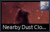](http://www.worldwidetelescope.org/wwtweb/goto.aspx?object=Nearby%20Dust%20Clouds%20in%20the%20Milky%20Way&ra=0.884444444444444&dec=56.6447222222222&zoom=3.945) *Nearby Dust Clouds in the Milky Way* |
| **Nebula** | **Nebula** | A diffuse mass of interstellar dust and gas. These areas result from supernova explosions and are the birthplaces of new stars. |  |
| | **Planetary Nebula** | A shell of gas ejected from stars, such as our Sun, at the end of their lifetimes. This gas continues to expand from the remaining white dwarf. |  |
| | **Supernova Remnant** | The remains of the explosion of a massive star such as a red supergiant. |  |
| | **Emission Nebula** | A nebula that shines by emitting light on a hydrogen cloud. |  |
| | **Reflection Nebula** | A nebula that shines by reflecting light from nearby stars. |  |
| **Galactic** | **Cluster of Galaxies** | A group of galaxies that are gravitationally bound together. |  |
| | **Quasar** | An extremely bright object at the edge of our universe that emits massive amounts of radiation, including radio waves and x-rays. | No current examples |
| | **Galaxy** | A cluster of stars, dust, and gas held together by gravity. |  |
| | **Spiral Galaxy** | A galaxy in which most of the stars are arranged in a disk and have spiral structures ("arms") that extend from the central bulge of stars. |  |
| | **Irregular Galaxy** | A galaxy that does not fall into one of the three main Hubble sequence galaxy classes. |  |
| | **Elliptical Galaxy** | A galaxy that does not have a disk but rather a smooth, featureless profile. They range in shape from nearly spherical to highly flattened. | [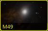](http://www.worldwidetelescope.org/wwtweb/goto.aspx?object=M49&ra=12.4966666666667&dec=8&zoom=1.40625) |
| | **Knot** | An area within a galaxy containing a greater concentration of material (such as gas, dust, or stars) than adjacent areas. Knots appear in images as bright areas within a galaxy. |  |
| **Other** | **Unidentified** | Deep sky objects that have not been identified or cataloged. |  |
| | **Plate Defect** | Plate defects are images containing photographic errors, such as the reflection of the telescope, color aberrations, dust, and so on. The telescope is usually reflected in an image when a single, very bright object is photographed. |  |
| | **Other NGC** | The New General Catalogue is one of the most commonly-used catalogs in amateur astronomy and contains nearly 8,000 objects. |  |

## Stellar Brightness

The value in comparing and cataloging the brightness of stars was apparent to
the ancient Greeks, who developed a system of six magnitudes, the brightest
being level one, the dimmest level six. The difference between each level was
roughly _twice-as-dim_, so a level six star would be 32 times as dim as a
level one star. This system was formalized much later so that a level six star
was 100 times as dim as a level one star, so the difference between each level
became 2.512. As the Sun, Moon and Planets were not part of the system to
introduce them meant adding negative numbers, and to introduce stars that are
only visible through telescopes the scale was extended far beyond six, and now
goes from -26.73 for the Sun, to about 30 for the dimmest stars visible using
the Hubble Space Telescope. It is an odd scale as it straddles zero, but the
only important information in it is the difference between two numbers when
calculating relative brightness - individual numbers on their own have little
meaning. The reference point (a magnitude of zero) has changed from the star
Polaris, to Vega, to no star in particular as all stars vary a little in
brightness.

The value in this logarithmic scale is that it keeps the numbers in a small
range. If the brightness scale was linear and not logarithmic it would have to
extend from zero to one trillion simply to include distant stars (and ignoring
the brightness of any object in the Solar System). The following image shows
the brightness of a number of stars around Canopus (the second brightest
distant star in our night sky):

| Star | Magnitude |
| :-- |
| τ Puppis | 2.93 |
| HR2400 | 5.6 |
| HR2513 | 6.57 |
| Canopus | -0.72 |
| HR2435 | 4.39 |
| HR2554 | 4.4 |

The brightness magnitude usually quoted for a star is the _apparent
magnitude_, which is how bright it appears to us on Earth. The _absolute
magnitude_ of an object is how bright it would appear at a standard distance
away from the observer (a distance which has been fixed at 10 parsecs or
32,616 light years). Both figures are often quoted in catalogs of stars, the
[Finder Scope](#the-finder-scope) quotes only the apparent magnitude. Apparent
magnitude is often referenced as the letter V, absolute magnitude as the
letters MV.

| First object | Second object | Relative Magnitude (V scale) | Relative Magnitude (linear) |
| :-- |
| **Sirius (-1.46)** | **Canopus (-0.72)** | 0.77 | 1.977 |
| **Spica (1.04)** | **HR5597 (6.37)** | 5.29 | 135.552 |
| **Canopus (-0.72)** | **HR2513 (6.57)** | 7.29 | 1600.137 |
| **Alpha Centauri (-0.01)** | **Proxima Centauri (11.05)** | 11.06 | 26559.333 |
| **Venus (-4.7)** | **Neptune (7.8)** | 12.5 | 100056.530 |
| **Spica (1.04)** | **IC3922 (14.8)** | 13.76 | 319352.396 |
| **The Sun (-26.73)** | **The full moon (-12.6)** | 14.13 | 449032.157 |
| **The Sun (-26.73)** | **Proxima Centauri (11.05)** | 37.78 | 1,296,408,329,574,280.0 |
