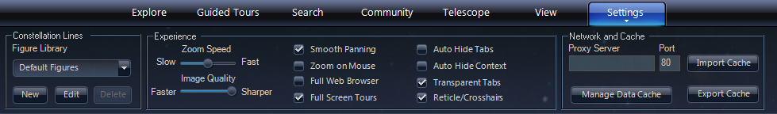
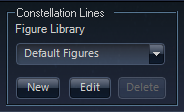
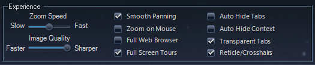
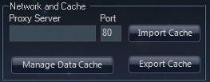
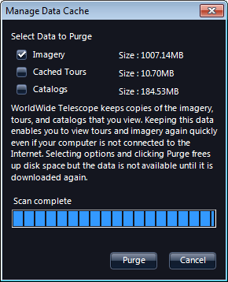
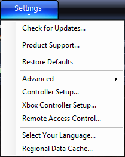
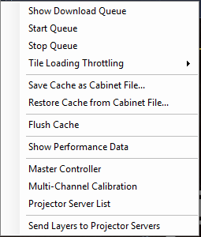
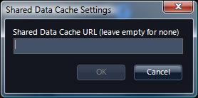

+++
title = "The Settings Menu"
description = "The Settings menu of the AAS WorldWide Telescope."
weight = 700
+++

Using the **Settings** panel and menu, you can control settings that affect
the current view, performance, and operation. Note that these settings differ
between the Web Client and the Windows Client.

## Constellation Lines

The **Constellation Lines** settings apply only to the [Sky](explore.md#sky)
view.

Use the **Constellation Lines** pane to create your own library of
constellation figures. These are the lines that by default are shown in red,
and map out the figures that the constellations are most famous for (the W of
Cassiopeia, for example). To create your own library (which does not delete or
replace the default library) go through the following steps:

1. Click **Settings**, then click **New** in the **Constellation Lines** pane.
2. A small **Figure Library Name** pane will appear. Enter an appropriate
   name, then click **OK**.
3. The **Constellation Figure Editor** pane will open. Click on the name of
   the first constellation for which you want to create a new figure.
4. In the main view _right_ click where you want to add a point, and draw the
   new figure.
5. Select the next constellation in the **Constellation Figure Editor**, and
   repeat step 4, until you have added all the new figures.
6. Click **Save** at the lower left of the **Constellation Figure Editor** to
   save the new figures.

When you next run WorldWide Telescope, the new figure set will be available in
this pane. Notice that the default set is available too, and remains
unchanged. The **Edit** button can be used to add points for any selected
constellation, and the **Delete** button can be used to delete the entire
library. The **Delete** button in the **Constellation Figure Editor** will
delete the figure for the selected constellation.

## Experience

The **Experience** settings apply to all of the views, and contain settings
that affect mouse operation, panning and zooming, and the appearance of the
user interface.

* **Zoom Speed** changes the rate at which the view is zoomed when using the
  mouse wheel.
* **Image Quality** adjusts the sharpnetss of the view. This setting is not
  often apparent, except when viewing the Earth close up.
* **Smooth Panning** avoids sharp stops when releasing the mouse during
  panning.
* **Zoom on Mouse** centers zooming on the current mouse position (normally
  zooming is focused on the center of the view).
* **Full Web Browser** launches a full web browser for links rather than a web
  window.
* **Full Screen Tours** runs tours in full-screen view.
* **Auto Hide Tabs** or **Auto Hide Context** will remove the upper and lower
  panels respectively when the mouse is not over them. To return them to view
  simply move your mouse cursor over the panels.
* **Transparent Tabs** makes the panels transparent.
* **Reticle/Crosshairs** adds the crosshairs ("+") to the center of the
  viewing area.

## Network and Cache

Use the **Network and Cache** settings to control internet connection
settings. These settings apply to all views.

A proxy server is not used by default, and the default port used to connect to
the internet is port 80. Change these settings only if necessary.

Use **Manage Data Cache** to clear local copies of images, tours or catalogs.
Most of this data is not initially stored locally by WorldWide Telescope, and
is only downloaded when needed. Once data is downloaded it is cached, and the
cached copy is then used on subsequent requests. This is similar to how a web
browser operates. If you want to free up disk space, or ensure that the latest
data is downloaded, click **Purge** to delete the data in the cache.

## Settings Menu Entries

Click the down arrow below **Settings** to open up the menu entries.

* **Check for Updates...** detects whether you are running the latest version
  of WorldWide Telescope.
* **Product Support...** links to the WorldWide Telescope support page.
* **Restore Defaults** restores the default settings in the **View** and
  **Settings** menus, but does not adjust the current **Observing Time**.
* **Advanced** brings up a sub-menu with options for controlling the download
  queue, displaying performance data, and more.

   

  * **Show Download Queue** shows the current image tiles being downloaded.
    The queue can be stopped, started again, flushed (all items are removed
    from the queue) and cleared (all items are removed from memory). Refer
    also to the section on the
    [Network and Cache](configuration.md#network-and-cache).
  * **Start Queue** starts the download queue.
  * **Stop Queue** stops the download queue.
  * **Tile Loading Throttling** lets you set the tile loading rate in tiles
    per second (15tps, 30tps, 60tps, 120tps, Unlimited).
  * **Save Cache as Cabinet File...** exports the current cache as a .cab
    file.
  * **Restore Cache from Cabinet File...** lets you import a .cab file with
    image cache data.
  * **Flush Cache** clears the current cache.
  * **Show Performance Data** adds a few performance metrics to the title bar
    (such as frame rate).
  * **Master Controller**: refer to the
    [Multi-Monitor Cluster](configuration.md#multi-monitor-cluster) section.
  * **Multi-Channel Calibration** provides options for calibrating the output
    of multiple projectors.
  * **Projector Server List** lets you choose from available projector
    servers.
  * **Send Layers to Projector Servers** sends the current layers to the
    selected projector servers.
* **Controller Setup...** provides options for configuring MIDI controller
  devices.
* **Xbox Controller Setup...** provides options for setting up an Xbox
  controller.
* **Remote Access Control...** lets you set up WorldWide Telescope for remote
  access from another networked computer.
* **Select Your Language...** changes the language of the user interface.
* **Regional Data Cache...** enables you to enter a URL for a local data
  cache. This is handy for classes and groups. Data is downloaded only once to
  the local cache, which participants can then access. Each user will need to
  enter the URL one time. The URL is used until the setting is cleared.
   For more details refer to
  [Regional Data Cache](configuration.md#regional-data-cache).
