+++
title = "The Telescope Menu"
description = "The Telescope menu of WorldWide Telescope."
weight = 800
+++

It is possible to control and track a physical telescope connected directly to
your computer with a USB cable. With everything working correctly it is
possible to both move the view of the physical telescope and have WorldWide
Telescope mimic the movements and display the virtual view, or to change the
view within WorldWide Telescope and have the physical telescope's motor drive
change its position and display the actual view. In order to do this the
physical telescope must work with the ASCOM Platform software.

Note that there are some practical considerations to setting up this system.
The physical telescope obviously needs to have a good view of the sky, which
for most users means an outside location, and at the same time the computer
needs internet access for WorldWide Telescope to function, and both systems
need electrical power. Also note that most telescopes are not digital, the
electric power is only controlling the movement of the hub, the actual view
from the physical telescope is not stored digitally and cannot be transferred
to the computer.

## Connecting and Controlling a Telescope

The first step in controlling a physical telescope is to install the ASCOM
software:

1. Click on {{ui(p="Telescope")}} to open up the telescope panel. Note the ASCOM logo
   to the far right of the panel, with the words {{ui(p="Not Installed")}} underneath
   it.

   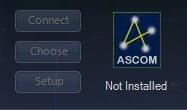
2. Click on the ASCOM logo to follow a link to the {{ui(p="ASCOM Standards for
   Astronomy")}} page, and download the ASCOM Platform:

    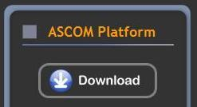
3. Go through the download and installation procedures. This may take a few
   minutes.
4. Confirm that the software has been installed by ensuring the word
   {{ui(p="Installed")}} now appears below the ASCOM logo in WorldWide Telescope.
   Close and restart WorldWide Telescope if necessary:

   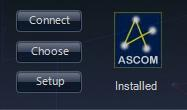

To ensure that the ASCOM software is working correctly with WorldWide
Telescope, test it in simulation mode:

1. Click the {{ui(p="Choose")}} button on the telescope panel, then scroll down the
   list and select {{ui(p="Simulator")}}:

   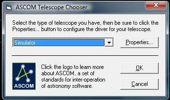

2. Click {{ui(p="OK")}}.
3. Now click {{ui(p="Connect")}} on the telescope panel. You should notice that many
   of the {{ui(p="Telescope Control")}} entries are now enabled. The actual buttons
   that are enabled depends on the setup of the simulator. Click {{ui(p="Setup")}} on
   the telescope panel. Change the {{ui(p="Equatorial System")}} entry in the
   {{ui(p="Advanced")}} section to **J2000**:

   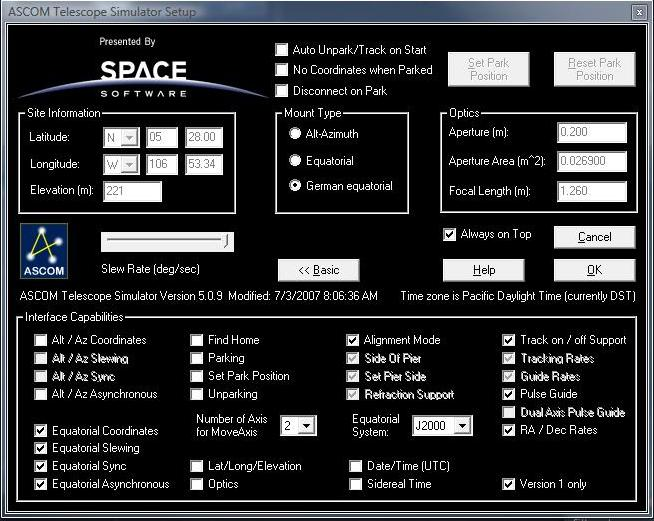
4. Click {{ui(p="OK")}} in the {{ui(p="Setup")}} dialog and you should notice that a new
   window has been opened, the {{ui(p="Scope Simulator")}}. This window mimics the
   remote control of a physical telescope:

   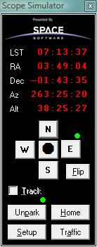
   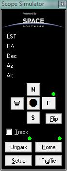

   Open up the {{ui(p="Scope Simulator")}} and ensure that there are red numerical
   position values. If there are not, as seen in the image to the right, then
   the simulator did not start correctly. If this happens, try closing
   WorldWide Telescope and then opening it again.
5. Next click on {{ui(p="Search")}} to open up the search panel, then enter
   {{ui(p="Polaris")}} into the search text box. When the thumbnails appear, double
   click on {{ui(p="Polaris")}} (not {{ui(p="Polaris Australis")}}). This will instantly
   change the WorldWide Telescope view to the star.
6. Click on {{ui(p="Slew")}} in the telescope panel. You should see the settings on
   the {{ui(p="Scope Simulator")}} change to the RA and Dec of Polaris:

   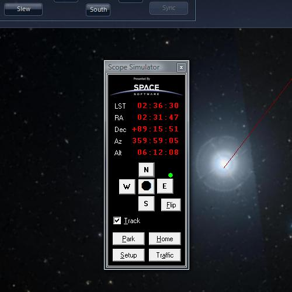

7. Next select the controls of the {{ui(p="Scope Simulator")}} -- one or more of
   **N**, **S**, **E** or **W**. Note that holding down Shift will move the
   virtual scope slower, and Ctrl even slower. So make some key presses to
   move the simulated view. Note the change in RA and Dec.
8. Click {{ui(p="Center")}} in the telescope panel to center the WorldWide Telescope
   view on whatever the simulated telescope is viewing. You should see the
   view smoothly animate to the simulator's settings.
9. Pressing {{ui(p="Traffic")}} on the {{ui(p="Scope Simulator")}} will display a window
   giving a log of the telescope movements:

   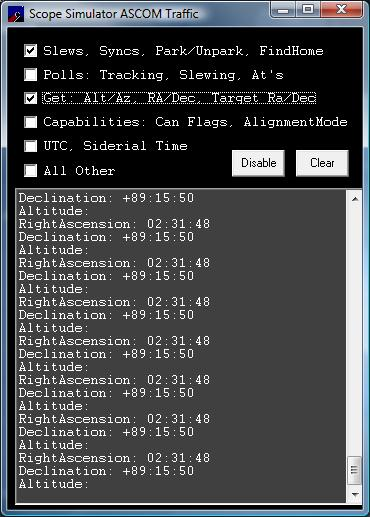
10. This completes the simulation test.

The next step is to set up the physical telescope and your computer in a
location that will enable you to align the telescope correctly. Align the
telescope before attaching it to the computer with the USB cable. Telescope
alignment can be involved depending on the technology used by the telescope
software. When it is correctly aligned:

1. Ensure the computer and telescope have an adequate power supply.
2. Point the telescope at a well known star, **Polaris** for example.
3. Attach the telescope to the computer with the USB cable.
4. Select {{ui(p="Choose")}} in the telescope panel, and select the type that best
   matches your telescope: {{ui(p="ASCOM Dome Control")}}, {{ui(p="Generic Hub")}} and so on.
5. In {{ui(p="Setup")}} check off the items that best match the features of the
   telescope.
6. Select {{ui(p="Connect")}}, and this should enable the {{ui(p="Telescope Control")}} pane
   of the telescope panel.
7. Click {{ui(p="Slew")}} to change the WorldWide Telescope view to match that of the
   telescope. Use the {{ui(p="Finder Scope")}} to verify that the WorldWide Telescope
   view is the same as the physical telescope, **Polaris** for example.
8. If the telescope alignment is at any point uncertain, use the {{ui(p="Sync")}}
   option. This transmits the RA and Dec of WorldWide Telescope to the
   physical telescope.
9. Use WorldWide Telescope to locate objects close to the original alignment,
   then {{ui(p="Slew")}} the physical telescope to the new location to try to view it
   for real! Alternatively control the physical telescope and use WorldWide
   telescope to identify the objects you locate.

## The Telescope Panel

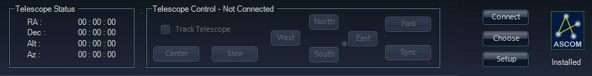

## Telescope Menu Entries<

Clicking on the down arrow below {{ui(p="Telescope")}} opens up the menu entries.

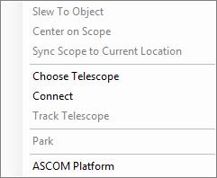
