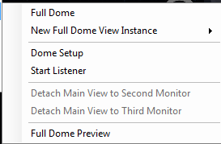

+++
title = "View Menu"
description = "The View menu of the AAS WorldWide Telescope program."
weight = 600
+++

The **View** pane and menu entries contain a range of settings that affect the
current view.

## Observing Location

The entries in the **Observing Location** box apply only to the
[Sky](explore.md#sky) view.

The **Observing Location** pane is used to set the viewpoint on Earth. You can
either select a **Data Set** and **Region** to obtain the viewpoint from a
particular city (such as Quito, Ecuador as shown in the example), or you can
simply enter a longitude, latitude and elevation.

Check the **View from this location** checkbox to view from the selected
location. Note the position of the horizon line. To show the full sky without
the horizon line, uncheck the **View from this location** checkbox.

View from Quito, Ecuador:

## Viewing From a New Location

### Set observing time for a new location

Changing the observing location does _not_ change the observing time to local
time in that location. Following this procedure will ensure the correct rise,
transit and set times for the planets, moon and stars, from that particular
location. To view the sky from a new location in local time:

1. Close WorldWide Telescope.
2. Set your computer clock time zone to that of the new location.
3. Restart WorldWide Telescope and set the observing location.

### Observing Time

The entries in the **Observing Time** box apply to the [Sky](explore.md#sky)
and [Solar System](explore.md#solar-system) views.

<!--  NOT FOUND -->

Use the **Observing Time** pane to change the time of the current view, or to
greatly accelerate or decelerate the simulated time. The movement applies to
the Sun, and the planets and moons of the Solar System. To set the observing
time, click the down arrow next to the currently displayed time and date.
Click the pin icon to keep the **Observing Time** dialog open.

One specific use of this feature is in viewing the shadows from past or future
solar eclipses on the Earth (see the
[Tutorial: Tracking a Solar Eclipse)](explore.md#tutorial-tracking-a-solar-eclipse).

**Important:** The date set must be between the limits of 0001/12/25 and
4000/12/31. Simulated time will freeze if it reaches one of these limits.

## View Menu Entries

Click the down arrow below **View** to open the view menu entries.

* **Reset Camera** sets WorldWide Telescope to the current default view.
* **Show On-Screen Controls** toggles the on-screen UI for zooming, panning,
  and so on.
* **Monochrome Style** changes the main display to monochrome (black and white).
* **Allow Unconstrained Tilt** allows tilting beyond the horizon of the
  surface in **Earth** and **Planet** views. This has the effect of "tilting"
  you through the ground, letting you look up at the ground from within the
  planet. To tilt the surface press **CTRL + click** and drag vertically.
* **Startup Look At** lets you choose the default view to use at start up.

  
* **Copy Current View Image** takes a snapshot of the current view (without UI
  elements) and copies it to the clipboard. You can then paste the image into
  another application such as an image editor or email.
* **Copy Shortcut to this View** copies a URL to the clipboard, that can be
  emailed to another user of WorldWide Telescope. Refer to the **Sharing
  Views** section of the
  [WorldWide Telescope Data Files Reference](http://www.worldwidetelescope.org/docs/WorldWideTelescopeDataFilesReference.html)
  for specific details of the format of the URL.
* **Save Current View Image to File...** takes a snapshot of the current view
  (without UI elements) and lets you save the image to your local computer.
* **Set Current View as Windows Desktop Background** takes a snapshot of the
  current view (without UI elements) and sets it as the background wallpaper
  for your Windows desktop.
* **Export Current View as STL File for 3D Printing...** exports a selected
  portion of planetary surface in the
  [STL](http://en.wikipedia.org/wiki/STL_%28file_format%29) file format. The
  portion to export is highlighted by a dashed yellow box. This setting is
  only applicable to the **Earth** and **Planet** views.

  
* **Screen Broadcast...** broadcasts the screen contents from local
  applications to show up on the projected display as a window. Note that this
  feature is only functional in a multi-channel environment.

  
* **Image Stack** displays a set of thumbnails on the right side of the
  screen, showing the current imagery in use.

  
* **Stereo** lets you choose options for 3D viewing. **Anaglyph** requires the
  use of red and cyan, or blue and yellow, 3D glasses. The **Side by Side**
  options are used with twin projectors.

  
* **Full Dome** sets WorldWide Telescope to display in
  [full dome](http://en.wikipedia.org/wiki/Talk%3AFulldome) mode, suitable for
  immersive dome-based video projection environments such as those used in
  planetariums.

  
* **Toggle Full Screen Mode (F11)** toggles full-screen display mode. In
  full-screen mode the main view takes up the entire screen while menus and
  panels are hidden. You can also use the F11 key to toggle full-screen mode.
* **Multi-Sample Antialiasing** enables or disables anti-aliasing in the main
  display. This can have a smoothing effect on the display. The default
  setting is **Four Samples**.

  
* **Lock Vertical Sync** synchronizes the screen refresh rate with the frame
  rate to prevent screen tearing.
* **Target Frame Rate** sets the target frame rate for the main display.
  Reduce this setting if the display does not pan, zoom or move smoothly on
  your system. The default setting is **60 FPS**.

  
