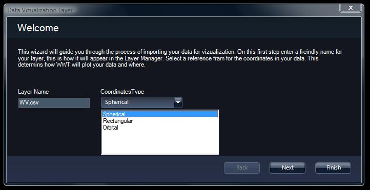

# Earth and Planet Research

WorldWide Telescope can be used by Earth scientists to study events on our own
planet in some detail. The main feature for this purpose is the **Layer
Manager**, which enables layers of data to be rendered on the 3D model of the
Earth, where those layers are either static data such as boundaries (political
boundaries, watersheds, tectonic plate boundaries, to name a few examples), or
dynamic data reporting events on a time line (earthquakes, hurricanes,
volcanoes and similar natural events perhaps being the most dramatic, but
simple changes in vegetation, sea level, water flow, and so on can also be
represented). Static data is usually represented by shape files (lists of
vectors defining regions, large and small), and dynamic data is usually
represented by spreadsheet data (columns of events, latitude and longitude,
times and the magnitude and persistence of the event).

Layers can also be applied to the Sun, the other planets, and some of the
moons, in our solar system.

Layers can be added and used as part of [Guided Tours](#GuidedTours).

## Time Series Data

Time series data is typically a list of events that occurred at a very
specific time (such as earthquakes), or were initiated at a certain time and
persist.

To add a layer of time series data, click the **Add** button on the Layer
Manager, or right-click on the node where the data should be added, and select
**Add** from the menu; select the file of data to be added from the Open File
dialog. The import of data from an Excel spreadsheet will be made easier if
there are column headings in the spreadsheet that are helpful, as WorldWide
Telescope uses these to make a best guess as to their purpose. It does not
matter if there are more columns in the spreadsheet than are needed - the
extraneous columns will be ignored. The spreadsheet should be in .csv or .txt
format.

Following the selection of the appropriate file, a series of Data
Visualization dialogs will appear that are used to configure the data for
WorldWide Telescope:

When this dialog appears, first give the data layer a friendly name, and
select from the drop down list of coordinate types (often the default of
spherical will apply).

Follow the instructions in the dialogs, carefully matching the column headings
in the spreadsheet to those requested by the Data Visualization tool.

### Setting Time Series Data Running

To set the time series data running, select and highlight the layer in the
**Layer Manager.** Then ensure the **Time Series** and (optionally) the **Auto
Loop** checkboxes are selected. Then go to the [View Menu](#TheViewMenu) and
accelerate time to see the visualization of the events.
