# Exploring

Exploring the universe is the funnest thing you can do with WorldWide Telescope! This section covers the views that you can choose from, and shows you how to navigate within each view.

To select a view, use the **Look At** drop down list (at bottom left):

## Earth

Use **Earth** view to explore our own planet from a viewpoint in space. To enter **Earth** view, select **Earth** from the **Look At** menu (bottom left).

**To Control the View**

*   Click and drag to rotate the Earth.
*   Use the mouse wheel to zoom in and out.
*   To tilt the field of view **CTRL + click** and drag vertically.
*   To rotate the field of view **CTRL + click** and drag horizontally.

Use tilt along with the **Show Elevation Model** setting in the **Earth > Overlays** node in the Layer Manager to get a fly-over effect, and see mountain ranges and river valleys in three dimensions.

Use **View > Reset Camera** to restore the default view and settings.

Use the **Imagery** menu to choose from the available imagery options, including aerial, streets, hybrid and nighttime views.

This image of Hawaii is obtained from the **Virtual Earth Hybrid** imagery:
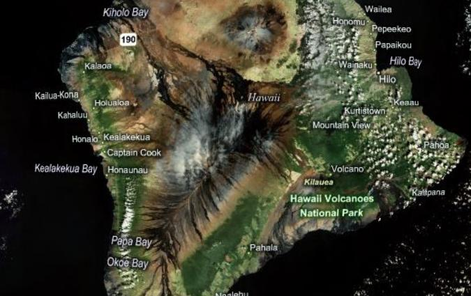

### Earth Tutorials

#### Tutorial: Comparing Night and Day

There are several imagery options for the Earth, including aerial photography, streets, a hybrid of these two, and a night view. The night imagery is the simplest, yet it reveals information that the other views do not convey as well. In this tutorial we'll examine relative population density by comparing night and day images.

1.  In the **Look At** list select **Earth**.
2.  In the **Imagery** list scroll to the **Bing Maps Streets** view.
3.  In the **Settings** pane ensure that **Earth Cloud Layer Overlay** is not selected.
4.  Rotate the Earth using the mouse until southwest Australia is in view, then zoom in to the following location: 

5.  Without changing the zoom or pan settings, change the **Imagery** to **Earth at Night**. Notice that the same view angle is maintained even though the imagery has changed. Try toggling the **Imagery** to **Bing Maps Streets**, then back to **Earth at Night** again. Human population density is readily revealed with the glow of artificial light in the night view. The bright areas on the night map exactly matches the city of Perth named on the **Bing Maps Streets** view. 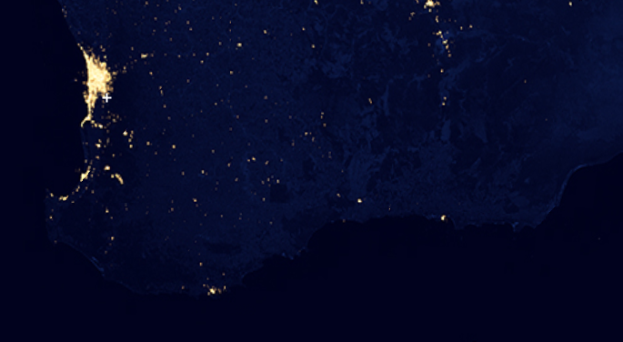

## Planet

Use **Planet** view to explore the other planets and some of the moons of the Solar System. To enter **Planet** view, select **Planet** from the **Look At** menu (bottom left).

**To Control the View**

*   Use the mouse wheel to zoom in and out.
*   Click and drag to rotate the planet or moon you are viewing.
*   To tilt the field of view **CTRL + click** and drag vertically.
*   To rotate the field of view **CTRL + click** and drag horizontally.

Use tilt along with the **Show Elevation Model** setting in the **Earth > Overlays** node in the Layer Manager to get a fly-over effect, and see mountain ranges and river valleys in three dimensions.

Use **View**, **Reset Camera** to restore the default view and settings.

Some moons are available under the **Planet** imagery, including Io, one of the best known of Jupiter's many moons:

### Planet Tutorials

#### Tutorial: Locating Olympus Mons

Olympus Mons is the tallest mountain on Mars (and indeed the Solar System). At a colossal 17 miles high it is three times higher than Everest. The following tutorial locates the mountain:

1.  In the **Look At** list ensure that **Planet** has been selected.
2.  In the **Imagery** list click on **Mars**.
3.  Pan and rotate the view in order to locate the mountain, noting that it is close to the Martian equator. The mountain can be located visually either from its top-down view, which is distinctive, or from its proximity to three smaller mountains than are in a near perfect line. These two views are shown in the following images: 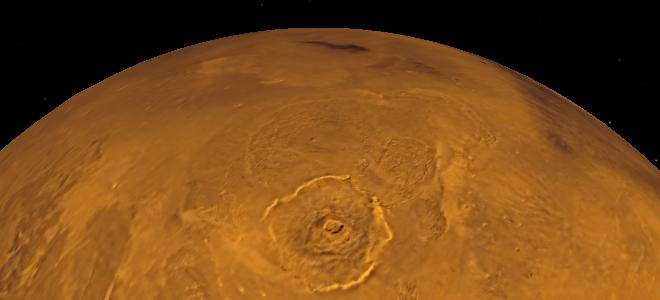 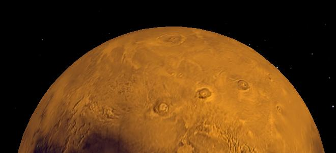

4.  Zoom in and use the **CTRL** key as you click and drag vertically. This will tilt the view to show just how tall Olympus Mons actually is: 

5.  Olympus Mons is a _shield_ volcano, approximately 340 miles wide. The most recent volcanic activity is estimated at 2 million years ago, so it is difficult to classify the volcano as extinct. One theory for the huge size of the mountain is that Mars does not have tectonic plates, so there is no gradual crust movement to recycle the surface.  However this theory is countered by the three mountains in a line, which suggests a plate edge. The three smaller mountains are also volcanoes and are named  Arsia Mons, Pavonis Mons  and Ascraeus Mons, though they are smaller only in relation to Olympus Mons (Arsia Mons - the southernmost - is the tallest at about 12 miles high, Pavonis Mons - the middle of the three - the shortest at 8.6 miles, and Ascraeus Mons - the northernmost - is about 11 miles high).
6.  Other surface features of Mars to look for include the great canyon, Valles Marineris, which runs along the equator and is over 2500 miles long. It is the deepest known crevice in the Solar System. Mars is also known for its plains, polar caps, and clear signs of water and wind erosion. Mars' surface temperature is quite cold, ranging from -140 to 20 Celsius. Its atmosphere is mostly carbon dioxide, but there is enough water vapor to form the occasional clouds.

#### Tutorial: Comparing Surface Features of the Solar System

Highly detailed surface images and elevation data are currently only available for the Earth, our Moon, and Mars. However, there is enough detail on many of the solar system planets and moons to locate their most notable features.

**To View a Planet**

1.  Select **Planet** from the **Look At** menu.
2.  Click **Imagery** and select the planet you want to see.

Much more imagery data is available under **Explore > Collections > Planets/Moons**.

1.  Mercury

    Mercury is known for its craters and ridges, volcanoes and lava flows. The largest features are the very wide craters. One of these, the Caloris Basin (30.5 Lat 170.2 Lng) is particularly interesting because of the so called _Chaotic_ _terrain_ that exists diametrically opposite to it (-30.5 Lat -9.8 Lng). There is a very thin atmosphere consisting largely of sodium. Surface temperatures range from −183 (at night and in the deepest craters) to 427 Celsius (when the Sun is directly overhead). Mercury has no moons.

1.  Venus

    Venus comes closer to the Earth than any other planet in size, and closest to the Earth in distance. Its surface includes mountains, volcanoes, rift valleys, and two continents of higher elevation than the rest. It's surface is however extremely hot -- around 435 Celsius -- and is partly obscured by clouds of sulfuric acid. There is no evidence of water erosion on the planet, though there is small amounts of water vapor in the atmosphere.
    Notice that Venus has fewer craters than Mercury, Mars or our Moon, which suggests the planet surface is relatively young (about 1 billion years old), though the dense atmosphere may also protect the surface to a degree. Venus has no moons.

1.  Earth

    Refer to [Earth](#ExploreEarth).
    Our solitary moon is old and heavily cratered, one of the best known craters is called Copernicus. It can be located visually using the **Explore > Collections > Planets/Moons** data (noting the three craters in a near line), or from its latitude and longitude:
    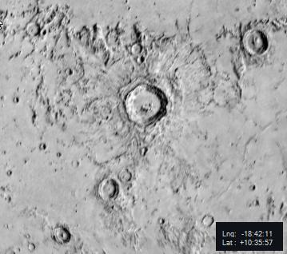

1.  Mars

    See the description in the [Locating Olympus Mons](#TutorialLocatingOlympusMons) tutorial.

    Mars has two moons, Phobos and Deimos. Some image data is available, find the thumbnails in the **Explore > Collections > Planets/Moons** data. Currently they are not represented in the **Sky** or **SolarSystem** views. Deimos is notable for its smooth surface:
    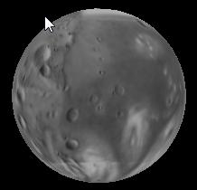

1.  Jupiter

    Jupiter's surface is gaseous so there are no mountains or valleys to speak of. The most prominent surface features are the banding and the spots -- with the Great Red Spot being the largest of the spots with a diameter that exceeds that of the Earth. The spots are swirling clouds of gas, often referred to as storms but are surprisingly stable, changing little in size in the years they have been observed. The banding is caused by clouds of different colors. The darker brown and red bands are called _belts_, and the lighter yellow and white bands called _zones_.
    Jupiter's atmosphere is mostly hydrogen with some helium, and traces of many other gases.

    Jupiter has four large moons, Io, Europa, Ganymede (the largest moon of the Solar System) and Callisto. Image data for all four exists in the **Planet**, **Sky** and **SolarSystem** views.
    Jupiter has many other satellites, totaling at least 63, though none of the others match the size of the four largest. Ganymede has ancient dark surface matter, and not quite so ancient lighter surface matter, marked with grooves and ridges:
    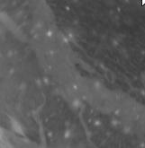

1.  Saturn

    Saturn's surface is relatively bland, consisting mostly of hydrogen and helium gas. It is known for its high winds, up to 1000 mph, and lightning that is one million times more powerful than that on Earth. It is the most beautiful planet in the Solar System because of its spectacular rings, believed to have been formed by a comet or other object passing too close and being pulled apart into tiny fragments of ice and dust. The creation and rotation of the rings cannot be explained solely by gravity, as there appears to be an electromagnetic interaction between dark _spokes_ in the rings that rotate almost synchronously with the magnetosphere of the planet.

    Saturn has a large number of moons, 53 currently have names, though many are small.
    Partial imagery exists in the Explore > Collections > Planets/Moons data for Mimas, Enceladus, Tethys, Dione, Rhea, and Iapetus. Mimas is known for its huge impact crater -- 62 miles in diameter:
    

1.  Uranus

    Another gas giant, the surface of Uranus consists of blue-green clouds -- colored by tiny crystals of methane. Similar to Jupiter and Saturn the atmosphere is mostly hydrogen and helium.

    Uranus has at least 21 satellites. Partial imagery exists for the largest five -- Ariel, Umbriel, Titania, Oberon and Miranda -- in the **Explore > Collections > Planets/Moons** data.
    Miranda has some strange rocky surface features called ovoids, that have near parallel ridges and canyons. One of these ovoids is clearly visible in the partial data:
    

1.  Neptune

    Neptune is mainly made up of hydrogen gas with some helium. Its deep blue color comes from trace methane ice in the atmosphere. Similar to Jupiter it is known for its surface storms that appear as dark irregularly shaped spots.

    Neptune has at least 13 moons. The largest, Triton, is the coldest known place in the Solar System, at -235 Celsius it is less that 35 degrees above Absolute Zero. This is due in part to the reflective nature of the surface of Triton. No image data currently exists in WorldWide Telescope for any of the moons.

1.  Pluto

    Recently reclassified as a _dwarf planet,_ Pluto is actually a binary system, rotating in synchronous orbit with one of its moons -- Charon -- with the center of rotation being outside of either body's mass. Pluto is now widely considered to be the largest member of the Kuiper Belt -- a region just to the outside of the Solar System containing many smaller objects. Pluto's surface is largely rock and ice, so is cratered, and it is also known for its bright South pole.

    There are two known moons in addition to Charon, named Nix and Hydra. None of the three are currently represented in WorldWide Telescope.

    The following programs have been built using the [WorldWide Telescope Web Control Script Reference](http://www.worldwidetelescope.org/docs/WorldWideTelescopeWebControlScriptReference.html), and enable detailed searching of the surfaces of many planets and moons.

 Demo Name |  Description | Link

 **WWT Web Client Hi-Def Planet Explorer**  Provides a range of options for exploring the surfaces of our Moon and Mars. Thousands of surface features, including craters, mountains, valleys, seas, plains, ridges and depressions, are available to step through, sort, search and view. | Make sure to select the correct planet or moon in the **Look At** and **Imagery** drop down lists, after starting the program. |
  **[Run](http://www.worldwidetelescope.org/docs/Samples/wwtwebclientplanetexplorer.html)**

**WWT Web Client Distant Planet Explorer**  Provides a range of options for exploring the surfaces of Mercury, Venus, and the four main moons of Jupiter: IO, Ganymede, Europa and Callisto. Hundreds of surface features, are available to step through, sort, search and view. | Make sure to select the correct planet or moon in the **Look At** and **Imagery** drop down lists, after starting the program. | **[Run](http://www.worldwidetelescope.org/docs/Samples/wwtwebclientdistantplanetexplorer.html)**

## Sky

Use **Sky** view to explore the celestial sphere, the vast expanse above and around us. To enter **Sky** view, select **Sky** from the **Look At** menu (bottom left).

**To Control the View**

*   Click and drag to pan.
*   Use the mouse wheel to zoom in and out.
*   Hold the shift key to slow the zoom rate.
*   To rotate the field of view **CTRL + click** and drag horizontally.

The Crab Nebula is one of the best known features of the constellation Taurus. It is a supernova remnant:

By default the **Explore > Collections** options are shown in the top panel. You can use the **Collections** panel to explore image data in WorldWide Telescope. Thumbnails in the **Collections** panel behave like files and folders; each thumbnail links either to another set of collections, or to a single piece of image data.

These images are detailed individual (or composite) pictures of the objects, and will be rendered over the background sky image. Note the down arrow in the lower right of the image. This can be used to show a much larger top panel, with many more thumbnails present. Interesting comparisons can be made by using the cross-fade slider (located in the lower panel) to compare the image you have loaded with the [Sky Survey](#SkySurveys).

Note that Collections data can be in various modes; most are in the **Sky** view. When selecting an object from a collection the **Look At** mode will be switched to the appropriate view automatically.

The context list in the lower panel is updated each time the view is changed. A single click in a context thumbnail (shown in the lower panel) will smoothly navigate to that location. Double clicking will skip straight to the location, NGC2555 in the example below. Hovering the mouse over the thumbnail will illuminate the object with an annotation in the main view (if the object is visible in the main view).

If there are too many context thumbnails to scroll though, use the up arrow to show many more of them:

Click in the globe, then drag the mouse, to change the field of view relative to the Celestial Sphere. Click in the constellation box to center the view on that constellation -- Draco in this example:

All of the [The View Menu](#TheViewMenu) options apply to the Sky view, except the **3d Solar System** pane. In particular refer to the [Observing Location](#ObservingLocation) pane to select a different viewpoint on Earth.

Also check the **Constellation Lines** and **Experience** options in the [The Settings Menu](#TheSettingsMenu).

Use **View > Reset Camera** to restore a default view and settings.

### Sky Tutorials

#### Tutorial: Tracking a Conjunction

A conjunction occurs when two or more objects in the sky appear close to each other. The following tutorial tracks a conjunction between the crescent Moon, Jupiter and Venus that occurred on 1st December 2008.

1.  In the **Look At** list ensure that **Sky** is selected.
2.  In the **Imagery** list change the entry to **Black Sky Background**.
3.  In the **View** panel click **Setup** in the **Observing Location** panel, and change the location to **Sydney, Australia**. Select **View from this location**. If you're using the Web Client you can skip this step.
4.  In the **View** panel **Observing Time** panel set the date to 2008 December 1st, and set the time to `0 0 0 local time` (midnight), or `8 0 0 UTC`.
5.  Click **OK**.
6.  Select **Explore > Constellations** and scroll to locate and click on the constellation **Sagittarius**.
7.  Zoom in a bit on the Moon, which is right in the center of Sagittarius.
8.  The crescent Moon makes a smiley face with Venus and Jupiter. Note that to show both annotations the following image is a composite of two screenshots. 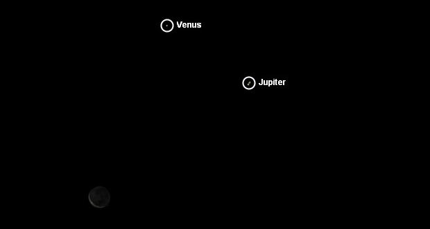

Conjunctions are a visually interesting phenomenon that usually involve near-Earth objects. To examine a range of distant features of the known universe, try the following tutorial, or select the examples in the [Context Search](#ContextSearch) table.

#### Tutorial: Visiting the Neighbors

In this tutorial you'll learn how to use the search features of WorldWide Telescope to locate our stellar neighbors.

1.  In the **Look At** list ensure that **Sky** is selected, and in the **Imagery** list select the [**Hipparcos Catalog**](#HipparcosCatalog).
1.  In the **View** pane ensure **View from this location** is not selected.
1.  Outside of the Solar System, the nearest known star to Earth is so dim it is impossible to see with the naked eye. The star, Proxima Centauri, is about 4.2 light years distant. It has two very bright neighbors known either as Alpha Centauri (A and B) or Rigil Kentaurus. To locate these click [**Search**](#TheSearchPanel) so that the search panel appears, and type "Prox" into the search text box. Note that the search narrows as you enter each letter, and it is only necessary to enter a few to locate this star. Double click the thumbnail to jump to the location. 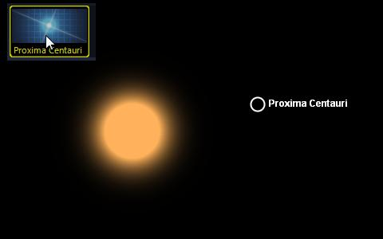 The image shows that there can be some discrepancy between the recorded position of a star, and its location on a photograph.

    Proxima Centauri has an apparent magnitude of around 11.05\. This is on a [Stellar Brightness](#StellarBrightness) logarithmic scale (the higher the numbers, the lower the brightness). A value of 11 is 2.5 times dimmer than a value of 10, which is 2.5 times dimmer than a value of 9, and so on.

1.  Use the mouse wheel to zoom out from Proxima Centauri until the bright stars of Alpha Centuari and Hadar appear (Hadar is also known as Beta Centauri). Notice that Proxima Centauri is no longer visible. Hadar has a brightness magnitude of 0.61 (Rigil Kentaurus is even brighter at -0.01) and Proxima Centauri has a brightness magnitude of 11.05, which makes Hadar 15000 times more bright than Proxima Centauri. Our nearest star is certainly not the brightest!
1.  To visit the brightest star type **Sirius** into the search text box, and click on the thumbnail. Aside from the Sun, Sirius is the brightest star in the sky by a considerable margin. 

    Sirius has a brightness magnitude of -1.46\. The second brightest star, Canopus, has a magnitude of -0.72\. This makes Sirius very nearly twice as bright as Canopus.

    However, Canopus is 308 light years distant from us, and Sirius only 8.6 light years, so Canopus would appear much brighter if it were not so distant.

1.  Another interesting nearby star is Epsilon Eridani. At a distance of 10.5 light years, and with an apparent magnitude of 3.73, it is often visible to the naked eye. Early observations of the star suggested, but did not confirm, that it is the nearest star with a planet - a gas giant similar to but larger than Jupiter - in a 7 Earth-year orbit. Search "Epsilon Eridani" to locate the star. Measurements using the Hubble Space Telescope have since confirmed the planet's existence. Planets are very difficult to detect because they are lost in the glare of their parent star. Their presence is usually inferred from a wobble in the star's movement (suggesting a nearby gravitational tug), or by coincidence when the planet crosses in front of the star from our viewpoint and alters the star's brightness to a degree. Because of these limitations in detection, most of the nearly 400 planets so far located are Jupiter-like in size. The nearest Earth-like planet so far detected orbits the red-dwarf star Gliese 581, located 20 light years from Earth. Good images of planets are very hard to come by.
1.  Visiting the nearest galaxy requires some definition. Large galaxies like the Milky Way have many smaller satellite galaxies, usually called dwarf galaxies. The nearest known dwarf galaxy is Canis Major Dwarf, about 25,000 light years distant from us. WorldWide Telescope does not yet have a single image of this galaxy, so we will visit instead the previous contender for the closest satellite galaxy, the Sagittarius Dwarf Elliptical Galaxy, believed to be around 70,000 light years from here. Change the **Imagery** selection from Hipparcos to the [**Digitized Sky Survey**](#DigitizedSkySurvey) and type "Sagittarius Dwarf" into the search text box.     
    

    The Sagittarius Dwarf Elliptical Galaxy is very faint as it currently resides on the opposite side of the galactic core of the Milky Way. It is set to pass through the Milky Way and will probably be absorbed entirely into the larger galaxy.

1.  There are at least 10 other satellite galaxies of the Milky Way. Some uncertainly exists over the Large Magellanic Cloud galaxy and its sibling, the Small Magellanic Cloud galaxy. Initial theories that these two were satellites of the Milky Way were revised when the speeds of the two galaxies was calculated to be far too high to be in orbit. Alternative theories include that these galaxies will pass by the Milky Way, or that they will not escape the huge gravitational forces of the Milky Way, and will become satellites. Typing "Large" into the search text box is enough to bring up a range of thumbnails for the Large Magellanic Cloud galaxy.
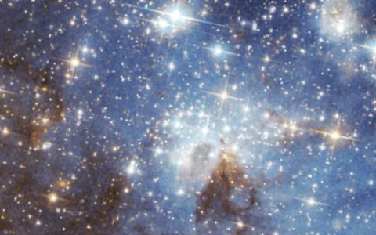

    Zoom in on the **Star Forming Region in the Large Magellanic Cloud**. Sometimes classified as irregular, this galaxy may have been a barred spiral galaxy before succumbing to the tidal forces of the gravity of the Milky Way.

1.  The galaxy most often quoted as our nearest neighbor is the Andromeda galaxy. This behemoth of a galaxy contains an estimated one trillion stars, and is so bright it is one of the furthest objects (at 2.5 Million light years) that can be seen from Earth with the naked eye. Despite having many more stars than the Milky Way it is calculated to have about the same mass, because of the greater amount of dark matter in the Milky Way. The two giant galaxies are set to collide in the distant future (the subject of a [guided tour](#GuidedTours) in WorldWide Telescope). The Andromeda galaxy is also well known by its Messier Catalog name, M31\. Type "M31" into the search text box. 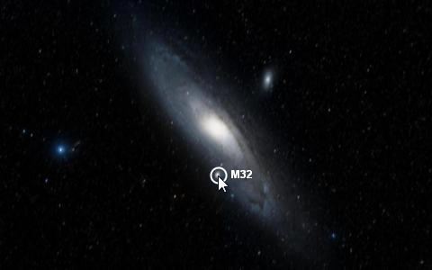

    The Andromeda galaxy is a classic spiral galaxy. It has at least 19 satellite galaxies in orbit, including M32 highlighted in the image, with M110 - an elliptical galaxy containing millions of stars - visible above the main body.

1.  The Andromeda and Milky Way galaxies are the two biggest galaxies in a group known as the Local Group. The Local Group has a third big galaxy, Triangulum, and over twenty smaller galaxies, not including the many dwarf galaxies. The whole group is part of the Virgo Supercluster. At about 3 million light years away, Triangulum is the furthest object that can be seen with the naked eye. It is sometimes referred to as the Pinwheel galaxy (though this name is also given to another galaxy, M101), but is most reliably located by its Messier Catalog number, M33\. Note that you will get different search results for each of these three names, even though they can refer to the same object! This is because the search is reliant on the names given to the objects by the creators of the images.

    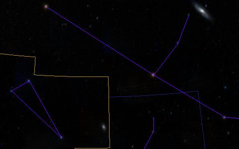
    The Triangulum, M33 or Pinwheel, galaxy may be remote but it is gravitationally bound to the Andromeda galaxy.

    Andromeda is in the top right of this image, M33 just inside the boundaries of the constellation Triangulum in the lower center.

1.  An object in the sky can usually be located by searching on its name, or one of its names, but you can also enter its stellar co-ordinates (known as right ascension or RA, and declination, or Dec). These co-ordinates are similar to longitude and latitude on Earth, though right ascension is often given in hours, minutes and seconds (it can also be given in degrees). Declination is almost always in degrees. The RA and Dec of Triangulum are RA: 1 hour 33 minutes 50 seconds, and Dec: 30 degrees 39 minutes 36 seconds. Enter these simply as `1 33 50`, and `30 39 36` into the RA and Dec boxes in the search panel. Click **Go** to navigate to the location.

    
    

1.  Triangulum may have a satellite galaxy called the Pisces Dwarf, but searching on this name will not currently reveal the galaxy. However we can locate it using its known right ascension and declination values, so enter `1 03 55` for **RA** and `21 53 06` for **Dec**, and click **Go**.

    

    The Pisces Dwarf galaxy appears only as the faint cloud between the bright stars at the top and bottom of the image.

    This galaxy may be spherical or irregular. The light from the galaxy is blue-shifted, which indicates that it is moving towards the Milky Way.

1.  All of the galaxies visited so far are part of the Local Group, which makes up a small part of the Virgo Supercluster. This supercluster contains at least 100 galaxy groups, and has a diameter of around 110 million light years. There are millions of superclusters in the known Universe. The Local Group is an outlying group within the Virgo Supercluster. The Virgo Cluster forms the heart of the supercluster, and contains up to 2000 galaxies. Locate the center of the Virgo Cluster be entering **RA** `12 27 00` and **Dec** `12 43 00` into the search panel. Click **Go** to see the last image in this tutorial -- the bright objects in the image are very bright galaxies.

    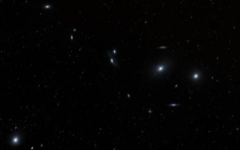

    The elliptical galaxy Messier 87 is one of the brightest galaxies in the Virgo Cluster, and can be seen in the bottom left hand corner of the image. The two other very bright objects are galaxies M84 and M86\. Most of the other bright objects in this image have been identified as galaxies, though a few of the less bright spots remain _unidentified_.

1.  The nearest supercluster to the Virgo Supercluster is the Hydra-Centaurus Supercluster. It is one of the estimated 10 million superclusters in the Universe. Superclusters may be the largest independent structure in nature, though there are theories that superclusters are subordinate to even more enormous concepts called _walls_ or _sheets_, which can be a billion light years in length. Other theories have the superclusters moving in _rivers_ towards objects with massive gravitational pull. However, a visit to the Virgo Cluster completes this tutorial.

    **Note**: the Messier Catalog referenced in this tutorial can be viewed in full in the Web Client version of WorldWide Telescope, using the following program.

Demo Name | Description | Link
**WWT Web Client Messier Catalog** |
All 110 objects in this famous catalog can be viewed, displayed as a slide show, sorted and searched. | **[Run](http://www.worldwidetelescope.org/docs/Samples/wwtwebclientmessiercatalog.html)**

#### Tutorial: The Sky Tonight

This tutorial shows how to use WorldWide Telescope to plan an evening's astronomical observing. In the first set of steps, you'll learn how to set your location, and track the sun to determine the ideal time to begin viewing. Complete the tutorial by following the steps to help locate common objects in either the [Northern Hemisphere](#NorthernHemisphere), or [Southern Hemisphere](#SouthernHemisphere).

**To Set Location and Determine Optimal Viewing Time**

1.  Ensure that the **Look at** box has been set to **Sky**, and that the **Imagery** is set to **Digitized Sky Survey**.
1.  In the **View** panel, set the **Observing Location** and **Observing time** to match your viewing location (Windows Client only; the Web Client will automatically use your present location).
1.  Check the **View from this location** checkbox.
1.  Click **Search** and enter **Sun**. Click on the thumbnail for the Sun to track it. Right click on the Sun to bring up and track the [The Finder Scope](#TheFinderScope).
1.  Click **View** to bring back the view panel, and fast forward the observing time (usually **x1000** works well) while tracking the Sun. Faint stars and galaxies are best seen once the Sun is at least 18 degrees below the horizon. Pause the **Observing time** when the Sun's **Alt** is close to `-18:00:00`. Use reverse time if you overshoot! Now write down the **Observing Time** shown in the **View** panel.
1.  The sky now displayed by WorldWide Telescope is ready to be viewed. Keep your notebook handy to jot down the altitude and azimuth of any object that might be visible.
1.  Click on **Search** to bring up the search options again, type **Solar System**, but this time click the checkbox **Plot Results**. Now pan and zoom around the sky to see if any planets will be in view. The best time to observe a planet, neglecting weather conditions, is close to its transit time (when it is at its highest point in the sky).

 

1.  The plotted results for the Solar System will include our own moon. It is a beautiful object to look at and it can be so bright it dominates the night sky. Click the Moon's thumbnail in the search results panel. Now you can see whether the Moon will be above or below the horizon, what phase it will be in, and what other objects it will be near.
1.  Outside of the Solar System, look for constellations and [asterisms](http://dictionary.reference.com/browse/asterism).

##### Northern Hemisphere

1.  Look to the north to find the Big Dipper, stars part of the constellation Ursa Major. The ladle of the dipper has two stars that can be used to point to Polaris, the north star. Polaris is very close to the Earth's rotational axis, so it will be in the northern sky at an elevation equal to an observer's latitude all day and night. Polaris is a _Cepheid variable star_, a star with a pulsating outer atmosphere, making it slightly brighter and then dimmer depending mostly on its changing surface area.

    

1.  If it is winter in the northern hemisphere, Orion the great hunter will be climbing through the sky. Easily identifiable by his belt, the surrounding constellations are also interesting. To the west, find Taurus the bull with a red giant eye, Aldeberan. This star is just like the northeastern star of Orion, Betelgeuse. A star further along in its evolution than the Sun, Betelgeuse is no longer fusing hydrogen in its core, but is fusing helium. Hydrogen is still being fused to produce energy, but only in a shell surrounding the core. This is not a very stable method of holding a star up and consequently red giant stars often pulsate trying to establish a steady equilibrium between gravity pulling material inward while the force from photons created in the interior push outward.
1.  The triangle of stars shown below is sometimes called the winter triangle: (clockwise from upper left) Procyon, Betelgeuse, and Siris. Sirius is part of Canis Major, the larger of Orion's hunting dogs. It's a bright massive star that happens to be relatively close to us, and it's the closest star you can see at night in the northern hemisphere. The bright star south of Sirius in Canis Major, named Wezen, is in contrast one of the most distant stars you can see without a telescope (at 1614 light years away). Sirius and Procyon are both the brighter members of a binary system - they are both in orbit with a white dwarf star, the collapsed core of a star that was once about the size of our Sun.

  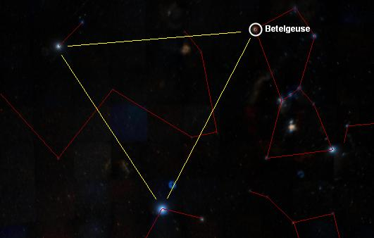

1.  In the summer, three bright stars make up the summer triangle. Counterclockwise from the left, Deneb, Vega, and Altair. Deneb is an amazing star, a blue super giant that appears bright in our skies even though it is over 1400 light years away. It is the tail of Cygnus the swan. Vega is one of the brightest stars in our night sky and is part of the constellation Lyra, a harp. Arab astronomers had Vega being part of a constellation that was a vulture, making the summer triangle three birds. Altair is part of the constellation Aguilla, the Eagle. These three stars straddle the background Milky Way, the disk of our galaxy. The white cloudy appearance is actually due to many stars and nebulae so distant we can't separate them. You have to be far from a city to see the Milky Way.

  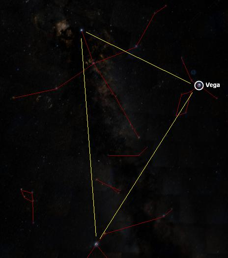

That completes the Sky Tonight tutorial. Take your notes outside at the calculated time, and scan the skies!

##### Southern Hemisphere

1.  If you are in the Southern hemisphere, there is an equally great variety of objects to look for. The two galaxies, the Large Magellanic Cloud and Small Magellanic Cloud, may be in view. These galaxies may be satellites of the Milky Way - or may just be passing through - or may even be attempting to pass by but in fact will become satellites. As big as the Large Magellanic Cloud is, it is about one tenth the mass of the Milky Way. These galaxies are fairly close to the bright star Canopus.

  

1.  Of special interest are the closest stars to Earth (at 4.3 light years), the binary system of Alpha Centauri, which might be visible in the constellation Centaurus. To locate it search on its alternative name: Rigil Kentaurus.
1.  One of the best known formations in the southern skies is the Southern Cross. Use the search options to locate any one of its four stars: Acrux, Becrux, Gacrux or Decrux. Alternatively select **Explore**, then **Constellations**, then click on the **Crux** thumbnail.

The bright star mentioned above, Rigil Kentaurus, along with its nearly-as-bright neighbor Hadar, are visible at the bottom of this image.

  

1.  The globular cluster Omega Centauri contains millions of stars, many as close as 0.1 light years to each other, and may be the remains of a small galaxy that collided with the Milky Way. It is about 15800 light years from Earth, and appears as a single point of light to us. There is evidence of a black hole at its center. Search for it using its catalog name, NGC5139.

That completes the Sky Tonight tutorial. Take your notes outside at the calculated time, and scan the skies!

#### Tutorial: Astronomy Terminology

In this tutorial WorldWide Telescope is used to demonstrate the purpose behind some of the most commonly used terms in astronomy.

1.  Set the **Look at** box to **Sky**,and the **Imagery** to **Digitized Sky Survey**. Also ensure **View from this location** is not selected in the **View** pane.

1.  Objects in the sky are located using _right ascension_ (RA) and _declination_ (Dec). Right ascension in space is equivalent to longitude on the Earth. Longitude is an east-west bearing from the Greenwich Meridian, right ascension is the east-west bearing from an equally arbitrary point in space - the point where the Sun crosses the _celestial equator_ on the March _equinox_. The equinox is chosen because at this point the Earth is neither tilted towards or away from the Sun, but instead is vertically aligned with the Sun (the _solstices_ occur when the tilt is at a maximum). The celestial equator is none other than the Earth's equator projected out into space, and the north and south _celestial poles_ are simply our own poles projected out indefinitely. Where the Sun crosses the celestial equator both right ascension and declination are zero.

    Declination is similar to latitude on Earth, measuring a north-south bearing. Objects above the celestial equator have a positive declination, objects below it a negative declination. The point where the Sun crosses the celestial equator is known as _The First Point of Aries_.

1.  In Layer Manager under **Sky > Overlays > Constellations**, uncheck the boxes for **Constellation Figures** and **Constellation Boundaries**. Then, under **Sky > Overlays > Grids**, check the boxes for **Equatorial Grid** and **Ecliptic Grid**.

1.  Open the **Search** panel, enter `0` for **RA** and `0` for **Dec**, then click **Go**.

     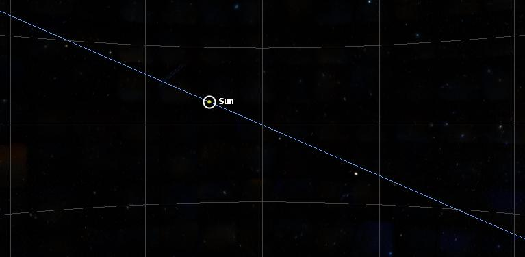
    The track of the Sun across the sky is known as the **_ecliptic_**. The First Point of Aries should now be in the middle of your view.

1.  The right ascension and declination of celestial objects do not change, unless the position of the objects changes relative to the coordinate system which of course they do, but very slowly, so slowly that it is only necessary to revise the coordinate system every 50 years. Each time a coordinate system is fixed, it is called an _epoch_. The current epoch, and the only one supported in WorldWide Telescope, is the **J2000** epoch - namely the position of the celestial objects and coordinate system at Noon on January 1st in the year 2000, at the Royal Observatory, Greenwich, England. The change to the J2000 epoch was made in 1984, as the positions of stars can be predicted accurately in advance of the actual year. There may of course be a change to the J2050 epoch, perhaps sometime after the year 2025.

1.  Of course stars and all other objects do appear to move in the sky, as a result of the rotation and orbit of the Earth. At any one moment the position of an object in the sky can be referenced by its _azimuth_ and _altitude_. Azimuth is similar to longitude or right ascension, in that it is an east-west bearing from true north. Altitude is an angle rather than a distance, it is the angle up or down from the horizon. By convention positive azimuth is to the east, negative to the west, and positive altitude is up from the horizon. Unlike right ascension and declination, azimuth and altitude change continuously. For example, open the **Search** panel, then enter **Sirius** in the search text box. When the bright star Sirius appears, zoom away from it until the view is from Earth (that is, minimize the zoom completely). Right-click on Sirius in the sky to bring up the [Finder Scope](#TheFinderScope).

     

    Note that the seconds values for the Altitude (**Alt**) and Azimuth (**Az**) of Sirius are changing, even when you look at the star in real time.

    In the **View > Observing Time** pane click the accelerated time button (the one with the "fast-forward" icon). The altitude and azimuth will now change quite quickly.

    Altitude and azimuth are very useful values when aligning a physical telescope from Earth to locate a particular star or planet. The values are different for every view point on Earth, hence the usefulness of right ascension and declination as a fixed coordinate system.

1.  The **Magnitude** entry on the **Finder Scope** refers to the _apparent magnitude_ of the brightness of Sirius. For a description of what this means refer to the [Stellar Brightness](#StellarBrightness) section, or work through the [Tutorial: Visiting the Neighbors](#TutorialVisitingtheNeighbors) tutorial.

1.  The **Distance** entry on the **Finder Scope** is the distance to the object in _light years_. A light year is an enormous distance. The speed of light in a vacuum is 186,282.397 miles per second (a _light second_), which works out to just under six trillion miles per year, approximately 5,878,500,000,000 (186.282.397 x 60 x 60x 24 x 365.2424) miles. The Sun is about 500 light seconds from Earth, the next nearest star is 4.2 light years away, or over 24 trillion miles. Occasionally space telescopes pick up events that help us visualize how sizeable a light year is in relation to the cosmos. For example, click **Explore**, then **Hubble Studies**, then click **Supernova1987A** .This will bring up a range of seven thumbnails. Click on the fifth, **Supernova1987A - 28th November 2003**. Now click on the sixth thumbnail, **Supernova1987A - 12th December 2004**.

     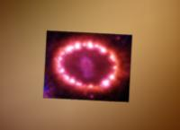    Though not taken exactly one year apart these two supernova images just might be showing one light year in the increased radius of the explosion.

1.  The light year is the most common unit of measurement in astronomy, but not the only one. Open the **Search** panel, then enter **Neptune** into the search text box. Click the thumbnail to show the planet, then right-click on the planet image itself to bring up the **Finder Scope**. For **Distance**, note that it is set at 29 _au_ (astronomical units). One astronomical unit is the mean distance from the Earth to the Sun. This unit of measurement is much smaller than a light year, and is useful within solar systems. The distance of 29 au to Neptune is the distance from Earth to Neptune at a specific point in time, the measurement will slowly vary as the planets orbit.

1.  The three values below **Distance** in the **Finder Scope** are _Rise_, _Transit_ and _Set_. Due to the Earth's rotation almost all visible celestial objects will appear to rise in the east and set in the west. By far the most important rise and set times are obviously those of the Sun. Because stars can only be seen at night their rising and setting may be invisible to us, however they follow the same pattern. The transit time is the time the object crosses the meridian of the observer, so in most cases will be the highest point of the object in the sky. Transit times can become problematic if the observer is near the poles, where a celestial object can appear to pass overhead several times. In order to see an object at its clearest, Earth observers will often try to time the observation to match the transit time. Rise, transit and set times are different for every viewing location on Earth.

1.  In the **View** panel select the **Observing Location** (New York in the example below), and check **View from this location**. This will ensure we have a horizon line (rising and setting are obviously meaningless without one). Next, in the **Search** panel text box, enter **Moon**. Click on the thumbnail for a close-up view of the moon, then zoom out till the horizon line is in view. Next, bring up the **View** panel again, and in the **Observing Time** pane, accelerate the time to **x1000**. You will notice the moon rise and set fairly rapidly. By carefully pausing or slowing the simulated time down, you should be able to match the rising and setting times with those on the **Finder Scope.**

       Moonrise in New York.

    Rise, transit and set times are given in local time, not UTC. Notice that the **Observing Time** of 21:56:11 is just a minute after the **Rise** time in the **Finder Scope**.

1.  Occasionally, instead of rise, transit and set times you will see the word _Circumpolar_. This means that the object will not go below the horizon, and so will not rise or set but will be in view all of the time. This happens when the object is near one of the celestial poles. For example, go to **Observing Location**, and instead of selecting a city simply enter some extreme coordinates (for example Latitude 80 degrees, Longitude 0 degrees as shown in the image below). Then search for and locate the Sun. Depending on the time of year and location, the Sun can become circumpolar, as in the example.

     
    Accelerate simulated time to **x1000** or **x10000** to show that the Sun does not dip below the horizon, but instead casts an ellipse in the sky.

1.  For a near perfect example of circumpolar activity select a northerly location, use the search options to find Polaris, then zoom out. Next, accelerate the simulated time rapidly. Note that the star remains almost stationary in the sky as everything else rotates. Similarly for the southern skies, select a southern city, search for Polaris Australis, and again watch as it stays almost stationary in the sky. These two stars are examples of _pole stars_. Although Polaris is often referred to as _the_ pole star, it is in fact just one of many, which change over time, that hardly move in the sky and act as great aids to navigation. The main reason why pole stars change over time is due to the Earth's _precession_. Precession is the gradual shift in an object's rotational axis or orbit. Earth's precession is induced by the gravity of the other planets, causing the Earth to wobble on its axis cyclically over a period of 26000 years. It is because of precession that the epochs mentioned earlier, such the current J2000,are required. It is also because of precession that the First Point of Aries, mentioned in step 2 of this tutorial, is currently in Pisces. When the equinoxes were first recognized thousands of years ago, this point did lie in Aries! In about the year 2600 it will cross into Aquarius.

1.  The J2000, also known as the [equatorial coordinate system](http://en.wikipedia.org/wiki/Equatorial_coordinate_system), uses right ascension, declination, and the J2000 epoch. You will find the J2000 coordinate system to be the most useful, but there are also other coordinate systems. In the **Search** panel there are options for **J2000**, **Azimuth and Altitude**, **Ecliptic** and **Galactic** coordinate systems. The Ecliptic coordinate system uses the Sun's ecliptic circle as the celestial equator, rather than a projection of the Earth's equator. Try changing the coordinate system from **J2000** to **Galactic**. The galactic coordinate system is based on a line from the Sun to the center of the Milky Way, with a celestial equator in line with the galactic plane. The Sun rotates about the center of the Milky Way at a speed of about 220 kilometers per second in an imperfect circle, and one rotation is called a **galactic year**. It takes around 230 million Earth years to complete one galactic year. Now enter zero for both lambda (λ) and beta (β), then click **Go**. You should now be looking at the center of the Milky Way.

     
    The center of the Milky Way is 25,000 light years distant, in Sagittarius, shown here using the Digitized Sky Survey.

    The actual center is not visible at most wavelengths, because of the presence of dust, but is now known to be a supermassive black hole.

    This completes the tutorial on astronomy terminology.

## Panorama

Explore the images sent back by manned and unmanned space vehicles.

**To Control the View**

*   Use the mouse wheel to zoom in and out.
*   Click and drag to rotate the view.
*   To rotate the field of view **CTRL + click** and drag horizontally.

Use **View > Reset Camera** to restore the default view and settings.

 The Apollo 12 landing site panorama provides some close up detail of the moon surface:
 

### Panorama Tutorials

*   [Tutorial: Comparing Styles of Panorama](#TutorialComparingStylesofPanorama)

#### Tutorial: Comparing Styles of Panorama

There is much less expanse to explore in panoramas than in the other viewing options. In most cases rotating the view will cover most of the content fairly quickly. The following tutorial simply goes through a number of the different panoramas, showing different presentation styles.

1.  Ensure that **Panorama** is selected in the **Look At** list.
1.  In the **Imagery** list select **Pathfinder: Many Rovers**. As only one Rover was present on this mission to Mars it is clear this is a composite of many individual images. If you scroll down you can see the airbags that were used to cushion the probe's landing. This was required because of the rock strewn landscape. The rover, named _Sojourner_, is only 25 inches long.

     

1.  Taking panoramic photographs is one of the objectives of unmanned missions. However, discerning detail from a camera at a low elevation and at a fixed point can be problematic. One method of addressing this is to increase the contrast by coloring the image. In the **Imagery** list scroll down to **Opportunity: Endurance South (false color)**. Compare this with the **Opportunity: Endurance South** panorama, which lacks added color, to understand why researchers color images. Notice how the false color image makes certain details much more visible!

     

4.  To see another method of highlighting landscape, scroll in the **Imagery** list to **Opportunity: Lyell**. Rotate the view until the large crater is in view, shown in the following image:

     

1.  Now load the **Opportunity: Lyell (stereo)** imagery, and using a pair of red and cyan glasses, pan to the same location in the stereo view. The escarpment certainly stands out!
1.  Even though the exploratory spacecraft were equipped with panoramic cameras, most panoramas have dark zones where no images were taken. Typically these dark zones are looking straight up and straight down, though some panoramas are only partial. Try **Opportunity: Burns Cliff**, shown below. for example.

    Note that if you load a panorama and see only black background, rotate the view as the panorama may only be partial.

     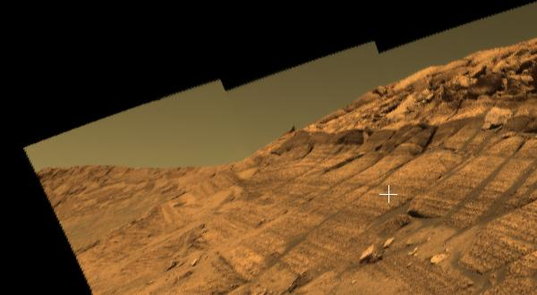

1.  Scroll in **Imagery** to the **Opportunity: Erebus** panorama. At first the panorama appears complete, but see if you can find the missing piece. Note the solar panels that cover the spacecraft:

     

## Solar System

Use **Solar System** view to explore the Solar System in three dimensions. Zoom in to view the surface details of many planets and moons. Three of the most visited objects in the virtual Universe, the Earth, the Moon and Saturn.

**To Control the View**

*   Click and drag to rotate the planet.
*   Use the **Planet Size** slider to increase or decrease the size of the Sun and planets.
    
*   Use the mouse wheel to zoom in and out.
*   To tilt the field of view **CTRL + click** and drag vertically.
*   To rotate the field of view **CTRL + click** and drag horizontally.

Use **View > Reset Camera** to restore the default view and settings.

Basic navigation is much easier using the lower panel thumbnails as the starting point, as there are only one star, nine planets, and five moons to choose from!

Three of the most visited objects in the virtual Universe, the Earth, the Moon and Saturn. For this particular image planet size is magnified to the maximum:
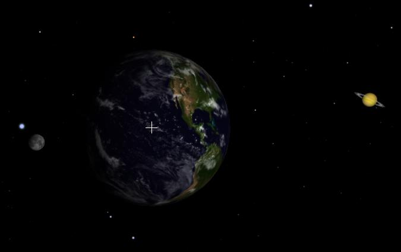

Refer to the [3d Solar System](#3dSolarSystem) settings in the **View** pane. Of great interest is the [Observing Time](#ObservingTime) pane, which enables the planets to be set in motion (more rapidly than in real time) and orbits to be observed, and also, for expert users of WorldWide Telescope, eclipse times and locations to be identified (see the [Tutorial: Tracking a Solar Eclipse](#TutorialTrackingaSolarEclipse)).

Use the mouse wheel to zoom out from the Solar System to view the Cosmos, pausing on the way to look at the Milky Way, noted for its two large spiral arms. The crosshairs show the position of the Solar System.

### Solar System Tutorials

#### Tutorial: Tracking a Solar Eclipse

A solar eclipse occurs when the Moon passes in front of the Sun, as seen from some locations on Earth. The result is a spectacular mid-day darkness along a path across the Earth. To view the effect in WorldWide Telescope, go through the following procedure:

1.  Research a time and location of a total solar eclipse. [NASA](http://eclipse.gsfc.nasa.gov/SEcat/SEdecade2041.html) maintains a website dedicated to this task, as do many other astronomy websites. For example, in the year 2041 April 30th, starting around 12.00 UTC (Universal time, or Greenwich Mean Time) there will be a total eclipse tracking across Africa and passing close to Lake Victoria.
1.  Select **SolarSystem** for the **Look At** list.
1.  Ensure that the **Planet Size** slider is set to **Actual**. The geometry will be incorrect if this is not set correctly.
1.  Click on the **Earth** thumbnail that appears in the lower panel.
1.  In Layer Manager, check **Sky > 3d Solar System > Multi-res Solar System Bodies**.
1.  In the **View** panel ensure that the **Lighting** item is checked.
1.  Also in the **View** panel change the **Observing Time** date information to the correct date: **Year** 2041 **Month** 4 **Day** 30, as one example.
1.  Also in the **Observing Time** panel, select **UTC**, then set the time to **Hrs** 12 **Min** 0 **Sec** 0. Click **Apply**. Close or unpin the **Date Time Selection** panel.
1.  Now rotate the Earth with the mouse until central Africa is in view. Zoom in a little to see the shadow of the Moon more clearly.
1.  Carefully use the fast forward button (setting it to **x100**) in the **Observing Time** panel to view the shadow as it moves across the continent. It should look similar to the following image as it passes Lake Victoria (at a time of 12.52.05 UTC):

     

To see the same eclipse but in the **Sky** view use the following procedure:

1.  Select **Sky** in the **Look At** list.
1.  In the **View** panel, select **Observing Location > Setup** and select the city **Kampala, Uganda**.
1.  In Layer Manager, under **Sky > Overlays > Grids**, check the **Ecliptic Grid** setting.
1.  In the **View** panel select **Observing Time**, and set the date to 2041, April 30th. Set the time to 11.30 UTC.
1.  Select **Explore > Constellations** and click on **Aries**. It is in this constellation that the eclipse occurs.
1.  Zoom in a little to view the Sun and Moon a bit more closely.
1.  Accelerate the time to **x100** to view the eclipse. You may have to pan the screen a bit to keep the eclipse in view.

     
     

Note that lunar eclipses (where the Earth passes in front of the Moon which turns the Moon's appearance a shade of red) are not currently implemented in WorldWide Telescope.

### Sandbox

Sandbox mode displays an empty universe in which you can view arbitrary 3D datasets, and place your own 3D models.

**NOTE:** Sandbox mode is only supported in the [WorldWide Telescope Windows Client](http://worldwidetelescope.org/download).

**To Control the View**

*   To tilt the field of view, click and drag vertically.
*   To pan around the center axis, click and drag horizontally.
*   To rotate the field of view **CTRL + click** and drag horizontally.
*   Use the mouse wheel to zoom in and out.

#### Adding your Own 3D Models

This section describes how to add your own 3D models to WorldWide Telescope.

1.  Right-click on "Sandbox" in the layer manager and select **Add**.

    

1.  Navigate to the OBJ or 3DS file you want to load. WWT scans the file and looks at the bounds of the model to scale it into the viewable 3D space. In this example we loaded [magnolia.obj](http://people.sc.fsu.edu/~jburkardt/data/obj/magnolia.obj).

1.  Right-click the item in layer manager and select **Properties**. Here you can position the object within the sandbox space.

    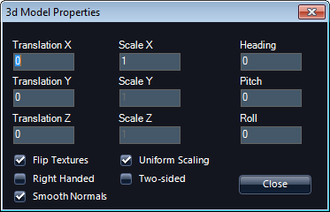

    When the **Properties** dialog is active, click and drag the colored arrows to position the selected object:

    *   Red: X axis
    *   Green: Y axis
    *   Blue: Z axis

    

    You can load multiple models and have them placed in a common coordinate system by making some invisible geometry at the same boundaries in 3D space for all models.

## Keyboard Shortcuts

The following keys are alternatives to using the mouse or joystick in any view, or provide additional functionality:

Key | Effect
 Page Up (or -) | Zoom out
 Page Down (or +) |  Zoom in
 Arrow Up | Rotate up
 Arrow Down | Rotate down
 Arrow Left | Rotate left
 Arrow Right | Rotate right
 Shift + zoom  (Page Up/Down) | Zoom slowly
 Shift + pan (Arrow) | Pan at a constant altitude
 Esc | Pause a tour.
 F5 | Refresh the view.
 F11 | Toggle between full screen and windowed mode.

## Xbox Controller

As an alternative to using the mouse, a USB wired Xbox controller can be used to navigate the view. Simply plug in the Xbox controller and appropriate device driver software will be located and installed.

 

The following table provides the purpose of the controller buttons:

Button |Purpose

 **Right Trigger** | Zoom in.
 **Left Trigger** | Zoom out.
 **Left Thumbstick** | Pan and scroll.
 **Right Thumbstick** | Rotate.
 **Left Bumper** |
 **Right Bumper** | In Sky view each click will step through the objects in the context search.
In the 3D Solar System view each click will step through the planets and moons of the solar system.
 **Directional Pad**
 **Back and Start buttons**
 **A X Y and B buttons**

Other compatible joystick controllers can also be used. If more than one is connected though, there may be conflicts, so for best results only one controller should be connected.

## Explore Menu Entries

Clicking on the down arrow below **Explore** opens up the menu entries.

The **New** options start a new data collection of images, or initiate the [tour creation process](#CreatingaTour).

The **Open** options enable the opening of a tour, a data collection, an image (which will be placed in the sky if it includes AVM metadata, or simply centered if there is no such data) and, for astronomers only, a [Virtual Observatory Table](#VirtualObservatoryTables). Finally there is an option to load ESRI Shape Files.

Clicking **Show Finder** will bring up [The Finder Scope](#TheFinderScope).

Clicking **Getting Started** links to this User Guide, **WorldWide Telescope Home Page** links to the website.
