# Guided Tours

Guided Tours are annotated and animated slide-shows, created to demonstrate a
feature of WorldWide Telescope (such as the **Welcome** tour), galaxies (such
as the **Sombrero Galaxy** tour), or different views and perspectives of the
sky and Earth (such as the **Multiple Worlds** tour). Feel free at any time to
pause a tour, explore on your own (with multiple information sources for
objects at your fingertips), and rejoin the tour where you left off.

Highly rated tours include **Tours > Galaxies > Universal Beauty** -- a tour
of spectacular sights in the Universe set to music, created by High Skies. For
a clear explanation of the search for Earth type planets, visit **Tours >
Planets > Search for Extra Solar Planets**, created by the Harvard-Smithsonian
Center for Astrophysics. Or select **Tours > Galaxies > Dust & Us** to join
Harvard Astronomer Alyssa Goodman on a journey showing how dust in the Milky
Way Galaxy condenses into stars and planets. Select **Tours > Cosmology > Dark
Matter at Abell 1689** to take a tour with University of Chicago Cosmologist
Mike Gladders to see a gravitational lens bending the light from galaxies
allowing you to see billions of years into the past. Looking to the future,
our own Milky Way galaxy is expected to collide with the Andromeda galaxy in a
few billion years time, which is explained in the **Tours > Galaxies > Impact
with M31** tour, created by Francis Reddy of Astronomy Magazine. The apparent
result of a galactic collision is shown in the **Tours > Galaxies > M82 Cigar
Galaxy** tour by Robert Hurt of the Spitzer Space Telescope. Other tours cover
nebula, eclipses, black holes, the Apollo programs, supernova and many other
topics.

You can also create your own tours, and share them with friends and colleagues.

## Playing a Tour

To display the range of tours supplied with WorldWide Telescope, click on
**Guided Tours**. Thumbnails will appear in the top pane for many different
types of tour. These are folders of tours. Click on one of the folder
thumbnails to view the range of actual tours. If a thumbnail is a direct link
to a tour, it will contain a large **T** in the top right hand corner. If a
thumbnail is for a folder of tours, it will not contain the **T**, and by
default is an image of a folder.

To play a tour, click the thumbnail:

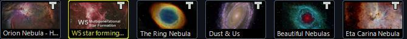

Alternatively, hover the mouse over the thumbnail so that the tour properties
appear, and then press the play arrow:

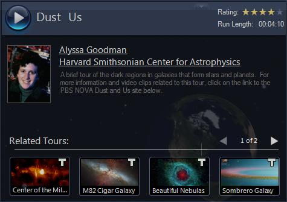

To pause a tour, click the Escape key. You are then free to explore at will.
When a tour is playing the top and lower panes are hidden. To bring these
panes into view, simply hover the mouse over where they normally appear.

To restart the tour, press the play arrow in the top left corner of the
screen. If the tour is not visible in the top panel, click the name of the
tour in the menu bar to bring it up.

Note the thumbnails in the top panel show the tour stops (the large **M** that
appears in the first image indicates that this is a master slide - refer to
[Creating a Tour](#creating-a-tour) for more details).

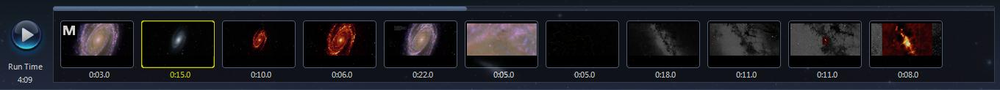

To cancel a tour, click the **X** by the tour name in the menu bar:

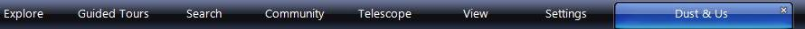

To close a tour after it has completed, either click the **X** by the tour
name, or the **Close Tour** button that appears in the final credits. In order
to transmit your rating of the tour, click on one or more stars. If you enter
too many stars and reconsider your opinion, click the star to the left to
reduce the number of stars. Click **Close Tour** and this rating will be
included in the average rating presented to other users.

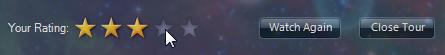

To navigate the folders of tours click on the thumbnails to open up folders
and tours, and click on the text to step back. For example, clicking
**Nebula** in the image below will close that folder and go back to display
the contents of the higher level **Tours** folder:

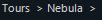

### Notes

* There are other ways to start a tour. For example from the **Explore > Open
  > Tour...** menu, from community data, and from other data collections that
  contain tours.
* When a tour is selected, a copy of it is downloaded to your local computer,
  and the entry **Save Tour As...** is added to the
  [Guided Tours Menu Entries](#guided-tours-menu-entries). This tour can then
  be played again without internet access, and edited (though be mindful of
  copyright and ownership issues).

### Playing Tours in Demo Mode

Refer to the [Guided Tours Menu Entries](#guided-tours-menu-entries) section
for details on how to play one or more tours in demo mode (that is,
continuously).

## Creating a Tour

Creating your own tour can be as simple as annotating a few images showing
deep sky objects, or locations on Earth. Or a tour can be as immersive as
combining images with art and music and speech to illustrate and enhance a
complex argument or experience.

### Tour Properties Dialog

To create a tour, click **Guided Tours > Create a New Tour...**, or **Explore
> New > Slide-based Tour...,** which has the same effect. The first thing that
you will see is the **Tour Properties** dialog. Give the new tour a title
(with a recommended limit of 35 characters, otherwise the title will be
resized or truncated), and add as many of the properties as you can now.
However these properties can be edited later, and some of the details may well
not be finalized until you have completed the content of the tour.

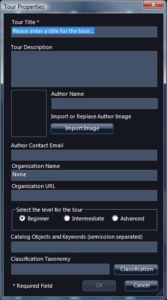

The information entered into this dialog is for informational purposes for the
users that might run the tour.

The author image should measure 70 pixels wide by 94 in height.

The
[WorldWide Telescope Data Files Reference](http://www.worldwidetelescope.org/docs/WorldWideTelescopeDataFilesReference.html)
document contains a full list in the Taxonomy appendix for use with the
**Classification Taxonomy** entry. Properly classifying guided tours will help
users locate the tour when searching. (Note the search feature currently only
applies to tours added to the default collection).

### Tour Editing Pane

Click **OK** to close the Tour Properties dialog and bring up the tour editing
pane:

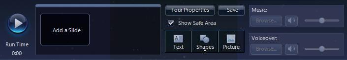

Adding slides to your tour could hardly be easier. Simply navigate to where
you want to be and click **Add a Slide**. Note that when you do this a
thumbnail image of the current view is taken, and added to your tour. You can
change the view using the **Look At** and **Imagery** lists between slides
though if you do the tour will jump sharply from one image to the next and not
scroll smoothly.

The key editing elements are to the right of the image above. **Tour
Properties** will bring up the original properties dialog, for editing.
**Music**, **Voiceover**, **Text**, **Shapes** and **Picture** items can be
added to the slide. The **Show Safe Area** checkbox can be used if you are
using a wide screen, but plan on the tour being fully visible to users of
narrower screens - checking it simply shades out the wider area.

* **Music**: MP3 and WMA files are the supported formats for both music and
  voice. Browse for a suitable piece. Note that there are not fade-in,
  fade-out or other sound effects available in WorldWide Telescope, so
  applying effects must be done independently in audio editing software. Only
  volume can be adjusted while editing a tour. If a piece of music is attached
  to an individual slide, and the piece is longer than the slide display time,
  the music will cut off suddenly at the end of the slide. The recommended
  approach is to attach music to the starting [Master Slide](#master-slides),
  so that the music runs without glitches throughout the tour. Start by
  completing a silent version of the tour, so you know exactly how long the
  tour is, then locate suitable music and apply fading and perhaps other
  effects (using quality music editing software) and finally apply it to the
  tour when the music and tour are in a completed state.  Note that the entire
  music file is embedded in the tour binary, so it is a good idea to fade out
  and truncate the music at exactly the right time, so as not to store
  unnecessary data.
* **Voiceover**: Use a similar procedure as for music, recording and editing
  the audio using quality software. The Sound Recorder accessory provided with
  Windows can be used to create voiceovers if you have a microphone attached
  to your computer, but without any editing features it is of limited utility.
  The difference between voiceovers and music is that voiceovers _should_ be
  applied to each individual slide, to get the timing right. Both music and
  voice can be rendered simultaneously, though adjust the volumes
  appropriately.
* **Text**: Enter the text into the dialog, along with font and color
  information. Note that the text can be resized on the slide, so there is no
  need to get the point size perfect within this dialog. If a background color
  is required for the text, select one after clicking on the palette icon in
  the text dialog. Add line breaks by pressing ENTER where required.

  Click **Save** to add the text to the slide. Then use the resize and rotate
  handles as necessary.

  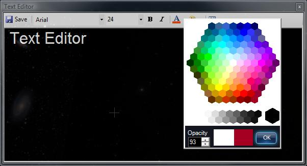

  To select white as a color, click on any of the white space around the color
  picker. The two colored boxes at the bottom of the color picker show the old
  and new colors respectively.
* **Shapes**: Circles, rectangles, open rectangles, rings, lines, arrows and
  stars are supported shapes. Once added to the screen, edit some of their
  properties using the right click menu shown below.

  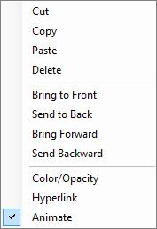

  Use the **Bring to...** and **Send...** options to layer multiple images
  appropriately.

  Selecting the **Color/Opacity** entry will bring up the color picker dialog
  shown above.

  Selecting **Hyperlink** will add a URL to the tour. If the user clicks on
  the shape, the URL will be opened in the default browser in a separate
  window. Note that no indication that this is a link is provided
  automatically -- this indication should be provided by the tour author.
* **Animate** enables the movement, recoloring and resizing of text, shapes or
  pictures. To animate an object, first move it, size it and color it at the
  location in the view you wish it to start. Then click **Animate**. Then drag
  the object to the location you wish the animation to end, and recolor and
  resize the object if required. Then deselect the object. Animations are only
  enabled between a starting point and an ending point. Right-click the slide
  you are working on, select **Preview Tour From Here...** and test the
  animations. Each animated object should smoothly move, recolor and resize
  over the time period assigned to the slide.
* **Picture**: Jpeg, Tiff, Png and [FITS](#fits-images) still images can be
  added to the slide. Similar to text and shape entries, picture entries can
  be resized and rotated on the slide. The same right click menu available for
  **Shapes** can be used with pictures.

### Slide Editing Menu

Some editing options are not quite so visible. Right click on a slide to bring
up a menu with a range of detailed options:

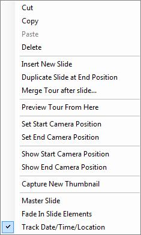
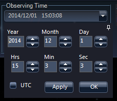

**Merge Tour after slide...** will insert another tour to become part of the
tour being edited.

To set the start and end camera position for a slide, simply navigate to the
required angle, then click **Set Start Camera Position**. Then navigate to the
required ending angle, and click **Set End Camera Position**. When the slide
is shown in the tour, the view will smoothly animate from the starting to
ending positions.

Use **Capture New Thumbnail** to replace the thumbnail image of a selected
slide.

To add a slide for a particular time -- say to capture an eclipse or a
crescent moon or a certain alignment of a star or planet, for example -- go
through the following procedure:

1. Click **View** then open the **Date Time Selection** pane from the
   **Observing Time** pane.
2. Click the push-pin icon in the **Date Time Selection** pane to undock it.
3. Use the arrows to select the required time. Click **Apply** as many times
   as necessary to locate the exact time you want. Do not click **OK** so the
   **Date Time Selection** pane remains open. So far you have not edited the
   tour, but just selected the right data and time.
4. Click the tour title bar to return to editing the tour. Create the new
   slide if it does not already exist and ensure the slide that the date and
   time applies to is highlighted with a yellow outline. Right-click to bring
   up the editing context menu, and ensure **Track Date/Time/Location** is
   selected.
5. Right-click the slide again to bring up the menu again, and this time
   select **Set Camera Start Position**.
6. In the **Date Time Selection** pane (that should still be storing the
   required date and time for the camera), click **OK**. This edits the tour
   and applies the date and time to the slide.
7. Preview your tour to ensure you have done this procedure correctly.

By default each slide will appear for 10.0 seconds. To change this click on
the pane just below each slide, and use the up and down arrows to change the
number of seconds.

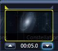

As an alternative to using the up and down arrows, mouse over the time itself,
and edit the numbers by hand.

Note that the time taken for a tour is greater than the sum total of times for
each slide, as the transition times from one slide to another are included in
the total run time.

### Master Slides

Before progressing to add more and more slides, first consider creating a
master slide. Master slides are templates that are applied to all subsequent
slides, containing watermarks, logos, copyright messages, and so on. One tour
can have one or more master slides -- so the master slide can change as the
tour progresses, though only the most recent master slide applies to any one
slide in a tour. All music, voiceovers, text, shapes and pictures on a master
slide will be applied to all subsequent slides.

If background music is to be applied to your tour, consider starting the tour
with a master slide with a display time of only a second or two, and attaching
the music file to this one slide.

To make a slide a master slide, right click to bring up the context menu, then
select **Master Slide**. A bold **M** will appear on the thumbnail. To revert
a slide to normal status, bring up the menu and click **Master Slide** again.

### Slide Title

To add a title to a slide, click on the area below the thumbnail but inside
the yellow bounding rectangle, and type up to 15 characters as a title, for
example:

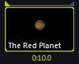

Note that a selected slide can be dragged and dropped to a new location in the
displayed list of slides.

### Control Views and Settings

To change current view settings for your slides, go into the **View** or
**Settings** menus and make the appropriate changes for the selected slide
(for example, to turn Constellation Figures or Boundary lines on or off). To
go back to editing the tour, click on the name of the tour in the menu bar.

**View** and **Settings** entries can be changed for each slide.

### Completing the Tour

Click **Save** in the tour editing pane to save off the tour at any stage.
Close the tour when it is completed by clicking the **X** by the name in the
menu bar:

### Sharing the Tour

Tours can be sent by email to friends and colleagues. A tour is stored in a
.wtt file, and can be sent as an attachment to a normal email. The file size
of the tour should obviously be below the limit applied by your ISP.

## Creating an Interactive Tour

An interactive tour is a tour where the user is required to give feedback.
This feedback could be in response to a menu of possible selections, such as
in a quiz with multiple choice answers, or even as simple as "where do you
want to go from here?". The main difference between an interactive tour and a
normal tour is that an interactive tour will not follow a set sequence of
events, but will instead jump from one stop on the tour to another that has
been selected by the user, or is in response to input from the user.

The basic process for creating an interactive tour is very similar to that of
creating any other tour, this section just covers the differences. So if you
are not familiar with the process of creating a tour, start with the
[Creating a Tour](#creating-a-tour) section.

Scenarios for interactive tours include providing "Back" buttons in normal
tours, creating coursework quizzes - perhaps at the end of a normal tour, the
students can be quizzed on its contents, and in providing some control over
the flow of a complex or long tour.

## Tour Menu Selection

The following images shows a typical menu system that might appear in a quiz.
The blue text entries are all links to other slides. The white text entries
are not linked to other slides.

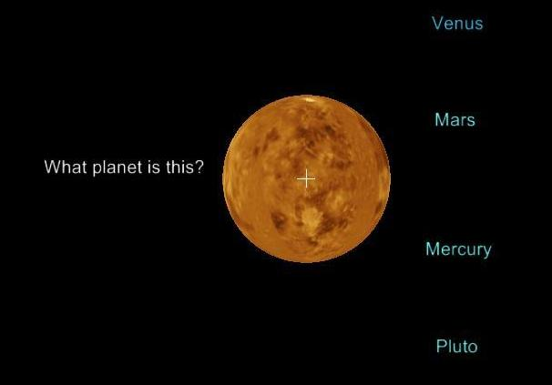
The question (or menu) slide.

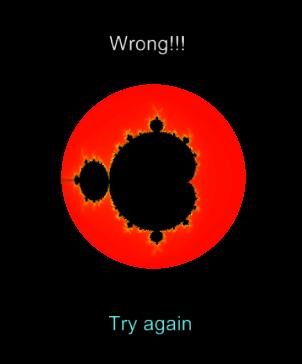

Three text entries in the question slide are linked to the "Wrong" answer
slide: Mars, Mercury and Pluto.

The "Try again" text will return the user to the question slide.

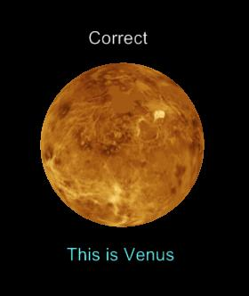

Only the correct text entry on the question slide is linked to the "Correct"
answer slide: Venus.

The "This is Venus" text will more the user onto the next question.

In order to create the menu system shown above, _first_ create all the
required slides with the appropriate text on them. Next right click on each
text entry in turn, and click on **Link to Slide**, this will bring up the
following dialog:

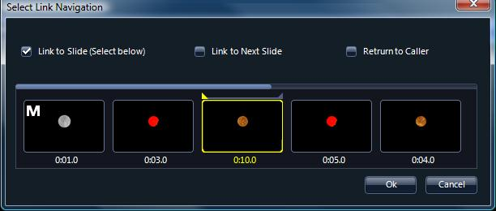

Slides can be linked to another specific slide with the **Link to Slide
(Select below)** option. This is the appropriate selection for all the menu
entries — linking "Venus" to the correct slide, and the rest to the "Wrong"
slide.

The "Wrong" slide may be used many times, so its "Try again" text should be
linked to **Return to Caller** — so the user will be returned to the question
they got wrong.

The correct answer slide will probably be linked to the next question with the
normal **Link to Next Slide** option.

Any of the overlays — text, shapes or pictures — can be turned into active
links. There are a few things to consider when creating an interactive rather
than normal tour:

* Master slides apply to the slides that follow it in linear order, not
  necessarily the order that the slides will be displayed. Consider making
  every slide that links to, or from, a slide out of normal sequence a master
  slide.
* In order to prevent the timeout of a menu slide (or any slide with links on
  it that a user should select one of) from simply moving on to the next
  slide, link that slide to itself. For example, the menu and "Wrong" slides
  should link back to themselves, however the "Correct" slide can simply
  timeout and move on to the next question slide.
* Music will not necessarily be rendered smoothly when the user jumps around
  the slides.
* Links can be applied to entire slides, rather than to overlay entries. For
  example, instead of the "Wrong" slide having a "Try again" button the slide
  could be linked with **Return to Caller**, in which case it would simply
  timeout and then return the user to the question slide. Or of course, both
  systems could be used.

## Guided Tours Menu Entries

Clicking on the down arrow below **Guided Tours** opens up the menu entries.

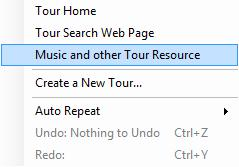

**Tour Home**, **Tour Search Web Page**, and **Music and other Tour Resource**
  link to Microsoft Research WorldWide Telescope websites.

To play tours in demo mode (that is, in a continuous loop) select **Auto
Repeat** then one of:

- **One**: play the selected tour continuously
- **All**: start with the selected tour, and cycle through the other tours in
  the top pane continuously.
  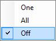

**Undo** and **Redo** are enabled appropriately while editing a tour.
