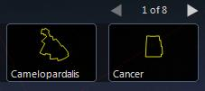
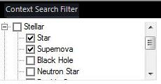
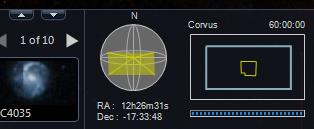

The following image shows the first view that will appear on running WorldWide
Telescope. This section describes the layout, and how it changes depending on
the selections of the user.

## The Top Panel

Along the top of the screen is the main menu, with entries **Explore**,
**Guided Tours**, **Search**, **Community**, **Telescope**, **View** and
**Settings**. These entries are described in detail later on in the
documentation, however the basic purpose of each entry follows. Note that the
main menu items can be clicked on themselves, which has a different function
than selecting the down arrow and opening up the menu contents.

Hovering the mouse underneath the main menu item will display a down arrow.
Clicking on this down arrow will open up the menu contents. Clicking on the
main menu item itself (for example, clicking on the entry **Explore**) will
change the appearance of the top panel, and not display the menu contents.

* [**Explore**](explore.md): The first two menu items, **New** and **Open**,
  are used to start new data files, or open existing data files, respectively.
  These are the primary purposes of the **Explore** menu - the location of
  data to display. Clicking the **Explore** entry itself will display the data
  **Collections** thumbnails across the top panel. Selecting any of these
  thumbnails will either open up a new set of thumbnails to browse, or change
  the view to display something new. These thumbnail images either reference
  individual items, or another set of items (similar to a folder and file
  structure). A set of images are referred to as _collections_ in WorldWide
  Telescope.
* [**Guided Tours**](guidedtours.md): A tour in WorldWide Telescope is an
  animated, annotated slide-show, for educational, research or entertainment
  purposes, usually focusing on a particular topic. Clicking the **Guided
  Tours** entry itself will display the **Tours** supplied by default with the
  product in the top panel. The menu entries can be used to search for other
  tours on the web, and to create a new tour. Opening a tour can also be done
  from the **Explore > Open** sub-menu.
* [**Search**](searchmenu.md): Clicking on this main menu item itself will
  change the top panel to show a range of search parameters, that are used to
  search on the default data provided with the product. Opening up the
  **Search** menu will enable some internet based searches.
* [**Community**](communities.md): A community in WorldWide Telescope is a
  public or private group that can be set up to share data. Clicking on the
  **Community** entry itself will display the **My Communities** entries in
  the top panel. This list will obviously be empty the first time the product
  is used. Select **Join a Community** to be linked to a website with links to
  public communities. Joining these communities will add them to your **My
  Communities** list, and give you a new collection of data, magazine
  articles, and so on, to browse and explore.
* [**Telescope**](telescopemenu.md): This menu item should only be selected if
  you have a physical telescope that can be connected to your computer with a
  USB cable and has the appropriate software interface. If you have access to
  such a telescope this feature enables some interesting possibilities,
  including using WorldWide Telescope to identify or locate objects in the
  sky, and perhaps to add your own images into the mix.
* [**View**](viewmenu.md): This menu item displays options to control the
  observing location and time. You can set WorldWide Telescope to show you the
  view from any location around the globe, using the current time or a
  time/date in the past or future.
* [**Settings**](settingsmenu.md): Clicking on this menu item itself will
  display a range of settings, these are somewhat similar to the View
  settings, controlling what is displayed.

The _Top Panel_ is shown in the image below. It is a glass panel that displays
a range of thumbnail images. Thumbnail images are there to be clicked on, with
the underlying text helping identity the data.

In this top panel view, the user has selected the thumbnail
**Constellations**, so the top panel now displays all 89 constellation
entries. Astronomers will note that there are 88 constellations, however
WorldWide Telescope treats the divided Serpens constellation as two.

If there are more thumbnails than the top panel can display, the number of
rows of thumbnails (with _previous_ and _next_ arrows) will appear to the far
right of the panel. Select the arrows or use the mouse wheel to scroll through
the options.

## The View

Underneath the top panel is the main view! In this case the user has selected
**Constellations** then **Cassiopeia**:

The images of the sky are annotated with the outlines of the constellations.
The constellation most central to the view is referred to as the _selected_
_constellation_, and is outlined in yellow. The red lines display _figures_ -
in this case linking the main stars that make up the constellation. Cassiopeia
is of course known for the five bright stars making up the large _W_.

The [View Menu](viewmenu.md) and the [Settings Menu](settingsmenu.md) have
options to change what lines are drawn, and their colors. The lines shown in
the image above are the default for a sky view.

To navigate the main view the primary device is the mouse. Use the mouse wheel
to zoom deep into outer space, and back. Hold down the left mouse button and
drag to change the angle of the view.

Clicking the right mouse button brings up the
[Finder Scope](astronomicalresearch.md#the-finder-scope), which can be dragged
around the screen with the mouse to help identify objects. In the image below,
it has been used to select one of the stars in Cassiopeia.

Click the **X** in the top right corner of the **Finder Scope** to close it.

## The Lower Panel

At the bottom of the screen there is the lower panel. This performs a variety
of functions, the most significant of which are the **Look At** and
**Imagery** entries.

The **Look At** list includes **[Earth](explore.md#earth),
[Planet](explore.md#planet), [Sky](explore.md#sky),
[Panorama](explore.md#panorama),** and
**[Solar System](explore.md#solar-system)**. This is the highest level list
determining what to display. Selecting **Solar** **System** reveals the
impressive 3D modeling of the Sun and Solar System planets (this is not
currently available in the web control version of WorldWide Telescope). The
**Imagery** list gives the range of data options given the selection made in
the **Look At** list. For **Solar System** there is only one option. For
**Sky** there is a large range of options, as there are many different
wavelengths of light that can be recorded, in addition to the visible
wavelength that we all see. Different wavelengths include x-ray, gamma,
microwave, and so on. The most fascinating imagery is to most people the
visible wavelength, but studies of the other wavelengths can reveal more
specific information about what is happening, or has happened, to the stellar
object.

**Panorama** is an interesting and slightly different selection. The range of
imagery for this includes the pictures taken from different landing vehicles
on the Moon and Mars. Selecting **Earth** gives the chance to examine our own
planet closely, right down to streets and small geographic features.

The selections made in the **Look At** and **Imagery** lists greatly affects
the relevance of other options (the [View](viewmenu.md) and
[Settings](settingsmenu.md) entries, for example), which are explained in
detail later on in this guide.

Underneath these two list entries in the lower panel is the context list of
thumbnails. A [Context Search](astronomicalresearch.md#context-search) is
carried out whenever the view is changed, and provides a thumbnail list of all
the objects of interest in the current view. The more you zoom in, the shorter
and shorter this list will become. For example, select **Explore** then
**Constellations** then click on **Corvus**. The context list is shown in the
image below:

There are a lot of entries in the list, starting with the planet Saturn. This
list does not only include the stellar objects in the constellation Corvus,
but all those objects in the current view. They are sorted in order. The first
items are the planets and named objects, the later ones often do not have a
name other than their catalog entries - _NGC4024_ for example. If this list is
long, which it often is, use the previous and next arrows to scroll through
it. Notice too that the context list is populated when a view comes to a halt,
it is often empty when the view is animating from one location to the next.
The size of the contexts lists can be reduced by de-selecting items in the
**[Context Search](astronomicalresearch.md#context-search) Filter**.

Only stars and supernova will now appear in the context list - no black holes
or neutron stars!

The final elements of the lower panel are shown in the image below:

The small up and down arrows can be used to show and hide the lower panel
itself.

The pane to the far right of the lower panel shows the _skyball_ (displaying
the field of view relative to the celestial sphere), and the selected
constellation. This pane also shows the parameters of the view - the right
ascension, declination and field of view in degrees (60:00:00 in this
example).

You can drag the yellow rectangle around in the skyball to change the view.
Click on the selected constellation to center the field of view on that
constellation.

Right ascension and declination are a well known space co-ordinate system for
astronomers, but to newcomers to astronomy probably the best way to view them
is as space longitude and latitude respectively. The field of view angle is at
a maximum of 60 degrees, which gives a wide angle view of the sky. Zooming in
can narrow this to a tiny percentage of one degree.

## The Layer Manager

You can use the **Layer Manager** to specify which layers and overlays to
display, as well as a number of other view-specific settings.

**To Display the Layer Manager**

* Click **View > Show Layer Manager**, or
* Click the Layer Manager icon.

**To Add a Layer**

* Click **Explore > Open > Layers**, or
* Right-click a Layer Manager node, then click **Add**.

### Layer Manager Nodes

Each view has its own node within the Layer Manager.

* The **Sun** node lets you choose which planetary bodies and 3D models will
  be visible in the [3D Solar System](explore.md#solar-system) view. You can
  toggle the visibility of the planets themselves, the moons of a planet, and
  any 3D models associated with the planet (such as the ISS model under
  **Earth**). Earth also includes several overlays for clouds, elevation of
  geographic features, and 3D cities.
* The **Sky** node applies to both **Sky** and **3D Solar System** views. Here
  you can toggle overlays for constellation figures and boundaries, coordinate
  system grids, and planetary orbits. You can also select background imagery
  (such as the Milky Way) for the 3D Solar System view.
* The **Sandbox** node lets you add custom content to view in
  [Sandbox](explore.md#sandbox) mode.
* The **Dome** node exposes options for using WorldWide Telescope with a
  planetarium dome.

This completes the overview of the screen layout. The following sections go
into much more detail on each individual topic.
