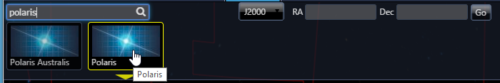
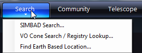

# The Search Menu

There are several methods of searching WorldWide Telescope data. Currently only default data is searched, not data that may have been added to your own collections, community data, and so on.

WorldWide Telescope includes the following catalogs in its internal index:

*   **NGC**: New General Catalog
*   **IC**: Index Catalog
*   **M**: Messier Catalog
*   **BSC**: Bright Star Catalog
*   **PGC**: Principal Galaxy Catalog

You must be connected to the internet in order for this feature to work.

## The Search Panel

You can open the Search panel by clicking **Search** in the upper panel.

To search on a name, such as _Polaris_ or _M51_, enter it in the text box top left. As you type the characters the search will be automatic and display thumbnails as image data is found.

Alternatively, enter an **RA** and **Dec** if you know the approximate location of the object you are searching for. The default units are hours. You can enter `23148`, `2h31m48s`, `2,31,48` or `02 31 48`; any one of these means 2 hours 31 minutes 48 seconds. To enter degrees, enter a "d", for example `89d 15m 51s`. These particular co-ordinates, if used for **RA** and **Dec** respectively, are the location of the star Polaris. Click **Go** to change the view to that location, then click **Search View** for a search of the current view to be carried out, with the results again displayed in thumbnail images.

**Plot Results** On the Windows Client, checking the **Plot Results** checkbox will make the search results appear both as thumbnails and circle annotations in the view. For example, entering 20 for **RA**, 18 for **Dec**, clicking **Go**, **Search View** and **Plot Results**, will reveal a constellation full of objects, as shown below. Use the [Finder Scope](astronomicalresearch.md#the-finder-scope) to further identify the objects.

## Search Menu Entries

Click the down arrow below **Search** to expand the menu.

*   **SIMBAD Search...** enables you to search the SIMBAD database by name. If a matching item is found the view will change to the location provided in the database.

*   **VO Cone Search/Registry Lookup...** provides a more complex dialog for searching [Virtual Observatory](astronomicalresearch.md#virtual-observatory-tables) databases based on RA, Dec or registry titles.
*   **Find Earth Based Location...** lets you search for a specific location on Earth. Note that this feature only applies to **Earth** view.
